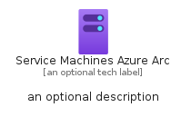
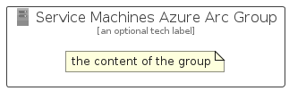

# ServiceMachinesAzureArc


```text
azure-20/Item/ManagementGovernance/ServiceMachinesAzureArc
```

```text
include('azure-20/Item/ManagementGovernance/ServiceMachinesAzureArc')
```


| Illustration | ServiceMachinesAzureArc | ServiceMachinesAzureArcCard | ServiceMachinesAzureArcGroup |
| :---: | :---: | :---: | :---: |
|  |  |  |  |


## Sprites
The item provides the following sriptes:

- `<$ServiceMachinesAzureArcXs>`
- `<$ServiceMachinesAzureArcSm>`
- `<$ServiceMachinesAzureArcMd>`
- `<$ServiceMachinesAzureArcLg>`


## ServiceMachinesAzureArc

### Load remotely
```plantuml
@startuml
' configures the library
!global $LIB_BASE_LOCATION="https://raw.githubusercontent.com/tmorin/plantuml-libs/master/distribution"

' loads the library's bootstrap
!include $LIB_BASE_LOCATION/bootstrap.puml

' loads the package bootstrap
include('azure-20/bootstrap')

' loads the Item which embeds the element ServiceMachinesAzureArc
include('azure-20/Item/ManagementGovernance/ServiceMachinesAzureArc')

' renders the element
ServiceMachinesAzureArc('ServiceMachinesAzureArc', 'Service Machines Azure Arc', 'an optional tech label', 'an optional description')
@enduml
```

### Load locally
```plantuml
@startuml
' configures the library
!global $INCLUSION_MODE="local"
!global $LIB_BASE_LOCATION="../../.."

' loads the library's bootstrap
!include $LIB_BASE_LOCATION/bootstrap.puml

' loads the package bootstrap
include('azure-20/bootstrap')

' loads the Item which embeds the element ServiceMachinesAzureArc
include('azure-20/Item/ManagementGovernance/ServiceMachinesAzureArc')

' renders the element
ServiceMachinesAzureArc('ServiceMachinesAzureArc', 'Service Machines Azure Arc', 'an optional tech label', 'an optional description')
@enduml
```

## ServiceMachinesAzureArcCard

### Load remotely
```plantuml
@startuml
' configures the library
!global $LIB_BASE_LOCATION="https://raw.githubusercontent.com/tmorin/plantuml-libs/master/distribution"

' loads the library's bootstrap
!include $LIB_BASE_LOCATION/bootstrap.puml

' loads the package bootstrap
include('azure-20/bootstrap')

' loads the Item which embeds the element ServiceMachinesAzureArcCard
include('azure-20/Item/ManagementGovernance/ServiceMachinesAzureArc')

' renders the element
ServiceMachinesAzureArcCard('ServiceMachinesAzureArcCard', 'Service Machines Azure Arc Card', 'an optional description')
@enduml
```

### Load locally
```plantuml
@startuml
' configures the library
!global $INCLUSION_MODE="local"
!global $LIB_BASE_LOCATION="../../.."

' loads the library's bootstrap
!include $LIB_BASE_LOCATION/bootstrap.puml

' loads the package bootstrap
include('azure-20/bootstrap')

' loads the Item which embeds the element ServiceMachinesAzureArcCard
include('azure-20/Item/ManagementGovernance/ServiceMachinesAzureArc')

' renders the element
ServiceMachinesAzureArcCard('ServiceMachinesAzureArcCard', 'Service Machines Azure Arc Card', 'an optional description')
@enduml
```

## ServiceMachinesAzureArcGroup

### Load remotely
```plantuml
@startuml
' configures the library
!global $LIB_BASE_LOCATION="https://raw.githubusercontent.com/tmorin/plantuml-libs/master/distribution"

' loads the library's bootstrap
!include $LIB_BASE_LOCATION/bootstrap.puml

' loads the package bootstrap
include('azure-20/bootstrap')

' loads the Item which embeds the element ServiceMachinesAzureArcGroup
include('azure-20/Item/ManagementGovernance/ServiceMachinesAzureArc')

' renders the element
ServiceMachinesAzureArcGroup('ServiceMachinesAzureArcGroup', 'Service Machines Azure Arc Group', 'an optional tech label') {
    note as note
        the content of the group
    end note
}
@enduml
```

### Load locally
```plantuml
@startuml
' configures the library
!global $INCLUSION_MODE="local"
!global $LIB_BASE_LOCATION="../../.."

' loads the library's bootstrap
!include $LIB_BASE_LOCATION/bootstrap.puml

' loads the package bootstrap
include('azure-20/bootstrap')

' loads the Item which embeds the element ServiceMachinesAzureArcGroup
include('azure-20/Item/ManagementGovernance/ServiceMachinesAzureArc')

' renders the element
ServiceMachinesAzureArcGroup('ServiceMachinesAzureArcGroup', 'Service Machines Azure Arc Group', 'an optional tech label') {
    note as note
        the content of the group
    end note
}
@enduml
```

