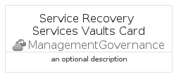

# ServiceRecoveryServicesVaults


```text
azure-20/Item/ManagementGovernance/ServiceRecoveryServicesVaults
```

```text
include('azure-20/Item/ManagementGovernance/ServiceRecoveryServicesVaults')
```


| Illustration | ServiceRecoveryServicesVaults | ServiceRecoveryServicesVaultsCard | ServiceRecoveryServicesVaultsGroup |
| :---: | :---: | :---: | :---: |
|  |  |  |  |


## Sprites
The item provides the following sriptes:

- `<$ServiceRecoveryServicesVaultsXs>`
- `<$ServiceRecoveryServicesVaultsSm>`
- `<$ServiceRecoveryServicesVaultsMd>`
- `<$ServiceRecoveryServicesVaultsLg>`


## ServiceRecoveryServicesVaults

### Load remotely
```plantuml
@startuml
' configures the library
!global $LIB_BASE_LOCATION="https://raw.githubusercontent.com/tmorin/plantuml-libs/master/distribution"

' loads the library's bootstrap
!include $LIB_BASE_LOCATION/bootstrap.puml

' loads the package bootstrap
include('azure-20/bootstrap')

' loads the Item which embeds the element ServiceRecoveryServicesVaults
include('azure-20/Item/ManagementGovernance/ServiceRecoveryServicesVaults')

' renders the element
ServiceRecoveryServicesVaults('ServiceRecoveryServicesVaults', 'Service Recovery Services Vaults', 'an optional tech label', 'an optional description')
@enduml
```

### Load locally
```plantuml
@startuml
' configures the library
!global $INCLUSION_MODE="local"
!global $LIB_BASE_LOCATION="../../.."

' loads the library's bootstrap
!include $LIB_BASE_LOCATION/bootstrap.puml

' loads the package bootstrap
include('azure-20/bootstrap')

' loads the Item which embeds the element ServiceRecoveryServicesVaults
include('azure-20/Item/ManagementGovernance/ServiceRecoveryServicesVaults')

' renders the element
ServiceRecoveryServicesVaults('ServiceRecoveryServicesVaults', 'Service Recovery Services Vaults', 'an optional tech label', 'an optional description')
@enduml
```

## ServiceRecoveryServicesVaultsCard

### Load remotely
```plantuml
@startuml
' configures the library
!global $LIB_BASE_LOCATION="https://raw.githubusercontent.com/tmorin/plantuml-libs/master/distribution"

' loads the library's bootstrap
!include $LIB_BASE_LOCATION/bootstrap.puml

' loads the package bootstrap
include('azure-20/bootstrap')

' loads the Item which embeds the element ServiceRecoveryServicesVaultsCard
include('azure-20/Item/ManagementGovernance/ServiceRecoveryServicesVaults')

' renders the element
ServiceRecoveryServicesVaultsCard('ServiceRecoveryServicesVaultsCard', 'Service Recovery Services Vaults Card', 'an optional description')
@enduml
```

### Load locally
```plantuml
@startuml
' configures the library
!global $INCLUSION_MODE="local"
!global $LIB_BASE_LOCATION="../../.."

' loads the library's bootstrap
!include $LIB_BASE_LOCATION/bootstrap.puml

' loads the package bootstrap
include('azure-20/bootstrap')

' loads the Item which embeds the element ServiceRecoveryServicesVaultsCard
include('azure-20/Item/ManagementGovernance/ServiceRecoveryServicesVaults')

' renders the element
ServiceRecoveryServicesVaultsCard('ServiceRecoveryServicesVaultsCard', 'Service Recovery Services Vaults Card', 'an optional description')
@enduml
```

## ServiceRecoveryServicesVaultsGroup

### Load remotely
```plantuml
@startuml
' configures the library
!global $LIB_BASE_LOCATION="https://raw.githubusercontent.com/tmorin/plantuml-libs/master/distribution"

' loads the library's bootstrap
!include $LIB_BASE_LOCATION/bootstrap.puml

' loads the package bootstrap
include('azure-20/bootstrap')

' loads the Item which embeds the element ServiceRecoveryServicesVaultsGroup
include('azure-20/Item/ManagementGovernance/ServiceRecoveryServicesVaults')

' renders the element
ServiceRecoveryServicesVaultsGroup('ServiceRecoveryServicesVaultsGroup', 'Service Recovery Services Vaults Group', 'an optional tech label') {
    note as note
        the content of the group
    end note
}
@enduml
```

### Load locally
```plantuml
@startuml
' configures the library
!global $INCLUSION_MODE="local"
!global $LIB_BASE_LOCATION="../../.."

' loads the library's bootstrap
!include $LIB_BASE_LOCATION/bootstrap.puml

' loads the package bootstrap
include('azure-20/bootstrap')

' loads the Item which embeds the element ServiceRecoveryServicesVaultsGroup
include('azure-20/Item/ManagementGovernance/ServiceRecoveryServicesVaults')

' renders the element
ServiceRecoveryServicesVaultsGroup('ServiceRecoveryServicesVaultsGroup', 'Service Recovery Services Vaults Group', 'an optional tech label') {
    note as note
        the content of the group
    end note
}
@enduml
```

