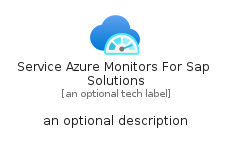
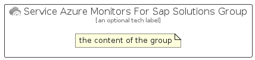

# ServiceAzureMonitorsForSapSolutions


```text
azure-20/Item/Monitor/ServiceAzureMonitorsForSapSolutions
```

```text
include('azure-20/Item/Monitor/ServiceAzureMonitorsForSapSolutions')
```


| Illustration | ServiceAzureMonitorsForSapSolutions | ServiceAzureMonitorsForSapSolutionsCard | ServiceAzureMonitorsForSapSolutionsGroup |
| :---: | :---: | :---: | :---: |
|  |  |  |  |


## Sprites
The item provides the following sriptes:

- `<$ServiceAzureMonitorsForSapSolutionsXs>`
- `<$ServiceAzureMonitorsForSapSolutionsSm>`
- `<$ServiceAzureMonitorsForSapSolutionsMd>`
- `<$ServiceAzureMonitorsForSapSolutionsLg>`


## ServiceAzureMonitorsForSapSolutions

### Load remotely
```plantuml
@startuml
' configures the library
!global $LIB_BASE_LOCATION="https://raw.githubusercontent.com/tmorin/plantuml-libs/master/distribution"

' loads the library's bootstrap
!include $LIB_BASE_LOCATION/bootstrap.puml

' loads the package bootstrap
include('azure-20/bootstrap')

' loads the Item which embeds the element ServiceAzureMonitorsForSapSolutions
include('azure-20/Item/Monitor/ServiceAzureMonitorsForSapSolutions')

' renders the element
ServiceAzureMonitorsForSapSolutions('ServiceAzureMonitorsForSapSolutions', 'Service Azure Monitors For Sap Solutions', 'an optional tech label', 'an optional description')
@enduml
```

### Load locally
```plantuml
@startuml
' configures the library
!global $INCLUSION_MODE="local"
!global $LIB_BASE_LOCATION="../../.."

' loads the library's bootstrap
!include $LIB_BASE_LOCATION/bootstrap.puml

' loads the package bootstrap
include('azure-20/bootstrap')

' loads the Item which embeds the element ServiceAzureMonitorsForSapSolutions
include('azure-20/Item/Monitor/ServiceAzureMonitorsForSapSolutions')

' renders the element
ServiceAzureMonitorsForSapSolutions('ServiceAzureMonitorsForSapSolutions', 'Service Azure Monitors For Sap Solutions', 'an optional tech label', 'an optional description')
@enduml
```

## ServiceAzureMonitorsForSapSolutionsCard

### Load remotely
```plantuml
@startuml
' configures the library
!global $LIB_BASE_LOCATION="https://raw.githubusercontent.com/tmorin/plantuml-libs/master/distribution"

' loads the library's bootstrap
!include $LIB_BASE_LOCATION/bootstrap.puml

' loads the package bootstrap
include('azure-20/bootstrap')

' loads the Item which embeds the element ServiceAzureMonitorsForSapSolutionsCard
include('azure-20/Item/Monitor/ServiceAzureMonitorsForSapSolutions')

' renders the element
ServiceAzureMonitorsForSapSolutionsCard('ServiceAzureMonitorsForSapSolutionsCard', 'Service Azure Monitors For Sap Solutions Card', 'an optional description')
@enduml
```

### Load locally
```plantuml
@startuml
' configures the library
!global $INCLUSION_MODE="local"
!global $LIB_BASE_LOCATION="../../.."

' loads the library's bootstrap
!include $LIB_BASE_LOCATION/bootstrap.puml

' loads the package bootstrap
include('azure-20/bootstrap')

' loads the Item which embeds the element ServiceAzureMonitorsForSapSolutionsCard
include('azure-20/Item/Monitor/ServiceAzureMonitorsForSapSolutions')

' renders the element
ServiceAzureMonitorsForSapSolutionsCard('ServiceAzureMonitorsForSapSolutionsCard', 'Service Azure Monitors For Sap Solutions Card', 'an optional description')
@enduml
```

## ServiceAzureMonitorsForSapSolutionsGroup

### Load remotely
```plantuml
@startuml
' configures the library
!global $LIB_BASE_LOCATION="https://raw.githubusercontent.com/tmorin/plantuml-libs/master/distribution"

' loads the library's bootstrap
!include $LIB_BASE_LOCATION/bootstrap.puml

' loads the package bootstrap
include('azure-20/bootstrap')

' loads the Item which embeds the element ServiceAzureMonitorsForSapSolutionsGroup
include('azure-20/Item/Monitor/ServiceAzureMonitorsForSapSolutions')

' renders the element
ServiceAzureMonitorsForSapSolutionsGroup('ServiceAzureMonitorsForSapSolutionsGroup', 'Service Azure Monitors For Sap Solutions Group', 'an optional tech label') {
    note as note
        the content of the group
    end note
}
@enduml
```

### Load locally
```plantuml
@startuml
' configures the library
!global $INCLUSION_MODE="local"
!global $LIB_BASE_LOCATION="../../.."

' loads the library's bootstrap
!include $LIB_BASE_LOCATION/bootstrap.puml

' loads the package bootstrap
include('azure-20/bootstrap')

' loads the Item which embeds the element ServiceAzureMonitorsForSapSolutionsGroup
include('azure-20/Item/Monitor/ServiceAzureMonitorsForSapSolutions')

' renders the element
ServiceAzureMonitorsForSapSolutionsGroup('ServiceAzureMonitorsForSapSolutionsGroup', 'Service Azure Monitors For Sap Solutions Group', 'an optional tech label') {
    note as note
        the content of the group
    end note
}
@enduml
```

