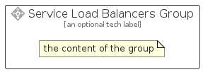

# ServiceLoadBalancers


```text
azure-20/Item/Networking/ServiceLoadBalancers
```

```text
include('azure-20/Item/Networking/ServiceLoadBalancers')
```


| Illustration | ServiceLoadBalancers | ServiceLoadBalancersCard | ServiceLoadBalancersGroup |
| :---: | :---: | :---: | :---: |
|  |  |  |  |


## Sprites
The item provides the following sriptes:

- `<$ServiceLoadBalancersXs>`
- `<$ServiceLoadBalancersSm>`
- `<$ServiceLoadBalancersMd>`
- `<$ServiceLoadBalancersLg>`


## ServiceLoadBalancers

### Load remotely
```plantuml
@startuml
' configures the library
!global $LIB_BASE_LOCATION="https://raw.githubusercontent.com/tmorin/plantuml-libs/master/distribution"

' loads the library's bootstrap
!include $LIB_BASE_LOCATION/bootstrap.puml

' loads the package bootstrap
include('azure-20/bootstrap')

' loads the Item which embeds the element ServiceLoadBalancers
include('azure-20/Item/Networking/ServiceLoadBalancers')

' renders the element
ServiceLoadBalancers('ServiceLoadBalancers', 'Service Load Balancers', 'an optional tech label', 'an optional description')
@enduml
```

### Load locally
```plantuml
@startuml
' configures the library
!global $INCLUSION_MODE="local"
!global $LIB_BASE_LOCATION="../../.."

' loads the library's bootstrap
!include $LIB_BASE_LOCATION/bootstrap.puml

' loads the package bootstrap
include('azure-20/bootstrap')

' loads the Item which embeds the element ServiceLoadBalancers
include('azure-20/Item/Networking/ServiceLoadBalancers')

' renders the element
ServiceLoadBalancers('ServiceLoadBalancers', 'Service Load Balancers', 'an optional tech label', 'an optional description')
@enduml
```

## ServiceLoadBalancersCard

### Load remotely
```plantuml
@startuml
' configures the library
!global $LIB_BASE_LOCATION="https://raw.githubusercontent.com/tmorin/plantuml-libs/master/distribution"

' loads the library's bootstrap
!include $LIB_BASE_LOCATION/bootstrap.puml

' loads the package bootstrap
include('azure-20/bootstrap')

' loads the Item which embeds the element ServiceLoadBalancersCard
include('azure-20/Item/Networking/ServiceLoadBalancers')

' renders the element
ServiceLoadBalancersCard('ServiceLoadBalancersCard', 'Service Load Balancers Card', 'an optional description')
@enduml
```

### Load locally
```plantuml
@startuml
' configures the library
!global $INCLUSION_MODE="local"
!global $LIB_BASE_LOCATION="../../.."

' loads the library's bootstrap
!include $LIB_BASE_LOCATION/bootstrap.puml

' loads the package bootstrap
include('azure-20/bootstrap')

' loads the Item which embeds the element ServiceLoadBalancersCard
include('azure-20/Item/Networking/ServiceLoadBalancers')

' renders the element
ServiceLoadBalancersCard('ServiceLoadBalancersCard', 'Service Load Balancers Card', 'an optional description')
@enduml
```

## ServiceLoadBalancersGroup

### Load remotely
```plantuml
@startuml
' configures the library
!global $LIB_BASE_LOCATION="https://raw.githubusercontent.com/tmorin/plantuml-libs/master/distribution"

' loads the library's bootstrap
!include $LIB_BASE_LOCATION/bootstrap.puml

' loads the package bootstrap
include('azure-20/bootstrap')

' loads the Item which embeds the element ServiceLoadBalancersGroup
include('azure-20/Item/Networking/ServiceLoadBalancers')

' renders the element
ServiceLoadBalancersGroup('ServiceLoadBalancersGroup', 'Service Load Balancers Group', 'an optional tech label') {
    note as note
        the content of the group
    end note
}
@enduml
```

### Load locally
```plantuml
@startuml
' configures the library
!global $INCLUSION_MODE="local"
!global $LIB_BASE_LOCATION="../../.."

' loads the library's bootstrap
!include $LIB_BASE_LOCATION/bootstrap.puml

' loads the package bootstrap
include('azure-20/bootstrap')

' loads the Item which embeds the element ServiceLoadBalancersGroup
include('azure-20/Item/Networking/ServiceLoadBalancers')

' renders the element
ServiceLoadBalancersGroup('ServiceLoadBalancersGroup', 'Service Load Balancers Group', 'an optional tech label') {
    note as note
        the content of the group
    end note
}
@enduml
```

