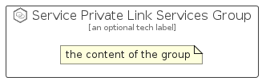

# ServicePrivateLinkServices


```text
azure-20/Item/Networking/ServicePrivateLinkServices
```

```text
include('azure-20/Item/Networking/ServicePrivateLinkServices')
```


| Illustration | ServicePrivateLinkServices | ServicePrivateLinkServicesCard | ServicePrivateLinkServicesGroup |
| :---: | :---: | :---: | :---: |
|  |  |  |  |


## Sprites
The item provides the following sriptes:

- `<$ServicePrivateLinkServicesXs>`
- `<$ServicePrivateLinkServicesSm>`
- `<$ServicePrivateLinkServicesMd>`
- `<$ServicePrivateLinkServicesLg>`


## ServicePrivateLinkServices

### Load remotely
```plantuml
@startuml
' configures the library
!global $LIB_BASE_LOCATION="https://raw.githubusercontent.com/tmorin/plantuml-libs/master/distribution"

' loads the library's bootstrap
!include $LIB_BASE_LOCATION/bootstrap.puml

' loads the package bootstrap
include('azure-20/bootstrap')

' loads the Item which embeds the element ServicePrivateLinkServices
include('azure-20/Item/Networking/ServicePrivateLinkServices')

' renders the element
ServicePrivateLinkServices('ServicePrivateLinkServices', 'Service Private Link Services', 'an optional tech label', 'an optional description')
@enduml
```

### Load locally
```plantuml
@startuml
' configures the library
!global $INCLUSION_MODE="local"
!global $LIB_BASE_LOCATION="../../.."

' loads the library's bootstrap
!include $LIB_BASE_LOCATION/bootstrap.puml

' loads the package bootstrap
include('azure-20/bootstrap')

' loads the Item which embeds the element ServicePrivateLinkServices
include('azure-20/Item/Networking/ServicePrivateLinkServices')

' renders the element
ServicePrivateLinkServices('ServicePrivateLinkServices', 'Service Private Link Services', 'an optional tech label', 'an optional description')
@enduml
```

## ServicePrivateLinkServicesCard

### Load remotely
```plantuml
@startuml
' configures the library
!global $LIB_BASE_LOCATION="https://raw.githubusercontent.com/tmorin/plantuml-libs/master/distribution"

' loads the library's bootstrap
!include $LIB_BASE_LOCATION/bootstrap.puml

' loads the package bootstrap
include('azure-20/bootstrap')

' loads the Item which embeds the element ServicePrivateLinkServicesCard
include('azure-20/Item/Networking/ServicePrivateLinkServices')

' renders the element
ServicePrivateLinkServicesCard('ServicePrivateLinkServicesCard', 'Service Private Link Services Card', 'an optional description')
@enduml
```

### Load locally
```plantuml
@startuml
' configures the library
!global $INCLUSION_MODE="local"
!global $LIB_BASE_LOCATION="../../.."

' loads the library's bootstrap
!include $LIB_BASE_LOCATION/bootstrap.puml

' loads the package bootstrap
include('azure-20/bootstrap')

' loads the Item which embeds the element ServicePrivateLinkServicesCard
include('azure-20/Item/Networking/ServicePrivateLinkServices')

' renders the element
ServicePrivateLinkServicesCard('ServicePrivateLinkServicesCard', 'Service Private Link Services Card', 'an optional description')
@enduml
```

## ServicePrivateLinkServicesGroup

### Load remotely
```plantuml
@startuml
' configures the library
!global $LIB_BASE_LOCATION="https://raw.githubusercontent.com/tmorin/plantuml-libs/master/distribution"

' loads the library's bootstrap
!include $LIB_BASE_LOCATION/bootstrap.puml

' loads the package bootstrap
include('azure-20/bootstrap')

' loads the Item which embeds the element ServicePrivateLinkServicesGroup
include('azure-20/Item/Networking/ServicePrivateLinkServices')

' renders the element
ServicePrivateLinkServicesGroup('ServicePrivateLinkServicesGroup', 'Service Private Link Services Group', 'an optional tech label') {
    note as note
        the content of the group
    end note
}
@enduml
```

### Load locally
```plantuml
@startuml
' configures the library
!global $INCLUSION_MODE="local"
!global $LIB_BASE_LOCATION="../../.."

' loads the library's bootstrap
!include $LIB_BASE_LOCATION/bootstrap.puml

' loads the package bootstrap
include('azure-20/bootstrap')

' loads the Item which embeds the element ServicePrivateLinkServicesGroup
include('azure-20/Item/Networking/ServicePrivateLinkServices')

' renders the element
ServicePrivateLinkServicesGroup('ServicePrivateLinkServicesGroup', 'Service Private Link Services Group', 'an optional tech label') {
    note as note
        the content of the group
    end note
}
@enduml
```

