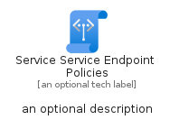
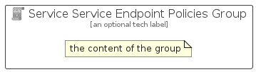

# ServiceServiceEndpointPolicies


```text
azure-20/Item/Networking/ServiceServiceEndpointPolicies
```

```text
include('azure-20/Item/Networking/ServiceServiceEndpointPolicies')
```


| Illustration | ServiceServiceEndpointPolicies | ServiceServiceEndpointPoliciesCard | ServiceServiceEndpointPoliciesGroup |
| :---: | :---: | :---: | :---: |
|  |  |  |  |


## Sprites
The item provides the following sriptes:

- `<$ServiceServiceEndpointPoliciesXs>`
- `<$ServiceServiceEndpointPoliciesSm>`
- `<$ServiceServiceEndpointPoliciesMd>`
- `<$ServiceServiceEndpointPoliciesLg>`


## ServiceServiceEndpointPolicies

### Load remotely
```plantuml
@startuml
' configures the library
!global $LIB_BASE_LOCATION="https://raw.githubusercontent.com/tmorin/plantuml-libs/master/distribution"

' loads the library's bootstrap
!include $LIB_BASE_LOCATION/bootstrap.puml

' loads the package bootstrap
include('azure-20/bootstrap')

' loads the Item which embeds the element ServiceServiceEndpointPolicies
include('azure-20/Item/Networking/ServiceServiceEndpointPolicies')

' renders the element
ServiceServiceEndpointPolicies('ServiceServiceEndpointPolicies', 'Service Service Endpoint Policies', 'an optional tech label', 'an optional description')
@enduml
```

### Load locally
```plantuml
@startuml
' configures the library
!global $INCLUSION_MODE="local"
!global $LIB_BASE_LOCATION="../../.."

' loads the library's bootstrap
!include $LIB_BASE_LOCATION/bootstrap.puml

' loads the package bootstrap
include('azure-20/bootstrap')

' loads the Item which embeds the element ServiceServiceEndpointPolicies
include('azure-20/Item/Networking/ServiceServiceEndpointPolicies')

' renders the element
ServiceServiceEndpointPolicies('ServiceServiceEndpointPolicies', 'Service Service Endpoint Policies', 'an optional tech label', 'an optional description')
@enduml
```

## ServiceServiceEndpointPoliciesCard

### Load remotely
```plantuml
@startuml
' configures the library
!global $LIB_BASE_LOCATION="https://raw.githubusercontent.com/tmorin/plantuml-libs/master/distribution"

' loads the library's bootstrap
!include $LIB_BASE_LOCATION/bootstrap.puml

' loads the package bootstrap
include('azure-20/bootstrap')

' loads the Item which embeds the element ServiceServiceEndpointPoliciesCard
include('azure-20/Item/Networking/ServiceServiceEndpointPolicies')

' renders the element
ServiceServiceEndpointPoliciesCard('ServiceServiceEndpointPoliciesCard', 'Service Service Endpoint Policies Card', 'an optional description')
@enduml
```

### Load locally
```plantuml
@startuml
' configures the library
!global $INCLUSION_MODE="local"
!global $LIB_BASE_LOCATION="../../.."

' loads the library's bootstrap
!include $LIB_BASE_LOCATION/bootstrap.puml

' loads the package bootstrap
include('azure-20/bootstrap')

' loads the Item which embeds the element ServiceServiceEndpointPoliciesCard
include('azure-20/Item/Networking/ServiceServiceEndpointPolicies')

' renders the element
ServiceServiceEndpointPoliciesCard('ServiceServiceEndpointPoliciesCard', 'Service Service Endpoint Policies Card', 'an optional description')
@enduml
```

## ServiceServiceEndpointPoliciesGroup

### Load remotely
```plantuml
@startuml
' configures the library
!global $LIB_BASE_LOCATION="https://raw.githubusercontent.com/tmorin/plantuml-libs/master/distribution"

' loads the library's bootstrap
!include $LIB_BASE_LOCATION/bootstrap.puml

' loads the package bootstrap
include('azure-20/bootstrap')

' loads the Item which embeds the element ServiceServiceEndpointPoliciesGroup
include('azure-20/Item/Networking/ServiceServiceEndpointPolicies')

' renders the element
ServiceServiceEndpointPoliciesGroup('ServiceServiceEndpointPoliciesGroup', 'Service Service Endpoint Policies Group', 'an optional tech label') {
    note as note
        the content of the group
    end note
}
@enduml
```

### Load locally
```plantuml
@startuml
' configures the library
!global $INCLUSION_MODE="local"
!global $LIB_BASE_LOCATION="../../.."

' loads the library's bootstrap
!include $LIB_BASE_LOCATION/bootstrap.puml

' loads the package bootstrap
include('azure-20/bootstrap')

' loads the Item which embeds the element ServiceServiceEndpointPoliciesGroup
include('azure-20/Item/Networking/ServiceServiceEndpointPolicies')

' renders the element
ServiceServiceEndpointPoliciesGroup('ServiceServiceEndpointPoliciesGroup', 'Service Service Endpoint Policies Group', 'an optional tech label') {
    note as note
        the content of the group
    end note
}
@enduml
```

