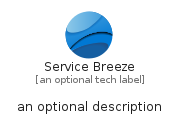
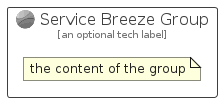

# ServiceBreeze


```text
azure-20/Item/NewIcons/ServiceBreeze
```

```text
include('azure-20/Item/NewIcons/ServiceBreeze')
```


| Illustration | ServiceBreeze | ServiceBreezeCard | ServiceBreezeGroup |
| :---: | :---: | :---: | :---: |
|  |  |  |  |


## Sprites
The item provides the following sriptes:

- `<$ServiceBreezeXs>`
- `<$ServiceBreezeSm>`
- `<$ServiceBreezeMd>`
- `<$ServiceBreezeLg>`


## ServiceBreeze

### Load remotely
```plantuml
@startuml
' configures the library
!global $LIB_BASE_LOCATION="https://raw.githubusercontent.com/tmorin/plantuml-libs/master/distribution"

' loads the library's bootstrap
!include $LIB_BASE_LOCATION/bootstrap.puml

' loads the package bootstrap
include('azure-20/bootstrap')

' loads the Item which embeds the element ServiceBreeze
include('azure-20/Item/NewIcons/ServiceBreeze')

' renders the element
ServiceBreeze('ServiceBreeze', 'Service Breeze', 'an optional tech label', 'an optional description')
@enduml
```

### Load locally
```plantuml
@startuml
' configures the library
!global $INCLUSION_MODE="local"
!global $LIB_BASE_LOCATION="../../.."

' loads the library's bootstrap
!include $LIB_BASE_LOCATION/bootstrap.puml

' loads the package bootstrap
include('azure-20/bootstrap')

' loads the Item which embeds the element ServiceBreeze
include('azure-20/Item/NewIcons/ServiceBreeze')

' renders the element
ServiceBreeze('ServiceBreeze', 'Service Breeze', 'an optional tech label', 'an optional description')
@enduml
```

## ServiceBreezeCard

### Load remotely
```plantuml
@startuml
' configures the library
!global $LIB_BASE_LOCATION="https://raw.githubusercontent.com/tmorin/plantuml-libs/master/distribution"

' loads the library's bootstrap
!include $LIB_BASE_LOCATION/bootstrap.puml

' loads the package bootstrap
include('azure-20/bootstrap')

' loads the Item which embeds the element ServiceBreezeCard
include('azure-20/Item/NewIcons/ServiceBreeze')

' renders the element
ServiceBreezeCard('ServiceBreezeCard', 'Service Breeze Card', 'an optional description')
@enduml
```

### Load locally
```plantuml
@startuml
' configures the library
!global $INCLUSION_MODE="local"
!global $LIB_BASE_LOCATION="../../.."

' loads the library's bootstrap
!include $LIB_BASE_LOCATION/bootstrap.puml

' loads the package bootstrap
include('azure-20/bootstrap')

' loads the Item which embeds the element ServiceBreezeCard
include('azure-20/Item/NewIcons/ServiceBreeze')

' renders the element
ServiceBreezeCard('ServiceBreezeCard', 'Service Breeze Card', 'an optional description')
@enduml
```

## ServiceBreezeGroup

### Load remotely
```plantuml
@startuml
' configures the library
!global $LIB_BASE_LOCATION="https://raw.githubusercontent.com/tmorin/plantuml-libs/master/distribution"

' loads the library's bootstrap
!include $LIB_BASE_LOCATION/bootstrap.puml

' loads the package bootstrap
include('azure-20/bootstrap')

' loads the Item which embeds the element ServiceBreezeGroup
include('azure-20/Item/NewIcons/ServiceBreeze')

' renders the element
ServiceBreezeGroup('ServiceBreezeGroup', 'Service Breeze Group', 'an optional tech label') {
    note as note
        the content of the group
    end note
}
@enduml
```

### Load locally
```plantuml
@startuml
' configures the library
!global $INCLUSION_MODE="local"
!global $LIB_BASE_LOCATION="../../.."

' loads the library's bootstrap
!include $LIB_BASE_LOCATION/bootstrap.puml

' loads the package bootstrap
include('azure-20/bootstrap')

' loads the Item which embeds the element ServiceBreezeGroup
include('azure-20/Item/NewIcons/ServiceBreeze')

' renders the element
ServiceBreezeGroup('ServiceBreezeGroup', 'Service Breeze Group', 'an optional tech label') {
    note as note
        the content of the group
    end note
}
@enduml
```

