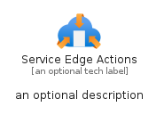
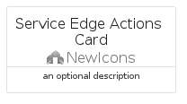

# ServiceEdgeActions


```text
azure-20/Item/NewIcons/ServiceEdgeActions
```

```text
include('azure-20/Item/NewIcons/ServiceEdgeActions')
```


| Illustration | ServiceEdgeActions | ServiceEdgeActionsCard | ServiceEdgeActionsGroup |
| :---: | :---: | :---: | :---: |
|  |  |  |  |


## Sprites
The item provides the following sriptes:

- `<$ServiceEdgeActionsXs>`
- `<$ServiceEdgeActionsSm>`
- `<$ServiceEdgeActionsMd>`
- `<$ServiceEdgeActionsLg>`


## ServiceEdgeActions

### Load remotely
```plantuml
@startuml
' configures the library
!global $LIB_BASE_LOCATION="https://raw.githubusercontent.com/tmorin/plantuml-libs/master/distribution"

' loads the library's bootstrap
!include $LIB_BASE_LOCATION/bootstrap.puml

' loads the package bootstrap
include('azure-20/bootstrap')

' loads the Item which embeds the element ServiceEdgeActions
include('azure-20/Item/NewIcons/ServiceEdgeActions')

' renders the element
ServiceEdgeActions('ServiceEdgeActions', 'Service Edge Actions', 'an optional tech label', 'an optional description')
@enduml
```

### Load locally
```plantuml
@startuml
' configures the library
!global $INCLUSION_MODE="local"
!global $LIB_BASE_LOCATION="../../.."

' loads the library's bootstrap
!include $LIB_BASE_LOCATION/bootstrap.puml

' loads the package bootstrap
include('azure-20/bootstrap')

' loads the Item which embeds the element ServiceEdgeActions
include('azure-20/Item/NewIcons/ServiceEdgeActions')

' renders the element
ServiceEdgeActions('ServiceEdgeActions', 'Service Edge Actions', 'an optional tech label', 'an optional description')
@enduml
```

## ServiceEdgeActionsCard

### Load remotely
```plantuml
@startuml
' configures the library
!global $LIB_BASE_LOCATION="https://raw.githubusercontent.com/tmorin/plantuml-libs/master/distribution"

' loads the library's bootstrap
!include $LIB_BASE_LOCATION/bootstrap.puml

' loads the package bootstrap
include('azure-20/bootstrap')

' loads the Item which embeds the element ServiceEdgeActionsCard
include('azure-20/Item/NewIcons/ServiceEdgeActions')

' renders the element
ServiceEdgeActionsCard('ServiceEdgeActionsCard', 'Service Edge Actions Card', 'an optional description')
@enduml
```

### Load locally
```plantuml
@startuml
' configures the library
!global $INCLUSION_MODE="local"
!global $LIB_BASE_LOCATION="../../.."

' loads the library's bootstrap
!include $LIB_BASE_LOCATION/bootstrap.puml

' loads the package bootstrap
include('azure-20/bootstrap')

' loads the Item which embeds the element ServiceEdgeActionsCard
include('azure-20/Item/NewIcons/ServiceEdgeActions')

' renders the element
ServiceEdgeActionsCard('ServiceEdgeActionsCard', 'Service Edge Actions Card', 'an optional description')
@enduml
```

## ServiceEdgeActionsGroup

### Load remotely
```plantuml
@startuml
' configures the library
!global $LIB_BASE_LOCATION="https://raw.githubusercontent.com/tmorin/plantuml-libs/master/distribution"

' loads the library's bootstrap
!include $LIB_BASE_LOCATION/bootstrap.puml

' loads the package bootstrap
include('azure-20/bootstrap')

' loads the Item which embeds the element ServiceEdgeActionsGroup
include('azure-20/Item/NewIcons/ServiceEdgeActions')

' renders the element
ServiceEdgeActionsGroup('ServiceEdgeActionsGroup', 'Service Edge Actions Group', 'an optional tech label') {
    note as note
        the content of the group
    end note
}
@enduml
```

### Load locally
```plantuml
@startuml
' configures the library
!global $INCLUSION_MODE="local"
!global $LIB_BASE_LOCATION="../../.."

' loads the library's bootstrap
!include $LIB_BASE_LOCATION/bootstrap.puml

' loads the package bootstrap
include('azure-20/bootstrap')

' loads the Item which embeds the element ServiceEdgeActionsGroup
include('azure-20/Item/NewIcons/ServiceEdgeActions')

' renders the element
ServiceEdgeActionsGroup('ServiceEdgeActionsGroup', 'Service Edge Actions Group', 'an optional tech label') {
    note as note
        the content of the group
    end note
}
@enduml
```

