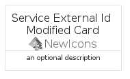
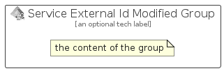

# ServiceExternalIdModified


```text
azure-20/Item/NewIcons/ServiceExternalIdModified
```

```text
include('azure-20/Item/NewIcons/ServiceExternalIdModified')
```


| Illustration | ServiceExternalIdModified | ServiceExternalIdModifiedCard | ServiceExternalIdModifiedGroup |
| :---: | :---: | :---: | :---: |
|  |  |  |  |


## Sprites
The item provides the following sriptes:

- `<$ServiceExternalIdModifiedXs>`
- `<$ServiceExternalIdModifiedSm>`
- `<$ServiceExternalIdModifiedMd>`
- `<$ServiceExternalIdModifiedLg>`


## ServiceExternalIdModified

### Load remotely
```plantuml
@startuml
' configures the library
!global $LIB_BASE_LOCATION="https://raw.githubusercontent.com/tmorin/plantuml-libs/master/distribution"

' loads the library's bootstrap
!include $LIB_BASE_LOCATION/bootstrap.puml

' loads the package bootstrap
include('azure-20/bootstrap')

' loads the Item which embeds the element ServiceExternalIdModified
include('azure-20/Item/NewIcons/ServiceExternalIdModified')

' renders the element
ServiceExternalIdModified('ServiceExternalIdModified', 'Service External Id Modified', 'an optional tech label', 'an optional description')
@enduml
```

### Load locally
```plantuml
@startuml
' configures the library
!global $INCLUSION_MODE="local"
!global $LIB_BASE_LOCATION="../../.."

' loads the library's bootstrap
!include $LIB_BASE_LOCATION/bootstrap.puml

' loads the package bootstrap
include('azure-20/bootstrap')

' loads the Item which embeds the element ServiceExternalIdModified
include('azure-20/Item/NewIcons/ServiceExternalIdModified')

' renders the element
ServiceExternalIdModified('ServiceExternalIdModified', 'Service External Id Modified', 'an optional tech label', 'an optional description')
@enduml
```

## ServiceExternalIdModifiedCard

### Load remotely
```plantuml
@startuml
' configures the library
!global $LIB_BASE_LOCATION="https://raw.githubusercontent.com/tmorin/plantuml-libs/master/distribution"

' loads the library's bootstrap
!include $LIB_BASE_LOCATION/bootstrap.puml

' loads the package bootstrap
include('azure-20/bootstrap')

' loads the Item which embeds the element ServiceExternalIdModifiedCard
include('azure-20/Item/NewIcons/ServiceExternalIdModified')

' renders the element
ServiceExternalIdModifiedCard('ServiceExternalIdModifiedCard', 'Service External Id Modified Card', 'an optional description')
@enduml
```

### Load locally
```plantuml
@startuml
' configures the library
!global $INCLUSION_MODE="local"
!global $LIB_BASE_LOCATION="../../.."

' loads the library's bootstrap
!include $LIB_BASE_LOCATION/bootstrap.puml

' loads the package bootstrap
include('azure-20/bootstrap')

' loads the Item which embeds the element ServiceExternalIdModifiedCard
include('azure-20/Item/NewIcons/ServiceExternalIdModified')

' renders the element
ServiceExternalIdModifiedCard('ServiceExternalIdModifiedCard', 'Service External Id Modified Card', 'an optional description')
@enduml
```

## ServiceExternalIdModifiedGroup

### Load remotely
```plantuml
@startuml
' configures the library
!global $LIB_BASE_LOCATION="https://raw.githubusercontent.com/tmorin/plantuml-libs/master/distribution"

' loads the library's bootstrap
!include $LIB_BASE_LOCATION/bootstrap.puml

' loads the package bootstrap
include('azure-20/bootstrap')

' loads the Item which embeds the element ServiceExternalIdModifiedGroup
include('azure-20/Item/NewIcons/ServiceExternalIdModified')

' renders the element
ServiceExternalIdModifiedGroup('ServiceExternalIdModifiedGroup', 'Service External Id Modified Group', 'an optional tech label') {
    note as note
        the content of the group
    end note
}
@enduml
```

### Load locally
```plantuml
@startuml
' configures the library
!global $INCLUSION_MODE="local"
!global $LIB_BASE_LOCATION="../../.."

' loads the library's bootstrap
!include $LIB_BASE_LOCATION/bootstrap.puml

' loads the package bootstrap
include('azure-20/bootstrap')

' loads the Item which embeds the element ServiceExternalIdModifiedGroup
include('azure-20/Item/NewIcons/ServiceExternalIdModified')

' renders the element
ServiceExternalIdModifiedGroup('ServiceExternalIdModifiedGroup', 'Service External Id Modified Group', 'an optional tech label') {
    note as note
        the content of the group
    end note
}
@enduml
```

