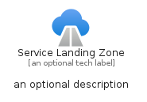

# ServiceLandingZone


```text
azure-20/Item/NewIcons/ServiceLandingZone
```

```text
include('azure-20/Item/NewIcons/ServiceLandingZone')
```


| Illustration | ServiceLandingZone | ServiceLandingZoneCard | ServiceLandingZoneGroup |
| :---: | :---: | :---: | :---: |
|  |  |  |  |


## Sprites
The item provides the following sriptes:

- `<$ServiceLandingZoneXs>`
- `<$ServiceLandingZoneSm>`
- `<$ServiceLandingZoneMd>`
- `<$ServiceLandingZoneLg>`


## ServiceLandingZone

### Load remotely
```plantuml
@startuml
' configures the library
!global $LIB_BASE_LOCATION="https://raw.githubusercontent.com/tmorin/plantuml-libs/master/distribution"

' loads the library's bootstrap
!include $LIB_BASE_LOCATION/bootstrap.puml

' loads the package bootstrap
include('azure-20/bootstrap')

' loads the Item which embeds the element ServiceLandingZone
include('azure-20/Item/NewIcons/ServiceLandingZone')

' renders the element
ServiceLandingZone('ServiceLandingZone', 'Service Landing Zone', 'an optional tech label', 'an optional description')
@enduml
```

### Load locally
```plantuml
@startuml
' configures the library
!global $INCLUSION_MODE="local"
!global $LIB_BASE_LOCATION="../../.."

' loads the library's bootstrap
!include $LIB_BASE_LOCATION/bootstrap.puml

' loads the package bootstrap
include('azure-20/bootstrap')

' loads the Item which embeds the element ServiceLandingZone
include('azure-20/Item/NewIcons/ServiceLandingZone')

' renders the element
ServiceLandingZone('ServiceLandingZone', 'Service Landing Zone', 'an optional tech label', 'an optional description')
@enduml
```

## ServiceLandingZoneCard

### Load remotely
```plantuml
@startuml
' configures the library
!global $LIB_BASE_LOCATION="https://raw.githubusercontent.com/tmorin/plantuml-libs/master/distribution"

' loads the library's bootstrap
!include $LIB_BASE_LOCATION/bootstrap.puml

' loads the package bootstrap
include('azure-20/bootstrap')

' loads the Item which embeds the element ServiceLandingZoneCard
include('azure-20/Item/NewIcons/ServiceLandingZone')

' renders the element
ServiceLandingZoneCard('ServiceLandingZoneCard', 'Service Landing Zone Card', 'an optional description')
@enduml
```

### Load locally
```plantuml
@startuml
' configures the library
!global $INCLUSION_MODE="local"
!global $LIB_BASE_LOCATION="../../.."

' loads the library's bootstrap
!include $LIB_BASE_LOCATION/bootstrap.puml

' loads the package bootstrap
include('azure-20/bootstrap')

' loads the Item which embeds the element ServiceLandingZoneCard
include('azure-20/Item/NewIcons/ServiceLandingZone')

' renders the element
ServiceLandingZoneCard('ServiceLandingZoneCard', 'Service Landing Zone Card', 'an optional description')
@enduml
```

## ServiceLandingZoneGroup

### Load remotely
```plantuml
@startuml
' configures the library
!global $LIB_BASE_LOCATION="https://raw.githubusercontent.com/tmorin/plantuml-libs/master/distribution"

' loads the library's bootstrap
!include $LIB_BASE_LOCATION/bootstrap.puml

' loads the package bootstrap
include('azure-20/bootstrap')

' loads the Item which embeds the element ServiceLandingZoneGroup
include('azure-20/Item/NewIcons/ServiceLandingZone')

' renders the element
ServiceLandingZoneGroup('ServiceLandingZoneGroup', 'Service Landing Zone Group', 'an optional tech label') {
    note as note
        the content of the group
    end note
}
@enduml
```

### Load locally
```plantuml
@startuml
' configures the library
!global $INCLUSION_MODE="local"
!global $LIB_BASE_LOCATION="../../.."

' loads the library's bootstrap
!include $LIB_BASE_LOCATION/bootstrap.puml

' loads the package bootstrap
include('azure-20/bootstrap')

' loads the Item which embeds the element ServiceLandingZoneGroup
include('azure-20/Item/NewIcons/ServiceLandingZone')

' renders the element
ServiceLandingZoneGroup('ServiceLandingZoneGroup', 'Service Landing Zone Group', 'an optional tech label') {
    note as note
        the content of the group
    end note
}
@enduml
```

