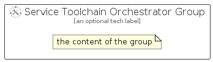

# ServiceToolchainOrchestrator


```text
azure-20/Item/NewIcons/ServiceToolchainOrchestrator
```

```text
include('azure-20/Item/NewIcons/ServiceToolchainOrchestrator')
```


| Illustration | ServiceToolchainOrchestrator | ServiceToolchainOrchestratorCard | ServiceToolchainOrchestratorGroup |
| :---: | :---: | :---: | :---: |
|  |  |  |  |


## Sprites
The item provides the following sriptes:

- `<$ServiceToolchainOrchestratorXs>`
- `<$ServiceToolchainOrchestratorSm>`
- `<$ServiceToolchainOrchestratorMd>`
- `<$ServiceToolchainOrchestratorLg>`


## ServiceToolchainOrchestrator

### Load remotely
```plantuml
@startuml
' configures the library
!global $LIB_BASE_LOCATION="https://raw.githubusercontent.com/tmorin/plantuml-libs/master/distribution"

' loads the library's bootstrap
!include $LIB_BASE_LOCATION/bootstrap.puml

' loads the package bootstrap
include('azure-20/bootstrap')

' loads the Item which embeds the element ServiceToolchainOrchestrator
include('azure-20/Item/NewIcons/ServiceToolchainOrchestrator')

' renders the element
ServiceToolchainOrchestrator('ServiceToolchainOrchestrator', 'Service Toolchain Orchestrator', 'an optional tech label', 'an optional description')
@enduml
```

### Load locally
```plantuml
@startuml
' configures the library
!global $INCLUSION_MODE="local"
!global $LIB_BASE_LOCATION="../../.."

' loads the library's bootstrap
!include $LIB_BASE_LOCATION/bootstrap.puml

' loads the package bootstrap
include('azure-20/bootstrap')

' loads the Item which embeds the element ServiceToolchainOrchestrator
include('azure-20/Item/NewIcons/ServiceToolchainOrchestrator')

' renders the element
ServiceToolchainOrchestrator('ServiceToolchainOrchestrator', 'Service Toolchain Orchestrator', 'an optional tech label', 'an optional description')
@enduml
```

## ServiceToolchainOrchestratorCard

### Load remotely
```plantuml
@startuml
' configures the library
!global $LIB_BASE_LOCATION="https://raw.githubusercontent.com/tmorin/plantuml-libs/master/distribution"

' loads the library's bootstrap
!include $LIB_BASE_LOCATION/bootstrap.puml

' loads the package bootstrap
include('azure-20/bootstrap')

' loads the Item which embeds the element ServiceToolchainOrchestratorCard
include('azure-20/Item/NewIcons/ServiceToolchainOrchestrator')

' renders the element
ServiceToolchainOrchestratorCard('ServiceToolchainOrchestratorCard', 'Service Toolchain Orchestrator Card', 'an optional description')
@enduml
```

### Load locally
```plantuml
@startuml
' configures the library
!global $INCLUSION_MODE="local"
!global $LIB_BASE_LOCATION="../../.."

' loads the library's bootstrap
!include $LIB_BASE_LOCATION/bootstrap.puml

' loads the package bootstrap
include('azure-20/bootstrap')

' loads the Item which embeds the element ServiceToolchainOrchestratorCard
include('azure-20/Item/NewIcons/ServiceToolchainOrchestrator')

' renders the element
ServiceToolchainOrchestratorCard('ServiceToolchainOrchestratorCard', 'Service Toolchain Orchestrator Card', 'an optional description')
@enduml
```

## ServiceToolchainOrchestratorGroup

### Load remotely
```plantuml
@startuml
' configures the library
!global $LIB_BASE_LOCATION="https://raw.githubusercontent.com/tmorin/plantuml-libs/master/distribution"

' loads the library's bootstrap
!include $LIB_BASE_LOCATION/bootstrap.puml

' loads the package bootstrap
include('azure-20/bootstrap')

' loads the Item which embeds the element ServiceToolchainOrchestratorGroup
include('azure-20/Item/NewIcons/ServiceToolchainOrchestrator')

' renders the element
ServiceToolchainOrchestratorGroup('ServiceToolchainOrchestratorGroup', 'Service Toolchain Orchestrator Group', 'an optional tech label') {
    note as note
        the content of the group
    end note
}
@enduml
```

### Load locally
```plantuml
@startuml
' configures the library
!global $INCLUSION_MODE="local"
!global $LIB_BASE_LOCATION="../../.."

' loads the library's bootstrap
!include $LIB_BASE_LOCATION/bootstrap.puml

' loads the package bootstrap
include('azure-20/bootstrap')

' loads the Item which embeds the element ServiceToolchainOrchestratorGroup
include('azure-20/Item/NewIcons/ServiceToolchainOrchestrator')

' renders the element
ServiceToolchainOrchestratorGroup('ServiceToolchainOrchestratorGroup', 'Service Toolchain Orchestrator Group', 'an optional tech label') {
    note as note
        the content of the group
    end note
}
@enduml
```

