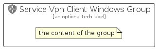

# ServiceVpnClientWindows


```text
azure-20/Item/NewIcons/ServiceVpnClientWindows
```

```text
include('azure-20/Item/NewIcons/ServiceVpnClientWindows')
```


| Illustration | ServiceVpnClientWindows | ServiceVpnClientWindowsCard | ServiceVpnClientWindowsGroup |
| :---: | :---: | :---: | :---: |
|  |  |  |  |


## Sprites
The item provides the following sriptes:

- `<$ServiceVpnClientWindowsXs>`
- `<$ServiceVpnClientWindowsSm>`
- `<$ServiceVpnClientWindowsMd>`
- `<$ServiceVpnClientWindowsLg>`


## ServiceVpnClientWindows

### Load remotely
```plantuml
@startuml
' configures the library
!global $LIB_BASE_LOCATION="https://raw.githubusercontent.com/tmorin/plantuml-libs/master/distribution"

' loads the library's bootstrap
!include $LIB_BASE_LOCATION/bootstrap.puml

' loads the package bootstrap
include('azure-20/bootstrap')

' loads the Item which embeds the element ServiceVpnClientWindows
include('azure-20/Item/NewIcons/ServiceVpnClientWindows')

' renders the element
ServiceVpnClientWindows('ServiceVpnClientWindows', 'Service Vpn Client Windows', 'an optional tech label', 'an optional description')
@enduml
```

### Load locally
```plantuml
@startuml
' configures the library
!global $INCLUSION_MODE="local"
!global $LIB_BASE_LOCATION="../../.."

' loads the library's bootstrap
!include $LIB_BASE_LOCATION/bootstrap.puml

' loads the package bootstrap
include('azure-20/bootstrap')

' loads the Item which embeds the element ServiceVpnClientWindows
include('azure-20/Item/NewIcons/ServiceVpnClientWindows')

' renders the element
ServiceVpnClientWindows('ServiceVpnClientWindows', 'Service Vpn Client Windows', 'an optional tech label', 'an optional description')
@enduml
```

## ServiceVpnClientWindowsCard

### Load remotely
```plantuml
@startuml
' configures the library
!global $LIB_BASE_LOCATION="https://raw.githubusercontent.com/tmorin/plantuml-libs/master/distribution"

' loads the library's bootstrap
!include $LIB_BASE_LOCATION/bootstrap.puml

' loads the package bootstrap
include('azure-20/bootstrap')

' loads the Item which embeds the element ServiceVpnClientWindowsCard
include('azure-20/Item/NewIcons/ServiceVpnClientWindows')

' renders the element
ServiceVpnClientWindowsCard('ServiceVpnClientWindowsCard', 'Service Vpn Client Windows Card', 'an optional description')
@enduml
```

### Load locally
```plantuml
@startuml
' configures the library
!global $INCLUSION_MODE="local"
!global $LIB_BASE_LOCATION="../../.."

' loads the library's bootstrap
!include $LIB_BASE_LOCATION/bootstrap.puml

' loads the package bootstrap
include('azure-20/bootstrap')

' loads the Item which embeds the element ServiceVpnClientWindowsCard
include('azure-20/Item/NewIcons/ServiceVpnClientWindows')

' renders the element
ServiceVpnClientWindowsCard('ServiceVpnClientWindowsCard', 'Service Vpn Client Windows Card', 'an optional description')
@enduml
```

## ServiceVpnClientWindowsGroup

### Load remotely
```plantuml
@startuml
' configures the library
!global $LIB_BASE_LOCATION="https://raw.githubusercontent.com/tmorin/plantuml-libs/master/distribution"

' loads the library's bootstrap
!include $LIB_BASE_LOCATION/bootstrap.puml

' loads the package bootstrap
include('azure-20/bootstrap')

' loads the Item which embeds the element ServiceVpnClientWindowsGroup
include('azure-20/Item/NewIcons/ServiceVpnClientWindows')

' renders the element
ServiceVpnClientWindowsGroup('ServiceVpnClientWindowsGroup', 'Service Vpn Client Windows Group', 'an optional tech label') {
    note as note
        the content of the group
    end note
}
@enduml
```

### Load locally
```plantuml
@startuml
' configures the library
!global $INCLUSION_MODE="local"
!global $LIB_BASE_LOCATION="../../.."

' loads the library's bootstrap
!include $LIB_BASE_LOCATION/bootstrap.puml

' loads the package bootstrap
include('azure-20/bootstrap')

' loads the Item which embeds the element ServiceVpnClientWindowsGroup
include('azure-20/Item/NewIcons/ServiceVpnClientWindows')

' renders the element
ServiceVpnClientWindowsGroup('ServiceVpnClientWindowsGroup', 'Service Vpn Client Windows Group', 'an optional tech label') {
    note as note
        the content of the group
    end note
}
@enduml
```

