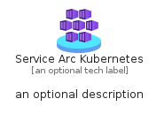
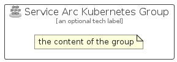

# ServiceArcKubernetes


```text
azure-20/Item/Other/ServiceArcKubernetes
```

```text
include('azure-20/Item/Other/ServiceArcKubernetes')
```


| Illustration | ServiceArcKubernetes | ServiceArcKubernetesCard | ServiceArcKubernetesGroup |
| :---: | :---: | :---: | :---: |
|  |  |  |  |


## Sprites
The item provides the following sriptes:

- `<$ServiceArcKubernetesXs>`
- `<$ServiceArcKubernetesSm>`
- `<$ServiceArcKubernetesMd>`
- `<$ServiceArcKubernetesLg>`


## ServiceArcKubernetes

### Load remotely
```plantuml
@startuml
' configures the library
!global $LIB_BASE_LOCATION="https://raw.githubusercontent.com/tmorin/plantuml-libs/master/distribution"

' loads the library's bootstrap
!include $LIB_BASE_LOCATION/bootstrap.puml

' loads the package bootstrap
include('azure-20/bootstrap')

' loads the Item which embeds the element ServiceArcKubernetes
include('azure-20/Item/Other/ServiceArcKubernetes')

' renders the element
ServiceArcKubernetes('ServiceArcKubernetes', 'Service Arc Kubernetes', 'an optional tech label', 'an optional description')
@enduml
```

### Load locally
```plantuml
@startuml
' configures the library
!global $INCLUSION_MODE="local"
!global $LIB_BASE_LOCATION="../../.."

' loads the library's bootstrap
!include $LIB_BASE_LOCATION/bootstrap.puml

' loads the package bootstrap
include('azure-20/bootstrap')

' loads the Item which embeds the element ServiceArcKubernetes
include('azure-20/Item/Other/ServiceArcKubernetes')

' renders the element
ServiceArcKubernetes('ServiceArcKubernetes', 'Service Arc Kubernetes', 'an optional tech label', 'an optional description')
@enduml
```

## ServiceArcKubernetesCard

### Load remotely
```plantuml
@startuml
' configures the library
!global $LIB_BASE_LOCATION="https://raw.githubusercontent.com/tmorin/plantuml-libs/master/distribution"

' loads the library's bootstrap
!include $LIB_BASE_LOCATION/bootstrap.puml

' loads the package bootstrap
include('azure-20/bootstrap')

' loads the Item which embeds the element ServiceArcKubernetesCard
include('azure-20/Item/Other/ServiceArcKubernetes')

' renders the element
ServiceArcKubernetesCard('ServiceArcKubernetesCard', 'Service Arc Kubernetes Card', 'an optional description')
@enduml
```

### Load locally
```plantuml
@startuml
' configures the library
!global $INCLUSION_MODE="local"
!global $LIB_BASE_LOCATION="../../.."

' loads the library's bootstrap
!include $LIB_BASE_LOCATION/bootstrap.puml

' loads the package bootstrap
include('azure-20/bootstrap')

' loads the Item which embeds the element ServiceArcKubernetesCard
include('azure-20/Item/Other/ServiceArcKubernetes')

' renders the element
ServiceArcKubernetesCard('ServiceArcKubernetesCard', 'Service Arc Kubernetes Card', 'an optional description')
@enduml
```

## ServiceArcKubernetesGroup

### Load remotely
```plantuml
@startuml
' configures the library
!global $LIB_BASE_LOCATION="https://raw.githubusercontent.com/tmorin/plantuml-libs/master/distribution"

' loads the library's bootstrap
!include $LIB_BASE_LOCATION/bootstrap.puml

' loads the package bootstrap
include('azure-20/bootstrap')

' loads the Item which embeds the element ServiceArcKubernetesGroup
include('azure-20/Item/Other/ServiceArcKubernetes')

' renders the element
ServiceArcKubernetesGroup('ServiceArcKubernetesGroup', 'Service Arc Kubernetes Group', 'an optional tech label') {
    note as note
        the content of the group
    end note
}
@enduml
```

### Load locally
```plantuml
@startuml
' configures the library
!global $INCLUSION_MODE="local"
!global $LIB_BASE_LOCATION="../../.."

' loads the library's bootstrap
!include $LIB_BASE_LOCATION/bootstrap.puml

' loads the package bootstrap
include('azure-20/bootstrap')

' loads the Item which embeds the element ServiceArcKubernetesGroup
include('azure-20/Item/Other/ServiceArcKubernetes')

' renders the element
ServiceArcKubernetesGroup('ServiceArcKubernetesGroup', 'Service Arc Kubernetes Group', 'an optional tech label') {
    note as note
        the content of the group
    end note
}
@enduml
```

