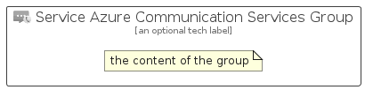

# ServiceAzureCommunicationServices


```text
azure-20/Item/Other/ServiceAzureCommunicationServices
```

```text
include('azure-20/Item/Other/ServiceAzureCommunicationServices')
```


| Illustration | ServiceAzureCommunicationServices | ServiceAzureCommunicationServicesCard | ServiceAzureCommunicationServicesGroup |
| :---: | :---: | :---: | :---: |
|  |  |  |  |


## Sprites
The item provides the following sriptes:

- `<$ServiceAzureCommunicationServicesXs>`
- `<$ServiceAzureCommunicationServicesSm>`
- `<$ServiceAzureCommunicationServicesMd>`
- `<$ServiceAzureCommunicationServicesLg>`


## ServiceAzureCommunicationServices

### Load remotely
```plantuml
@startuml
' configures the library
!global $LIB_BASE_LOCATION="https://raw.githubusercontent.com/tmorin/plantuml-libs/master/distribution"

' loads the library's bootstrap
!include $LIB_BASE_LOCATION/bootstrap.puml

' loads the package bootstrap
include('azure-20/bootstrap')

' loads the Item which embeds the element ServiceAzureCommunicationServices
include('azure-20/Item/Other/ServiceAzureCommunicationServices')

' renders the element
ServiceAzureCommunicationServices('ServiceAzureCommunicationServices', 'Service Azure Communication Services', 'an optional tech label', 'an optional description')
@enduml
```

### Load locally
```plantuml
@startuml
' configures the library
!global $INCLUSION_MODE="local"
!global $LIB_BASE_LOCATION="../../.."

' loads the library's bootstrap
!include $LIB_BASE_LOCATION/bootstrap.puml

' loads the package bootstrap
include('azure-20/bootstrap')

' loads the Item which embeds the element ServiceAzureCommunicationServices
include('azure-20/Item/Other/ServiceAzureCommunicationServices')

' renders the element
ServiceAzureCommunicationServices('ServiceAzureCommunicationServices', 'Service Azure Communication Services', 'an optional tech label', 'an optional description')
@enduml
```

## ServiceAzureCommunicationServicesCard

### Load remotely
```plantuml
@startuml
' configures the library
!global $LIB_BASE_LOCATION="https://raw.githubusercontent.com/tmorin/plantuml-libs/master/distribution"

' loads the library's bootstrap
!include $LIB_BASE_LOCATION/bootstrap.puml

' loads the package bootstrap
include('azure-20/bootstrap')

' loads the Item which embeds the element ServiceAzureCommunicationServicesCard
include('azure-20/Item/Other/ServiceAzureCommunicationServices')

' renders the element
ServiceAzureCommunicationServicesCard('ServiceAzureCommunicationServicesCard', 'Service Azure Communication Services Card', 'an optional description')
@enduml
```

### Load locally
```plantuml
@startuml
' configures the library
!global $INCLUSION_MODE="local"
!global $LIB_BASE_LOCATION="../../.."

' loads the library's bootstrap
!include $LIB_BASE_LOCATION/bootstrap.puml

' loads the package bootstrap
include('azure-20/bootstrap')

' loads the Item which embeds the element ServiceAzureCommunicationServicesCard
include('azure-20/Item/Other/ServiceAzureCommunicationServices')

' renders the element
ServiceAzureCommunicationServicesCard('ServiceAzureCommunicationServicesCard', 'Service Azure Communication Services Card', 'an optional description')
@enduml
```

## ServiceAzureCommunicationServicesGroup

### Load remotely
```plantuml
@startuml
' configures the library
!global $LIB_BASE_LOCATION="https://raw.githubusercontent.com/tmorin/plantuml-libs/master/distribution"

' loads the library's bootstrap
!include $LIB_BASE_LOCATION/bootstrap.puml

' loads the package bootstrap
include('azure-20/bootstrap')

' loads the Item which embeds the element ServiceAzureCommunicationServicesGroup
include('azure-20/Item/Other/ServiceAzureCommunicationServices')

' renders the element
ServiceAzureCommunicationServicesGroup('ServiceAzureCommunicationServicesGroup', 'Service Azure Communication Services Group', 'an optional tech label') {
    note as note
        the content of the group
    end note
}
@enduml
```

### Load locally
```plantuml
@startuml
' configures the library
!global $INCLUSION_MODE="local"
!global $LIB_BASE_LOCATION="../../.."

' loads the library's bootstrap
!include $LIB_BASE_LOCATION/bootstrap.puml

' loads the package bootstrap
include('azure-20/bootstrap')

' loads the Item which embeds the element ServiceAzureCommunicationServicesGroup
include('azure-20/Item/Other/ServiceAzureCommunicationServices')

' renders the element
ServiceAzureCommunicationServicesGroup('ServiceAzureCommunicationServicesGroup', 'Service Azure Communication Services Group', 'an optional tech label') {
    note as note
        the content of the group
    end note
}
@enduml
```

