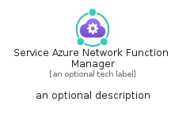
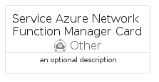
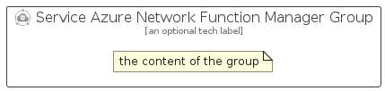

# ServiceAzureNetworkFunctionManager


```text
azure-20/Item/Other/ServiceAzureNetworkFunctionManager
```

```text
include('azure-20/Item/Other/ServiceAzureNetworkFunctionManager')
```


| Illustration | ServiceAzureNetworkFunctionManager | ServiceAzureNetworkFunctionManagerCard | ServiceAzureNetworkFunctionManagerGroup |
| :---: | :---: | :---: | :---: |
|  |  |  |  |


## Sprites
The item provides the following sriptes:

- `<$ServiceAzureNetworkFunctionManagerXs>`
- `<$ServiceAzureNetworkFunctionManagerSm>`
- `<$ServiceAzureNetworkFunctionManagerMd>`
- `<$ServiceAzureNetworkFunctionManagerLg>`


## ServiceAzureNetworkFunctionManager

### Load remotely
```plantuml
@startuml
' configures the library
!global $LIB_BASE_LOCATION="https://raw.githubusercontent.com/tmorin/plantuml-libs/master/distribution"

' loads the library's bootstrap
!include $LIB_BASE_LOCATION/bootstrap.puml

' loads the package bootstrap
include('azure-20/bootstrap')

' loads the Item which embeds the element ServiceAzureNetworkFunctionManager
include('azure-20/Item/Other/ServiceAzureNetworkFunctionManager')

' renders the element
ServiceAzureNetworkFunctionManager('ServiceAzureNetworkFunctionManager', 'Service Azure Network Function Manager', 'an optional tech label', 'an optional description')
@enduml
```

### Load locally
```plantuml
@startuml
' configures the library
!global $INCLUSION_MODE="local"
!global $LIB_BASE_LOCATION="../../.."

' loads the library's bootstrap
!include $LIB_BASE_LOCATION/bootstrap.puml

' loads the package bootstrap
include('azure-20/bootstrap')

' loads the Item which embeds the element ServiceAzureNetworkFunctionManager
include('azure-20/Item/Other/ServiceAzureNetworkFunctionManager')

' renders the element
ServiceAzureNetworkFunctionManager('ServiceAzureNetworkFunctionManager', 'Service Azure Network Function Manager', 'an optional tech label', 'an optional description')
@enduml
```

## ServiceAzureNetworkFunctionManagerCard

### Load remotely
```plantuml
@startuml
' configures the library
!global $LIB_BASE_LOCATION="https://raw.githubusercontent.com/tmorin/plantuml-libs/master/distribution"

' loads the library's bootstrap
!include $LIB_BASE_LOCATION/bootstrap.puml

' loads the package bootstrap
include('azure-20/bootstrap')

' loads the Item which embeds the element ServiceAzureNetworkFunctionManagerCard
include('azure-20/Item/Other/ServiceAzureNetworkFunctionManager')

' renders the element
ServiceAzureNetworkFunctionManagerCard('ServiceAzureNetworkFunctionManagerCard', 'Service Azure Network Function Manager Card', 'an optional description')
@enduml
```

### Load locally
```plantuml
@startuml
' configures the library
!global $INCLUSION_MODE="local"
!global $LIB_BASE_LOCATION="../../.."

' loads the library's bootstrap
!include $LIB_BASE_LOCATION/bootstrap.puml

' loads the package bootstrap
include('azure-20/bootstrap')

' loads the Item which embeds the element ServiceAzureNetworkFunctionManagerCard
include('azure-20/Item/Other/ServiceAzureNetworkFunctionManager')

' renders the element
ServiceAzureNetworkFunctionManagerCard('ServiceAzureNetworkFunctionManagerCard', 'Service Azure Network Function Manager Card', 'an optional description')
@enduml
```

## ServiceAzureNetworkFunctionManagerGroup

### Load remotely
```plantuml
@startuml
' configures the library
!global $LIB_BASE_LOCATION="https://raw.githubusercontent.com/tmorin/plantuml-libs/master/distribution"

' loads the library's bootstrap
!include $LIB_BASE_LOCATION/bootstrap.puml

' loads the package bootstrap
include('azure-20/bootstrap')

' loads the Item which embeds the element ServiceAzureNetworkFunctionManagerGroup
include('azure-20/Item/Other/ServiceAzureNetworkFunctionManager')

' renders the element
ServiceAzureNetworkFunctionManagerGroup('ServiceAzureNetworkFunctionManagerGroup', 'Service Azure Network Function Manager Group', 'an optional tech label') {
    note as note
        the content of the group
    end note
}
@enduml
```

### Load locally
```plantuml
@startuml
' configures the library
!global $INCLUSION_MODE="local"
!global $LIB_BASE_LOCATION="../../.."

' loads the library's bootstrap
!include $LIB_BASE_LOCATION/bootstrap.puml

' loads the package bootstrap
include('azure-20/bootstrap')

' loads the Item which embeds the element ServiceAzureNetworkFunctionManagerGroup
include('azure-20/Item/Other/ServiceAzureNetworkFunctionManager')

' renders the element
ServiceAzureNetworkFunctionManagerGroup('ServiceAzureNetworkFunctionManagerGroup', 'Service Azure Network Function Manager Group', 'an optional tech label') {
    note as note
        the content of the group
    end note
}
@enduml
```

