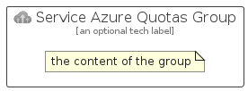

# ServiceAzureQuotas


```text
azure-20/Item/Other/ServiceAzureQuotas
```

```text
include('azure-20/Item/Other/ServiceAzureQuotas')
```


| Illustration | ServiceAzureQuotas | ServiceAzureQuotasCard | ServiceAzureQuotasGroup |
| :---: | :---: | :---: | :---: |
|  |  |  |  |


## Sprites
The item provides the following sriptes:

- `<$ServiceAzureQuotasXs>`
- `<$ServiceAzureQuotasSm>`
- `<$ServiceAzureQuotasMd>`
- `<$ServiceAzureQuotasLg>`


## ServiceAzureQuotas

### Load remotely
```plantuml
@startuml
' configures the library
!global $LIB_BASE_LOCATION="https://raw.githubusercontent.com/tmorin/plantuml-libs/master/distribution"

' loads the library's bootstrap
!include $LIB_BASE_LOCATION/bootstrap.puml

' loads the package bootstrap
include('azure-20/bootstrap')

' loads the Item which embeds the element ServiceAzureQuotas
include('azure-20/Item/Other/ServiceAzureQuotas')

' renders the element
ServiceAzureQuotas('ServiceAzureQuotas', 'Service Azure Quotas', 'an optional tech label', 'an optional description')
@enduml
```

### Load locally
```plantuml
@startuml
' configures the library
!global $INCLUSION_MODE="local"
!global $LIB_BASE_LOCATION="../../.."

' loads the library's bootstrap
!include $LIB_BASE_LOCATION/bootstrap.puml

' loads the package bootstrap
include('azure-20/bootstrap')

' loads the Item which embeds the element ServiceAzureQuotas
include('azure-20/Item/Other/ServiceAzureQuotas')

' renders the element
ServiceAzureQuotas('ServiceAzureQuotas', 'Service Azure Quotas', 'an optional tech label', 'an optional description')
@enduml
```

## ServiceAzureQuotasCard

### Load remotely
```plantuml
@startuml
' configures the library
!global $LIB_BASE_LOCATION="https://raw.githubusercontent.com/tmorin/plantuml-libs/master/distribution"

' loads the library's bootstrap
!include $LIB_BASE_LOCATION/bootstrap.puml

' loads the package bootstrap
include('azure-20/bootstrap')

' loads the Item which embeds the element ServiceAzureQuotasCard
include('azure-20/Item/Other/ServiceAzureQuotas')

' renders the element
ServiceAzureQuotasCard('ServiceAzureQuotasCard', 'Service Azure Quotas Card', 'an optional description')
@enduml
```

### Load locally
```plantuml
@startuml
' configures the library
!global $INCLUSION_MODE="local"
!global $LIB_BASE_LOCATION="../../.."

' loads the library's bootstrap
!include $LIB_BASE_LOCATION/bootstrap.puml

' loads the package bootstrap
include('azure-20/bootstrap')

' loads the Item which embeds the element ServiceAzureQuotasCard
include('azure-20/Item/Other/ServiceAzureQuotas')

' renders the element
ServiceAzureQuotasCard('ServiceAzureQuotasCard', 'Service Azure Quotas Card', 'an optional description')
@enduml
```

## ServiceAzureQuotasGroup

### Load remotely
```plantuml
@startuml
' configures the library
!global $LIB_BASE_LOCATION="https://raw.githubusercontent.com/tmorin/plantuml-libs/master/distribution"

' loads the library's bootstrap
!include $LIB_BASE_LOCATION/bootstrap.puml

' loads the package bootstrap
include('azure-20/bootstrap')

' loads the Item which embeds the element ServiceAzureQuotasGroup
include('azure-20/Item/Other/ServiceAzureQuotas')

' renders the element
ServiceAzureQuotasGroup('ServiceAzureQuotasGroup', 'Service Azure Quotas Group', 'an optional tech label') {
    note as note
        the content of the group
    end note
}
@enduml
```

### Load locally
```plantuml
@startuml
' configures the library
!global $INCLUSION_MODE="local"
!global $LIB_BASE_LOCATION="../../.."

' loads the library's bootstrap
!include $LIB_BASE_LOCATION/bootstrap.puml

' loads the package bootstrap
include('azure-20/bootstrap')

' loads the Item which embeds the element ServiceAzureQuotasGroup
include('azure-20/Item/Other/ServiceAzureQuotas')

' renders the element
ServiceAzureQuotasGroup('ServiceAzureQuotasGroup', 'Service Azure Quotas Group', 'an optional tech label') {
    note as note
        the content of the group
    end note
}
@enduml
```

