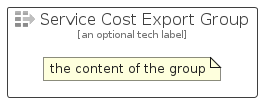

# ServiceCostExport


```text
azure-20/Item/Other/ServiceCostExport
```

```text
include('azure-20/Item/Other/ServiceCostExport')
```


| Illustration | ServiceCostExport | ServiceCostExportCard | ServiceCostExportGroup |
| :---: | :---: | :---: | :---: |
|  |  |  |  |


## Sprites
The item provides the following sriptes:

- `<$ServiceCostExportXs>`
- `<$ServiceCostExportSm>`
- `<$ServiceCostExportMd>`
- `<$ServiceCostExportLg>`


## ServiceCostExport

### Load remotely
```plantuml
@startuml
' configures the library
!global $LIB_BASE_LOCATION="https://raw.githubusercontent.com/tmorin/plantuml-libs/master/distribution"

' loads the library's bootstrap
!include $LIB_BASE_LOCATION/bootstrap.puml

' loads the package bootstrap
include('azure-20/bootstrap')

' loads the Item which embeds the element ServiceCostExport
include('azure-20/Item/Other/ServiceCostExport')

' renders the element
ServiceCostExport('ServiceCostExport', 'Service Cost Export', 'an optional tech label', 'an optional description')
@enduml
```

### Load locally
```plantuml
@startuml
' configures the library
!global $INCLUSION_MODE="local"
!global $LIB_BASE_LOCATION="../../.."

' loads the library's bootstrap
!include $LIB_BASE_LOCATION/bootstrap.puml

' loads the package bootstrap
include('azure-20/bootstrap')

' loads the Item which embeds the element ServiceCostExport
include('azure-20/Item/Other/ServiceCostExport')

' renders the element
ServiceCostExport('ServiceCostExport', 'Service Cost Export', 'an optional tech label', 'an optional description')
@enduml
```

## ServiceCostExportCard

### Load remotely
```plantuml
@startuml
' configures the library
!global $LIB_BASE_LOCATION="https://raw.githubusercontent.com/tmorin/plantuml-libs/master/distribution"

' loads the library's bootstrap
!include $LIB_BASE_LOCATION/bootstrap.puml

' loads the package bootstrap
include('azure-20/bootstrap')

' loads the Item which embeds the element ServiceCostExportCard
include('azure-20/Item/Other/ServiceCostExport')

' renders the element
ServiceCostExportCard('ServiceCostExportCard', 'Service Cost Export Card', 'an optional description')
@enduml
```

### Load locally
```plantuml
@startuml
' configures the library
!global $INCLUSION_MODE="local"
!global $LIB_BASE_LOCATION="../../.."

' loads the library's bootstrap
!include $LIB_BASE_LOCATION/bootstrap.puml

' loads the package bootstrap
include('azure-20/bootstrap')

' loads the Item which embeds the element ServiceCostExportCard
include('azure-20/Item/Other/ServiceCostExport')

' renders the element
ServiceCostExportCard('ServiceCostExportCard', 'Service Cost Export Card', 'an optional description')
@enduml
```

## ServiceCostExportGroup

### Load remotely
```plantuml
@startuml
' configures the library
!global $LIB_BASE_LOCATION="https://raw.githubusercontent.com/tmorin/plantuml-libs/master/distribution"

' loads the library's bootstrap
!include $LIB_BASE_LOCATION/bootstrap.puml

' loads the package bootstrap
include('azure-20/bootstrap')

' loads the Item which embeds the element ServiceCostExportGroup
include('azure-20/Item/Other/ServiceCostExport')

' renders the element
ServiceCostExportGroup('ServiceCostExportGroup', 'Service Cost Export Group', 'an optional tech label') {
    note as note
        the content of the group
    end note
}
@enduml
```

### Load locally
```plantuml
@startuml
' configures the library
!global $INCLUSION_MODE="local"
!global $LIB_BASE_LOCATION="../../.."

' loads the library's bootstrap
!include $LIB_BASE_LOCATION/bootstrap.puml

' loads the package bootstrap
include('azure-20/bootstrap')

' loads the Item which embeds the element ServiceCostExportGroup
include('azure-20/Item/Other/ServiceCostExport')

' renders the element
ServiceCostExportGroup('ServiceCostExportGroup', 'Service Cost Export Group', 'an optional tech label') {
    note as note
        the content of the group
    end note
}
@enduml
```

