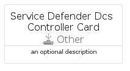
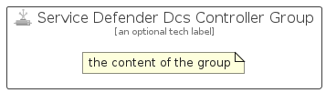

# ServiceDefenderDcsController


```text
azure-20/Item/Other/ServiceDefenderDcsController
```

```text
include('azure-20/Item/Other/ServiceDefenderDcsController')
```


| Illustration | ServiceDefenderDcsController | ServiceDefenderDcsControllerCard | ServiceDefenderDcsControllerGroup |
| :---: | :---: | :---: | :---: |
|  |  |  |  |


## Sprites
The item provides the following sriptes:

- `<$ServiceDefenderDcsControllerXs>`
- `<$ServiceDefenderDcsControllerSm>`
- `<$ServiceDefenderDcsControllerMd>`
- `<$ServiceDefenderDcsControllerLg>`


## ServiceDefenderDcsController

### Load remotely
```plantuml
@startuml
' configures the library
!global $LIB_BASE_LOCATION="https://raw.githubusercontent.com/tmorin/plantuml-libs/master/distribution"

' loads the library's bootstrap
!include $LIB_BASE_LOCATION/bootstrap.puml

' loads the package bootstrap
include('azure-20/bootstrap')

' loads the Item which embeds the element ServiceDefenderDcsController
include('azure-20/Item/Other/ServiceDefenderDcsController')

' renders the element
ServiceDefenderDcsController('ServiceDefenderDcsController', 'Service Defender Dcs Controller', 'an optional tech label', 'an optional description')
@enduml
```

### Load locally
```plantuml
@startuml
' configures the library
!global $INCLUSION_MODE="local"
!global $LIB_BASE_LOCATION="../../.."

' loads the library's bootstrap
!include $LIB_BASE_LOCATION/bootstrap.puml

' loads the package bootstrap
include('azure-20/bootstrap')

' loads the Item which embeds the element ServiceDefenderDcsController
include('azure-20/Item/Other/ServiceDefenderDcsController')

' renders the element
ServiceDefenderDcsController('ServiceDefenderDcsController', 'Service Defender Dcs Controller', 'an optional tech label', 'an optional description')
@enduml
```

## ServiceDefenderDcsControllerCard

### Load remotely
```plantuml
@startuml
' configures the library
!global $LIB_BASE_LOCATION="https://raw.githubusercontent.com/tmorin/plantuml-libs/master/distribution"

' loads the library's bootstrap
!include $LIB_BASE_LOCATION/bootstrap.puml

' loads the package bootstrap
include('azure-20/bootstrap')

' loads the Item which embeds the element ServiceDefenderDcsControllerCard
include('azure-20/Item/Other/ServiceDefenderDcsController')

' renders the element
ServiceDefenderDcsControllerCard('ServiceDefenderDcsControllerCard', 'Service Defender Dcs Controller Card', 'an optional description')
@enduml
```

### Load locally
```plantuml
@startuml
' configures the library
!global $INCLUSION_MODE="local"
!global $LIB_BASE_LOCATION="../../.."

' loads the library's bootstrap
!include $LIB_BASE_LOCATION/bootstrap.puml

' loads the package bootstrap
include('azure-20/bootstrap')

' loads the Item which embeds the element ServiceDefenderDcsControllerCard
include('azure-20/Item/Other/ServiceDefenderDcsController')

' renders the element
ServiceDefenderDcsControllerCard('ServiceDefenderDcsControllerCard', 'Service Defender Dcs Controller Card', 'an optional description')
@enduml
```

## ServiceDefenderDcsControllerGroup

### Load remotely
```plantuml
@startuml
' configures the library
!global $LIB_BASE_LOCATION="https://raw.githubusercontent.com/tmorin/plantuml-libs/master/distribution"

' loads the library's bootstrap
!include $LIB_BASE_LOCATION/bootstrap.puml

' loads the package bootstrap
include('azure-20/bootstrap')

' loads the Item which embeds the element ServiceDefenderDcsControllerGroup
include('azure-20/Item/Other/ServiceDefenderDcsController')

' renders the element
ServiceDefenderDcsControllerGroup('ServiceDefenderDcsControllerGroup', 'Service Defender Dcs Controller Group', 'an optional tech label') {
    note as note
        the content of the group
    end note
}
@enduml
```

### Load locally
```plantuml
@startuml
' configures the library
!global $INCLUSION_MODE="local"
!global $LIB_BASE_LOCATION="../../.."

' loads the library's bootstrap
!include $LIB_BASE_LOCATION/bootstrap.puml

' loads the package bootstrap
include('azure-20/bootstrap')

' loads the Item which embeds the element ServiceDefenderDcsControllerGroup
include('azure-20/Item/Other/ServiceDefenderDcsController')

' renders the element
ServiceDefenderDcsControllerGroup('ServiceDefenderDcsControllerGroup', 'Service Defender Dcs Controller Group', 'an optional tech label') {
    note as note
        the content of the group
    end note
}
@enduml
```

