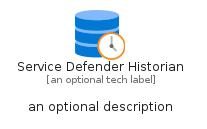

# ServiceDefenderHistorian


```text
azure-20/Item/Other/ServiceDefenderHistorian
```

```text
include('azure-20/Item/Other/ServiceDefenderHistorian')
```


| Illustration | ServiceDefenderHistorian | ServiceDefenderHistorianCard | ServiceDefenderHistorianGroup |
| :---: | :---: | :---: | :---: |
|  |  |  |  |


## Sprites
The item provides the following sriptes:

- `<$ServiceDefenderHistorianXs>`
- `<$ServiceDefenderHistorianSm>`
- `<$ServiceDefenderHistorianMd>`
- `<$ServiceDefenderHistorianLg>`


## ServiceDefenderHistorian

### Load remotely
```plantuml
@startuml
' configures the library
!global $LIB_BASE_LOCATION="https://raw.githubusercontent.com/tmorin/plantuml-libs/master/distribution"

' loads the library's bootstrap
!include $LIB_BASE_LOCATION/bootstrap.puml

' loads the package bootstrap
include('azure-20/bootstrap')

' loads the Item which embeds the element ServiceDefenderHistorian
include('azure-20/Item/Other/ServiceDefenderHistorian')

' renders the element
ServiceDefenderHistorian('ServiceDefenderHistorian', 'Service Defender Historian', 'an optional tech label', 'an optional description')
@enduml
```

### Load locally
```plantuml
@startuml
' configures the library
!global $INCLUSION_MODE="local"
!global $LIB_BASE_LOCATION="../../.."

' loads the library's bootstrap
!include $LIB_BASE_LOCATION/bootstrap.puml

' loads the package bootstrap
include('azure-20/bootstrap')

' loads the Item which embeds the element ServiceDefenderHistorian
include('azure-20/Item/Other/ServiceDefenderHistorian')

' renders the element
ServiceDefenderHistorian('ServiceDefenderHistorian', 'Service Defender Historian', 'an optional tech label', 'an optional description')
@enduml
```

## ServiceDefenderHistorianCard

### Load remotely
```plantuml
@startuml
' configures the library
!global $LIB_BASE_LOCATION="https://raw.githubusercontent.com/tmorin/plantuml-libs/master/distribution"

' loads the library's bootstrap
!include $LIB_BASE_LOCATION/bootstrap.puml

' loads the package bootstrap
include('azure-20/bootstrap')

' loads the Item which embeds the element ServiceDefenderHistorianCard
include('azure-20/Item/Other/ServiceDefenderHistorian')

' renders the element
ServiceDefenderHistorianCard('ServiceDefenderHistorianCard', 'Service Defender Historian Card', 'an optional description')
@enduml
```

### Load locally
```plantuml
@startuml
' configures the library
!global $INCLUSION_MODE="local"
!global $LIB_BASE_LOCATION="../../.."

' loads the library's bootstrap
!include $LIB_BASE_LOCATION/bootstrap.puml

' loads the package bootstrap
include('azure-20/bootstrap')

' loads the Item which embeds the element ServiceDefenderHistorianCard
include('azure-20/Item/Other/ServiceDefenderHistorian')

' renders the element
ServiceDefenderHistorianCard('ServiceDefenderHistorianCard', 'Service Defender Historian Card', 'an optional description')
@enduml
```

## ServiceDefenderHistorianGroup

### Load remotely
```plantuml
@startuml
' configures the library
!global $LIB_BASE_LOCATION="https://raw.githubusercontent.com/tmorin/plantuml-libs/master/distribution"

' loads the library's bootstrap
!include $LIB_BASE_LOCATION/bootstrap.puml

' loads the package bootstrap
include('azure-20/bootstrap')

' loads the Item which embeds the element ServiceDefenderHistorianGroup
include('azure-20/Item/Other/ServiceDefenderHistorian')

' renders the element
ServiceDefenderHistorianGroup('ServiceDefenderHistorianGroup', 'Service Defender Historian Group', 'an optional tech label') {
    note as note
        the content of the group
    end note
}
@enduml
```

### Load locally
```plantuml
@startuml
' configures the library
!global $INCLUSION_MODE="local"
!global $LIB_BASE_LOCATION="../../.."

' loads the library's bootstrap
!include $LIB_BASE_LOCATION/bootstrap.puml

' loads the package bootstrap
include('azure-20/bootstrap')

' loads the Item which embeds the element ServiceDefenderHistorianGroup
include('azure-20/Item/Other/ServiceDefenderHistorian')

' renders the element
ServiceDefenderHistorianGroup('ServiceDefenderHistorianGroup', 'Service Defender Historian Group', 'an optional tech label') {
    note as note
        the content of the group
    end note
}
@enduml
```

