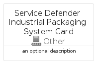

# ServiceDefenderIndustrialPackagingSystem


```text
azure-20/Item/Other/ServiceDefenderIndustrialPackagingSystem
```

```text
include('azure-20/Item/Other/ServiceDefenderIndustrialPackagingSystem')
```


| Illustration | ServiceDefenderIndustrialPackagingSystem | ServiceDefenderIndustrialPackagingSystemCard | ServiceDefenderIndustrialPackagingSystemGroup |
| :---: | :---: | :---: | :---: |
|  |  |  |  |


## Sprites
The item provides the following sriptes:

- `<$ServiceDefenderIndustrialPackagingSystemXs>`
- `<$ServiceDefenderIndustrialPackagingSystemSm>`
- `<$ServiceDefenderIndustrialPackagingSystemMd>`
- `<$ServiceDefenderIndustrialPackagingSystemLg>`


## ServiceDefenderIndustrialPackagingSystem

### Load remotely
```plantuml
@startuml
' configures the library
!global $LIB_BASE_LOCATION="https://raw.githubusercontent.com/tmorin/plantuml-libs/master/distribution"

' loads the library's bootstrap
!include $LIB_BASE_LOCATION/bootstrap.puml

' loads the package bootstrap
include('azure-20/bootstrap')

' loads the Item which embeds the element ServiceDefenderIndustrialPackagingSystem
include('azure-20/Item/Other/ServiceDefenderIndustrialPackagingSystem')

' renders the element
ServiceDefenderIndustrialPackagingSystem('ServiceDefenderIndustrialPackagingSystem', 'Service Defender Industrial Packaging System', 'an optional tech label', 'an optional description')
@enduml
```

### Load locally
```plantuml
@startuml
' configures the library
!global $INCLUSION_MODE="local"
!global $LIB_BASE_LOCATION="../../.."

' loads the library's bootstrap
!include $LIB_BASE_LOCATION/bootstrap.puml

' loads the package bootstrap
include('azure-20/bootstrap')

' loads the Item which embeds the element ServiceDefenderIndustrialPackagingSystem
include('azure-20/Item/Other/ServiceDefenderIndustrialPackagingSystem')

' renders the element
ServiceDefenderIndustrialPackagingSystem('ServiceDefenderIndustrialPackagingSystem', 'Service Defender Industrial Packaging System', 'an optional tech label', 'an optional description')
@enduml
```

## ServiceDefenderIndustrialPackagingSystemCard

### Load remotely
```plantuml
@startuml
' configures the library
!global $LIB_BASE_LOCATION="https://raw.githubusercontent.com/tmorin/plantuml-libs/master/distribution"

' loads the library's bootstrap
!include $LIB_BASE_LOCATION/bootstrap.puml

' loads the package bootstrap
include('azure-20/bootstrap')

' loads the Item which embeds the element ServiceDefenderIndustrialPackagingSystemCard
include('azure-20/Item/Other/ServiceDefenderIndustrialPackagingSystem')

' renders the element
ServiceDefenderIndustrialPackagingSystemCard('ServiceDefenderIndustrialPackagingSystemCard', 'Service Defender Industrial Packaging System Card', 'an optional description')
@enduml
```

### Load locally
```plantuml
@startuml
' configures the library
!global $INCLUSION_MODE="local"
!global $LIB_BASE_LOCATION="../../.."

' loads the library's bootstrap
!include $LIB_BASE_LOCATION/bootstrap.puml

' loads the package bootstrap
include('azure-20/bootstrap')

' loads the Item which embeds the element ServiceDefenderIndustrialPackagingSystemCard
include('azure-20/Item/Other/ServiceDefenderIndustrialPackagingSystem')

' renders the element
ServiceDefenderIndustrialPackagingSystemCard('ServiceDefenderIndustrialPackagingSystemCard', 'Service Defender Industrial Packaging System Card', 'an optional description')
@enduml
```

## ServiceDefenderIndustrialPackagingSystemGroup

### Load remotely
```plantuml
@startuml
' configures the library
!global $LIB_BASE_LOCATION="https://raw.githubusercontent.com/tmorin/plantuml-libs/master/distribution"

' loads the library's bootstrap
!include $LIB_BASE_LOCATION/bootstrap.puml

' loads the package bootstrap
include('azure-20/bootstrap')

' loads the Item which embeds the element ServiceDefenderIndustrialPackagingSystemGroup
include('azure-20/Item/Other/ServiceDefenderIndustrialPackagingSystem')

' renders the element
ServiceDefenderIndustrialPackagingSystemGroup('ServiceDefenderIndustrialPackagingSystemGroup', 'Service Defender Industrial Packaging System Group', 'an optional tech label') {
    note as note
        the content of the group
    end note
}
@enduml
```

### Load locally
```plantuml
@startuml
' configures the library
!global $INCLUSION_MODE="local"
!global $LIB_BASE_LOCATION="../../.."

' loads the library's bootstrap
!include $LIB_BASE_LOCATION/bootstrap.puml

' loads the package bootstrap
include('azure-20/bootstrap')

' loads the Item which embeds the element ServiceDefenderIndustrialPackagingSystemGroup
include('azure-20/Item/Other/ServiceDefenderIndustrialPackagingSystem')

' renders the element
ServiceDefenderIndustrialPackagingSystemGroup('ServiceDefenderIndustrialPackagingSystemGroup', 'Service Defender Industrial Packaging System Group', 'an optional tech label') {
    note as note
        the content of the group
    end note
}
@enduml
```

