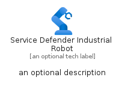
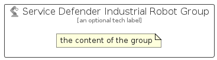

# ServiceDefenderIndustrialRobot


```text
azure-20/Item/Other/ServiceDefenderIndustrialRobot
```

```text
include('azure-20/Item/Other/ServiceDefenderIndustrialRobot')
```


| Illustration | ServiceDefenderIndustrialRobot | ServiceDefenderIndustrialRobotCard | ServiceDefenderIndustrialRobotGroup |
| :---: | :---: | :---: | :---: |
|  |  |  |  |


## Sprites
The item provides the following sriptes:

- `<$ServiceDefenderIndustrialRobotXs>`
- `<$ServiceDefenderIndustrialRobotSm>`
- `<$ServiceDefenderIndustrialRobotMd>`
- `<$ServiceDefenderIndustrialRobotLg>`


## ServiceDefenderIndustrialRobot

### Load remotely
```plantuml
@startuml
' configures the library
!global $LIB_BASE_LOCATION="https://raw.githubusercontent.com/tmorin/plantuml-libs/master/distribution"

' loads the library's bootstrap
!include $LIB_BASE_LOCATION/bootstrap.puml

' loads the package bootstrap
include('azure-20/bootstrap')

' loads the Item which embeds the element ServiceDefenderIndustrialRobot
include('azure-20/Item/Other/ServiceDefenderIndustrialRobot')

' renders the element
ServiceDefenderIndustrialRobot('ServiceDefenderIndustrialRobot', 'Service Defender Industrial Robot', 'an optional tech label', 'an optional description')
@enduml
```

### Load locally
```plantuml
@startuml
' configures the library
!global $INCLUSION_MODE="local"
!global $LIB_BASE_LOCATION="../../.."

' loads the library's bootstrap
!include $LIB_BASE_LOCATION/bootstrap.puml

' loads the package bootstrap
include('azure-20/bootstrap')

' loads the Item which embeds the element ServiceDefenderIndustrialRobot
include('azure-20/Item/Other/ServiceDefenderIndustrialRobot')

' renders the element
ServiceDefenderIndustrialRobot('ServiceDefenderIndustrialRobot', 'Service Defender Industrial Robot', 'an optional tech label', 'an optional description')
@enduml
```

## ServiceDefenderIndustrialRobotCard

### Load remotely
```plantuml
@startuml
' configures the library
!global $LIB_BASE_LOCATION="https://raw.githubusercontent.com/tmorin/plantuml-libs/master/distribution"

' loads the library's bootstrap
!include $LIB_BASE_LOCATION/bootstrap.puml

' loads the package bootstrap
include('azure-20/bootstrap')

' loads the Item which embeds the element ServiceDefenderIndustrialRobotCard
include('azure-20/Item/Other/ServiceDefenderIndustrialRobot')

' renders the element
ServiceDefenderIndustrialRobotCard('ServiceDefenderIndustrialRobotCard', 'Service Defender Industrial Robot Card', 'an optional description')
@enduml
```

### Load locally
```plantuml
@startuml
' configures the library
!global $INCLUSION_MODE="local"
!global $LIB_BASE_LOCATION="../../.."

' loads the library's bootstrap
!include $LIB_BASE_LOCATION/bootstrap.puml

' loads the package bootstrap
include('azure-20/bootstrap')

' loads the Item which embeds the element ServiceDefenderIndustrialRobotCard
include('azure-20/Item/Other/ServiceDefenderIndustrialRobot')

' renders the element
ServiceDefenderIndustrialRobotCard('ServiceDefenderIndustrialRobotCard', 'Service Defender Industrial Robot Card', 'an optional description')
@enduml
```

## ServiceDefenderIndustrialRobotGroup

### Load remotely
```plantuml
@startuml
' configures the library
!global $LIB_BASE_LOCATION="https://raw.githubusercontent.com/tmorin/plantuml-libs/master/distribution"

' loads the library's bootstrap
!include $LIB_BASE_LOCATION/bootstrap.puml

' loads the package bootstrap
include('azure-20/bootstrap')

' loads the Item which embeds the element ServiceDefenderIndustrialRobotGroup
include('azure-20/Item/Other/ServiceDefenderIndustrialRobot')

' renders the element
ServiceDefenderIndustrialRobotGroup('ServiceDefenderIndustrialRobotGroup', 'Service Defender Industrial Robot Group', 'an optional tech label') {
    note as note
        the content of the group
    end note
}
@enduml
```

### Load locally
```plantuml
@startuml
' configures the library
!global $INCLUSION_MODE="local"
!global $LIB_BASE_LOCATION="../../.."

' loads the library's bootstrap
!include $LIB_BASE_LOCATION/bootstrap.puml

' loads the package bootstrap
include('azure-20/bootstrap')

' loads the Item which embeds the element ServiceDefenderIndustrialRobotGroup
include('azure-20/Item/Other/ServiceDefenderIndustrialRobot')

' renders the element
ServiceDefenderIndustrialRobotGroup('ServiceDefenderIndustrialRobotGroup', 'Service Defender Industrial Robot Group', 'an optional tech label') {
    note as note
        the content of the group
    end note
}
@enduml
```

