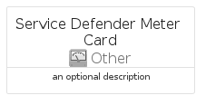

# ServiceDefenderMeter


```text
azure-20/Item/Other/ServiceDefenderMeter
```

```text
include('azure-20/Item/Other/ServiceDefenderMeter')
```


| Illustration | ServiceDefenderMeter | ServiceDefenderMeterCard | ServiceDefenderMeterGroup |
| :---: | :---: | :---: | :---: |
|  |  |  |  |


## Sprites
The item provides the following sriptes:

- `<$ServiceDefenderMeterXs>`
- `<$ServiceDefenderMeterSm>`
- `<$ServiceDefenderMeterMd>`
- `<$ServiceDefenderMeterLg>`


## ServiceDefenderMeter

### Load remotely
```plantuml
@startuml
' configures the library
!global $LIB_BASE_LOCATION="https://raw.githubusercontent.com/tmorin/plantuml-libs/master/distribution"

' loads the library's bootstrap
!include $LIB_BASE_LOCATION/bootstrap.puml

' loads the package bootstrap
include('azure-20/bootstrap')

' loads the Item which embeds the element ServiceDefenderMeter
include('azure-20/Item/Other/ServiceDefenderMeter')

' renders the element
ServiceDefenderMeter('ServiceDefenderMeter', 'Service Defender Meter', 'an optional tech label', 'an optional description')
@enduml
```

### Load locally
```plantuml
@startuml
' configures the library
!global $INCLUSION_MODE="local"
!global $LIB_BASE_LOCATION="../../.."

' loads the library's bootstrap
!include $LIB_BASE_LOCATION/bootstrap.puml

' loads the package bootstrap
include('azure-20/bootstrap')

' loads the Item which embeds the element ServiceDefenderMeter
include('azure-20/Item/Other/ServiceDefenderMeter')

' renders the element
ServiceDefenderMeter('ServiceDefenderMeter', 'Service Defender Meter', 'an optional tech label', 'an optional description')
@enduml
```

## ServiceDefenderMeterCard

### Load remotely
```plantuml
@startuml
' configures the library
!global $LIB_BASE_LOCATION="https://raw.githubusercontent.com/tmorin/plantuml-libs/master/distribution"

' loads the library's bootstrap
!include $LIB_BASE_LOCATION/bootstrap.puml

' loads the package bootstrap
include('azure-20/bootstrap')

' loads the Item which embeds the element ServiceDefenderMeterCard
include('azure-20/Item/Other/ServiceDefenderMeter')

' renders the element
ServiceDefenderMeterCard('ServiceDefenderMeterCard', 'Service Defender Meter Card', 'an optional description')
@enduml
```

### Load locally
```plantuml
@startuml
' configures the library
!global $INCLUSION_MODE="local"
!global $LIB_BASE_LOCATION="../../.."

' loads the library's bootstrap
!include $LIB_BASE_LOCATION/bootstrap.puml

' loads the package bootstrap
include('azure-20/bootstrap')

' loads the Item which embeds the element ServiceDefenderMeterCard
include('azure-20/Item/Other/ServiceDefenderMeter')

' renders the element
ServiceDefenderMeterCard('ServiceDefenderMeterCard', 'Service Defender Meter Card', 'an optional description')
@enduml
```

## ServiceDefenderMeterGroup

### Load remotely
```plantuml
@startuml
' configures the library
!global $LIB_BASE_LOCATION="https://raw.githubusercontent.com/tmorin/plantuml-libs/master/distribution"

' loads the library's bootstrap
!include $LIB_BASE_LOCATION/bootstrap.puml

' loads the package bootstrap
include('azure-20/bootstrap')

' loads the Item which embeds the element ServiceDefenderMeterGroup
include('azure-20/Item/Other/ServiceDefenderMeter')

' renders the element
ServiceDefenderMeterGroup('ServiceDefenderMeterGroup', 'Service Defender Meter Group', 'an optional tech label') {
    note as note
        the content of the group
    end note
}
@enduml
```

### Load locally
```plantuml
@startuml
' configures the library
!global $INCLUSION_MODE="local"
!global $LIB_BASE_LOCATION="../../.."

' loads the library's bootstrap
!include $LIB_BASE_LOCATION/bootstrap.puml

' loads the package bootstrap
include('azure-20/bootstrap')

' loads the Item which embeds the element ServiceDefenderMeterGroup
include('azure-20/Item/Other/ServiceDefenderMeter')

' renders the element
ServiceDefenderMeterGroup('ServiceDefenderMeterGroup', 'Service Defender Meter Group', 'an optional tech label') {
    note as note
        the content of the group
    end note
}
@enduml
```

