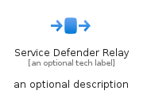
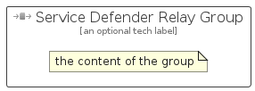

# ServiceDefenderRelay


```text
azure-20/Item/Other/ServiceDefenderRelay
```

```text
include('azure-20/Item/Other/ServiceDefenderRelay')
```


| Illustration | ServiceDefenderRelay | ServiceDefenderRelayCard | ServiceDefenderRelayGroup |
| :---: | :---: | :---: | :---: |
|  |  |  |  |


## Sprites
The item provides the following sriptes:

- `<$ServiceDefenderRelayXs>`
- `<$ServiceDefenderRelaySm>`
- `<$ServiceDefenderRelayMd>`
- `<$ServiceDefenderRelayLg>`


## ServiceDefenderRelay

### Load remotely
```plantuml
@startuml
' configures the library
!global $LIB_BASE_LOCATION="https://raw.githubusercontent.com/tmorin/plantuml-libs/master/distribution"

' loads the library's bootstrap
!include $LIB_BASE_LOCATION/bootstrap.puml

' loads the package bootstrap
include('azure-20/bootstrap')

' loads the Item which embeds the element ServiceDefenderRelay
include('azure-20/Item/Other/ServiceDefenderRelay')

' renders the element
ServiceDefenderRelay('ServiceDefenderRelay', 'Service Defender Relay', 'an optional tech label', 'an optional description')
@enduml
```

### Load locally
```plantuml
@startuml
' configures the library
!global $INCLUSION_MODE="local"
!global $LIB_BASE_LOCATION="../../.."

' loads the library's bootstrap
!include $LIB_BASE_LOCATION/bootstrap.puml

' loads the package bootstrap
include('azure-20/bootstrap')

' loads the Item which embeds the element ServiceDefenderRelay
include('azure-20/Item/Other/ServiceDefenderRelay')

' renders the element
ServiceDefenderRelay('ServiceDefenderRelay', 'Service Defender Relay', 'an optional tech label', 'an optional description')
@enduml
```

## ServiceDefenderRelayCard

### Load remotely
```plantuml
@startuml
' configures the library
!global $LIB_BASE_LOCATION="https://raw.githubusercontent.com/tmorin/plantuml-libs/master/distribution"

' loads the library's bootstrap
!include $LIB_BASE_LOCATION/bootstrap.puml

' loads the package bootstrap
include('azure-20/bootstrap')

' loads the Item which embeds the element ServiceDefenderRelayCard
include('azure-20/Item/Other/ServiceDefenderRelay')

' renders the element
ServiceDefenderRelayCard('ServiceDefenderRelayCard', 'Service Defender Relay Card', 'an optional description')
@enduml
```

### Load locally
```plantuml
@startuml
' configures the library
!global $INCLUSION_MODE="local"
!global $LIB_BASE_LOCATION="../../.."

' loads the library's bootstrap
!include $LIB_BASE_LOCATION/bootstrap.puml

' loads the package bootstrap
include('azure-20/bootstrap')

' loads the Item which embeds the element ServiceDefenderRelayCard
include('azure-20/Item/Other/ServiceDefenderRelay')

' renders the element
ServiceDefenderRelayCard('ServiceDefenderRelayCard', 'Service Defender Relay Card', 'an optional description')
@enduml
```

## ServiceDefenderRelayGroup

### Load remotely
```plantuml
@startuml
' configures the library
!global $LIB_BASE_LOCATION="https://raw.githubusercontent.com/tmorin/plantuml-libs/master/distribution"

' loads the library's bootstrap
!include $LIB_BASE_LOCATION/bootstrap.puml

' loads the package bootstrap
include('azure-20/bootstrap')

' loads the Item which embeds the element ServiceDefenderRelayGroup
include('azure-20/Item/Other/ServiceDefenderRelay')

' renders the element
ServiceDefenderRelayGroup('ServiceDefenderRelayGroup', 'Service Defender Relay Group', 'an optional tech label') {
    note as note
        the content of the group
    end note
}
@enduml
```

### Load locally
```plantuml
@startuml
' configures the library
!global $INCLUSION_MODE="local"
!global $LIB_BASE_LOCATION="../../.."

' loads the library's bootstrap
!include $LIB_BASE_LOCATION/bootstrap.puml

' loads the package bootstrap
include('azure-20/bootstrap')

' loads the Item which embeds the element ServiceDefenderRelayGroup
include('azure-20/Item/Other/ServiceDefenderRelay')

' renders the element
ServiceDefenderRelayGroup('ServiceDefenderRelayGroup', 'Service Defender Relay Group', 'an optional tech label') {
    note as note
        the content of the group
    end note
}
@enduml
```

