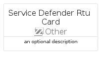

# ServiceDefenderRtu


```text
azure-20/Item/Other/ServiceDefenderRtu
```

```text
include('azure-20/Item/Other/ServiceDefenderRtu')
```


| Illustration | ServiceDefenderRtu | ServiceDefenderRtuCard | ServiceDefenderRtuGroup |
| :---: | :---: | :---: | :---: |
|  |  |  |  |


## Sprites
The item provides the following sriptes:

- `<$ServiceDefenderRtuXs>`
- `<$ServiceDefenderRtuSm>`
- `<$ServiceDefenderRtuMd>`
- `<$ServiceDefenderRtuLg>`


## ServiceDefenderRtu

### Load remotely
```plantuml
@startuml
' configures the library
!global $LIB_BASE_LOCATION="https://raw.githubusercontent.com/tmorin/plantuml-libs/master/distribution"

' loads the library's bootstrap
!include $LIB_BASE_LOCATION/bootstrap.puml

' loads the package bootstrap
include('azure-20/bootstrap')

' loads the Item which embeds the element ServiceDefenderRtu
include('azure-20/Item/Other/ServiceDefenderRtu')

' renders the element
ServiceDefenderRtu('ServiceDefenderRtu', 'Service Defender Rtu', 'an optional tech label', 'an optional description')
@enduml
```

### Load locally
```plantuml
@startuml
' configures the library
!global $INCLUSION_MODE="local"
!global $LIB_BASE_LOCATION="../../.."

' loads the library's bootstrap
!include $LIB_BASE_LOCATION/bootstrap.puml

' loads the package bootstrap
include('azure-20/bootstrap')

' loads the Item which embeds the element ServiceDefenderRtu
include('azure-20/Item/Other/ServiceDefenderRtu')

' renders the element
ServiceDefenderRtu('ServiceDefenderRtu', 'Service Defender Rtu', 'an optional tech label', 'an optional description')
@enduml
```

## ServiceDefenderRtuCard

### Load remotely
```plantuml
@startuml
' configures the library
!global $LIB_BASE_LOCATION="https://raw.githubusercontent.com/tmorin/plantuml-libs/master/distribution"

' loads the library's bootstrap
!include $LIB_BASE_LOCATION/bootstrap.puml

' loads the package bootstrap
include('azure-20/bootstrap')

' loads the Item which embeds the element ServiceDefenderRtuCard
include('azure-20/Item/Other/ServiceDefenderRtu')

' renders the element
ServiceDefenderRtuCard('ServiceDefenderRtuCard', 'Service Defender Rtu Card', 'an optional description')
@enduml
```

### Load locally
```plantuml
@startuml
' configures the library
!global $INCLUSION_MODE="local"
!global $LIB_BASE_LOCATION="../../.."

' loads the library's bootstrap
!include $LIB_BASE_LOCATION/bootstrap.puml

' loads the package bootstrap
include('azure-20/bootstrap')

' loads the Item which embeds the element ServiceDefenderRtuCard
include('azure-20/Item/Other/ServiceDefenderRtu')

' renders the element
ServiceDefenderRtuCard('ServiceDefenderRtuCard', 'Service Defender Rtu Card', 'an optional description')
@enduml
```

## ServiceDefenderRtuGroup

### Load remotely
```plantuml
@startuml
' configures the library
!global $LIB_BASE_LOCATION="https://raw.githubusercontent.com/tmorin/plantuml-libs/master/distribution"

' loads the library's bootstrap
!include $LIB_BASE_LOCATION/bootstrap.puml

' loads the package bootstrap
include('azure-20/bootstrap')

' loads the Item which embeds the element ServiceDefenderRtuGroup
include('azure-20/Item/Other/ServiceDefenderRtu')

' renders the element
ServiceDefenderRtuGroup('ServiceDefenderRtuGroup', 'Service Defender Rtu Group', 'an optional tech label') {
    note as note
        the content of the group
    end note
}
@enduml
```

### Load locally
```plantuml
@startuml
' configures the library
!global $INCLUSION_MODE="local"
!global $LIB_BASE_LOCATION="../../.."

' loads the library's bootstrap
!include $LIB_BASE_LOCATION/bootstrap.puml

' loads the package bootstrap
include('azure-20/bootstrap')

' loads the Item which embeds the element ServiceDefenderRtuGroup
include('azure-20/Item/Other/ServiceDefenderRtu')

' renders the element
ServiceDefenderRtuGroup('ServiceDefenderRtuGroup', 'Service Defender Rtu Group', 'an optional tech label') {
    note as note
        the content of the group
    end note
}
@enduml
```

