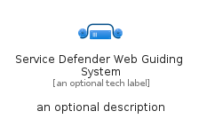

# ServiceDefenderWebGuidingSystem


```text
azure-20/Item/Other/ServiceDefenderWebGuidingSystem
```

```text
include('azure-20/Item/Other/ServiceDefenderWebGuidingSystem')
```


| Illustration | ServiceDefenderWebGuidingSystem | ServiceDefenderWebGuidingSystemCard | ServiceDefenderWebGuidingSystemGroup |
| :---: | :---: | :---: | :---: |
|  |  |  |  |


## Sprites
The item provides the following sriptes:

- `<$ServiceDefenderWebGuidingSystemXs>`
- `<$ServiceDefenderWebGuidingSystemSm>`
- `<$ServiceDefenderWebGuidingSystemMd>`
- `<$ServiceDefenderWebGuidingSystemLg>`


## ServiceDefenderWebGuidingSystem

### Load remotely
```plantuml
@startuml
' configures the library
!global $LIB_BASE_LOCATION="https://raw.githubusercontent.com/tmorin/plantuml-libs/master/distribution"

' loads the library's bootstrap
!include $LIB_BASE_LOCATION/bootstrap.puml

' loads the package bootstrap
include('azure-20/bootstrap')

' loads the Item which embeds the element ServiceDefenderWebGuidingSystem
include('azure-20/Item/Other/ServiceDefenderWebGuidingSystem')

' renders the element
ServiceDefenderWebGuidingSystem('ServiceDefenderWebGuidingSystem', 'Service Defender Web Guiding System', 'an optional tech label', 'an optional description')
@enduml
```

### Load locally
```plantuml
@startuml
' configures the library
!global $INCLUSION_MODE="local"
!global $LIB_BASE_LOCATION="../../.."

' loads the library's bootstrap
!include $LIB_BASE_LOCATION/bootstrap.puml

' loads the package bootstrap
include('azure-20/bootstrap')

' loads the Item which embeds the element ServiceDefenderWebGuidingSystem
include('azure-20/Item/Other/ServiceDefenderWebGuidingSystem')

' renders the element
ServiceDefenderWebGuidingSystem('ServiceDefenderWebGuidingSystem', 'Service Defender Web Guiding System', 'an optional tech label', 'an optional description')
@enduml
```

## ServiceDefenderWebGuidingSystemCard

### Load remotely
```plantuml
@startuml
' configures the library
!global $LIB_BASE_LOCATION="https://raw.githubusercontent.com/tmorin/plantuml-libs/master/distribution"

' loads the library's bootstrap
!include $LIB_BASE_LOCATION/bootstrap.puml

' loads the package bootstrap
include('azure-20/bootstrap')

' loads the Item which embeds the element ServiceDefenderWebGuidingSystemCard
include('azure-20/Item/Other/ServiceDefenderWebGuidingSystem')

' renders the element
ServiceDefenderWebGuidingSystemCard('ServiceDefenderWebGuidingSystemCard', 'Service Defender Web Guiding System Card', 'an optional description')
@enduml
```

### Load locally
```plantuml
@startuml
' configures the library
!global $INCLUSION_MODE="local"
!global $LIB_BASE_LOCATION="../../.."

' loads the library's bootstrap
!include $LIB_BASE_LOCATION/bootstrap.puml

' loads the package bootstrap
include('azure-20/bootstrap')

' loads the Item which embeds the element ServiceDefenderWebGuidingSystemCard
include('azure-20/Item/Other/ServiceDefenderWebGuidingSystem')

' renders the element
ServiceDefenderWebGuidingSystemCard('ServiceDefenderWebGuidingSystemCard', 'Service Defender Web Guiding System Card', 'an optional description')
@enduml
```

## ServiceDefenderWebGuidingSystemGroup

### Load remotely
```plantuml
@startuml
' configures the library
!global $LIB_BASE_LOCATION="https://raw.githubusercontent.com/tmorin/plantuml-libs/master/distribution"

' loads the library's bootstrap
!include $LIB_BASE_LOCATION/bootstrap.puml

' loads the package bootstrap
include('azure-20/bootstrap')

' loads the Item which embeds the element ServiceDefenderWebGuidingSystemGroup
include('azure-20/Item/Other/ServiceDefenderWebGuidingSystem')

' renders the element
ServiceDefenderWebGuidingSystemGroup('ServiceDefenderWebGuidingSystemGroup', 'Service Defender Web Guiding System Group', 'an optional tech label') {
    note as note
        the content of the group
    end note
}
@enduml
```

### Load locally
```plantuml
@startuml
' configures the library
!global $INCLUSION_MODE="local"
!global $LIB_BASE_LOCATION="../../.."

' loads the library's bootstrap
!include $LIB_BASE_LOCATION/bootstrap.puml

' loads the package bootstrap
include('azure-20/bootstrap')

' loads the Item which embeds the element ServiceDefenderWebGuidingSystemGroup
include('azure-20/Item/Other/ServiceDefenderWebGuidingSystem')

' renders the element
ServiceDefenderWebGuidingSystemGroup('ServiceDefenderWebGuidingSystemGroup', 'Service Defender Web Guiding System Group', 'an optional tech label') {
    note as note
        the content of the group
    end note
}
@enduml
```

