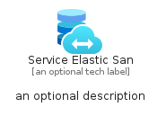

# ServiceElasticSan


```text
azure-20/Item/Other/ServiceElasticSan
```

```text
include('azure-20/Item/Other/ServiceElasticSan')
```


| Illustration | ServiceElasticSan | ServiceElasticSanCard | ServiceElasticSanGroup |
| :---: | :---: | :---: | :---: |
|  |  |  |  |


## Sprites
The item provides the following sriptes:

- `<$ServiceElasticSanXs>`
- `<$ServiceElasticSanSm>`
- `<$ServiceElasticSanMd>`
- `<$ServiceElasticSanLg>`


## ServiceElasticSan

### Load remotely
```plantuml
@startuml
' configures the library
!global $LIB_BASE_LOCATION="https://raw.githubusercontent.com/tmorin/plantuml-libs/master/distribution"

' loads the library's bootstrap
!include $LIB_BASE_LOCATION/bootstrap.puml

' loads the package bootstrap
include('azure-20/bootstrap')

' loads the Item which embeds the element ServiceElasticSan
include('azure-20/Item/Other/ServiceElasticSan')

' renders the element
ServiceElasticSan('ServiceElasticSan', 'Service Elastic San', 'an optional tech label', 'an optional description')
@enduml
```

### Load locally
```plantuml
@startuml
' configures the library
!global $INCLUSION_MODE="local"
!global $LIB_BASE_LOCATION="../../.."

' loads the library's bootstrap
!include $LIB_BASE_LOCATION/bootstrap.puml

' loads the package bootstrap
include('azure-20/bootstrap')

' loads the Item which embeds the element ServiceElasticSan
include('azure-20/Item/Other/ServiceElasticSan')

' renders the element
ServiceElasticSan('ServiceElasticSan', 'Service Elastic San', 'an optional tech label', 'an optional description')
@enduml
```

## ServiceElasticSanCard

### Load remotely
```plantuml
@startuml
' configures the library
!global $LIB_BASE_LOCATION="https://raw.githubusercontent.com/tmorin/plantuml-libs/master/distribution"

' loads the library's bootstrap
!include $LIB_BASE_LOCATION/bootstrap.puml

' loads the package bootstrap
include('azure-20/bootstrap')

' loads the Item which embeds the element ServiceElasticSanCard
include('azure-20/Item/Other/ServiceElasticSan')

' renders the element
ServiceElasticSanCard('ServiceElasticSanCard', 'Service Elastic San Card', 'an optional description')
@enduml
```

### Load locally
```plantuml
@startuml
' configures the library
!global $INCLUSION_MODE="local"
!global $LIB_BASE_LOCATION="../../.."

' loads the library's bootstrap
!include $LIB_BASE_LOCATION/bootstrap.puml

' loads the package bootstrap
include('azure-20/bootstrap')

' loads the Item which embeds the element ServiceElasticSanCard
include('azure-20/Item/Other/ServiceElasticSan')

' renders the element
ServiceElasticSanCard('ServiceElasticSanCard', 'Service Elastic San Card', 'an optional description')
@enduml
```

## ServiceElasticSanGroup

### Load remotely
```plantuml
@startuml
' configures the library
!global $LIB_BASE_LOCATION="https://raw.githubusercontent.com/tmorin/plantuml-libs/master/distribution"

' loads the library's bootstrap
!include $LIB_BASE_LOCATION/bootstrap.puml

' loads the package bootstrap
include('azure-20/bootstrap')

' loads the Item which embeds the element ServiceElasticSanGroup
include('azure-20/Item/Other/ServiceElasticSan')

' renders the element
ServiceElasticSanGroup('ServiceElasticSanGroup', 'Service Elastic San Group', 'an optional tech label') {
    note as note
        the content of the group
    end note
}
@enduml
```

### Load locally
```plantuml
@startuml
' configures the library
!global $INCLUSION_MODE="local"
!global $LIB_BASE_LOCATION="../../.."

' loads the library's bootstrap
!include $LIB_BASE_LOCATION/bootstrap.puml

' loads the package bootstrap
include('azure-20/bootstrap')

' loads the Item which embeds the element ServiceElasticSanGroup
include('azure-20/Item/Other/ServiceElasticSan')

' renders the element
ServiceElasticSanGroup('ServiceElasticSanGroup', 'Service Elastic San Group', 'an optional tech label') {
    note as note
        the content of the group
    end note
}
@enduml
```

