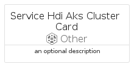
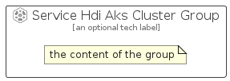

# ServiceHdiAksCluster


```text
azure-20/Item/Other/ServiceHdiAksCluster
```

```text
include('azure-20/Item/Other/ServiceHdiAksCluster')
```


| Illustration | ServiceHdiAksCluster | ServiceHdiAksClusterCard | ServiceHdiAksClusterGroup |
| :---: | :---: | :---: | :---: |
|  |  |  |  |


## Sprites
The item provides the following sriptes:

- `<$ServiceHdiAksClusterXs>`
- `<$ServiceHdiAksClusterSm>`
- `<$ServiceHdiAksClusterMd>`
- `<$ServiceHdiAksClusterLg>`


## ServiceHdiAksCluster

### Load remotely
```plantuml
@startuml
' configures the library
!global $LIB_BASE_LOCATION="https://raw.githubusercontent.com/tmorin/plantuml-libs/master/distribution"

' loads the library's bootstrap
!include $LIB_BASE_LOCATION/bootstrap.puml

' loads the package bootstrap
include('azure-20/bootstrap')

' loads the Item which embeds the element ServiceHdiAksCluster
include('azure-20/Item/Other/ServiceHdiAksCluster')

' renders the element
ServiceHdiAksCluster('ServiceHdiAksCluster', 'Service Hdi Aks Cluster', 'an optional tech label', 'an optional description')
@enduml
```

### Load locally
```plantuml
@startuml
' configures the library
!global $INCLUSION_MODE="local"
!global $LIB_BASE_LOCATION="../../.."

' loads the library's bootstrap
!include $LIB_BASE_LOCATION/bootstrap.puml

' loads the package bootstrap
include('azure-20/bootstrap')

' loads the Item which embeds the element ServiceHdiAksCluster
include('azure-20/Item/Other/ServiceHdiAksCluster')

' renders the element
ServiceHdiAksCluster('ServiceHdiAksCluster', 'Service Hdi Aks Cluster', 'an optional tech label', 'an optional description')
@enduml
```

## ServiceHdiAksClusterCard

### Load remotely
```plantuml
@startuml
' configures the library
!global $LIB_BASE_LOCATION="https://raw.githubusercontent.com/tmorin/plantuml-libs/master/distribution"

' loads the library's bootstrap
!include $LIB_BASE_LOCATION/bootstrap.puml

' loads the package bootstrap
include('azure-20/bootstrap')

' loads the Item which embeds the element ServiceHdiAksClusterCard
include('azure-20/Item/Other/ServiceHdiAksCluster')

' renders the element
ServiceHdiAksClusterCard('ServiceHdiAksClusterCard', 'Service Hdi Aks Cluster Card', 'an optional description')
@enduml
```

### Load locally
```plantuml
@startuml
' configures the library
!global $INCLUSION_MODE="local"
!global $LIB_BASE_LOCATION="../../.."

' loads the library's bootstrap
!include $LIB_BASE_LOCATION/bootstrap.puml

' loads the package bootstrap
include('azure-20/bootstrap')

' loads the Item which embeds the element ServiceHdiAksClusterCard
include('azure-20/Item/Other/ServiceHdiAksCluster')

' renders the element
ServiceHdiAksClusterCard('ServiceHdiAksClusterCard', 'Service Hdi Aks Cluster Card', 'an optional description')
@enduml
```

## ServiceHdiAksClusterGroup

### Load remotely
```plantuml
@startuml
' configures the library
!global $LIB_BASE_LOCATION="https://raw.githubusercontent.com/tmorin/plantuml-libs/master/distribution"

' loads the library's bootstrap
!include $LIB_BASE_LOCATION/bootstrap.puml

' loads the package bootstrap
include('azure-20/bootstrap')

' loads the Item which embeds the element ServiceHdiAksClusterGroup
include('azure-20/Item/Other/ServiceHdiAksCluster')

' renders the element
ServiceHdiAksClusterGroup('ServiceHdiAksClusterGroup', 'Service Hdi Aks Cluster Group', 'an optional tech label') {
    note as note
        the content of the group
    end note
}
@enduml
```

### Load locally
```plantuml
@startuml
' configures the library
!global $INCLUSION_MODE="local"
!global $LIB_BASE_LOCATION="../../.."

' loads the library's bootstrap
!include $LIB_BASE_LOCATION/bootstrap.puml

' loads the package bootstrap
include('azure-20/bootstrap')

' loads the Item which embeds the element ServiceHdiAksClusterGroup
include('azure-20/Item/Other/ServiceHdiAksCluster')

' renders the element
ServiceHdiAksClusterGroup('ServiceHdiAksClusterGroup', 'Service Hdi Aks Cluster Group', 'an optional tech label') {
    note as note
        the content of the group
    end note
}
@enduml
```

