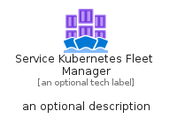
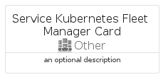
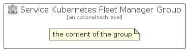

# ServiceKubernetesFleetManager


```text
azure-20/Item/Other/ServiceKubernetesFleetManager
```

```text
include('azure-20/Item/Other/ServiceKubernetesFleetManager')
```


| Illustration | ServiceKubernetesFleetManager | ServiceKubernetesFleetManagerCard | ServiceKubernetesFleetManagerGroup |
| :---: | :---: | :---: | :---: |
|  |  |  |  |


## Sprites
The item provides the following sriptes:

- `<$ServiceKubernetesFleetManagerXs>`
- `<$ServiceKubernetesFleetManagerSm>`
- `<$ServiceKubernetesFleetManagerMd>`
- `<$ServiceKubernetesFleetManagerLg>`


## ServiceKubernetesFleetManager

### Load remotely
```plantuml
@startuml
' configures the library
!global $LIB_BASE_LOCATION="https://raw.githubusercontent.com/tmorin/plantuml-libs/master/distribution"

' loads the library's bootstrap
!include $LIB_BASE_LOCATION/bootstrap.puml

' loads the package bootstrap
include('azure-20/bootstrap')

' loads the Item which embeds the element ServiceKubernetesFleetManager
include('azure-20/Item/Other/ServiceKubernetesFleetManager')

' renders the element
ServiceKubernetesFleetManager('ServiceKubernetesFleetManager', 'Service Kubernetes Fleet Manager', 'an optional tech label', 'an optional description')
@enduml
```

### Load locally
```plantuml
@startuml
' configures the library
!global $INCLUSION_MODE="local"
!global $LIB_BASE_LOCATION="../../.."

' loads the library's bootstrap
!include $LIB_BASE_LOCATION/bootstrap.puml

' loads the package bootstrap
include('azure-20/bootstrap')

' loads the Item which embeds the element ServiceKubernetesFleetManager
include('azure-20/Item/Other/ServiceKubernetesFleetManager')

' renders the element
ServiceKubernetesFleetManager('ServiceKubernetesFleetManager', 'Service Kubernetes Fleet Manager', 'an optional tech label', 'an optional description')
@enduml
```

## ServiceKubernetesFleetManagerCard

### Load remotely
```plantuml
@startuml
' configures the library
!global $LIB_BASE_LOCATION="https://raw.githubusercontent.com/tmorin/plantuml-libs/master/distribution"

' loads the library's bootstrap
!include $LIB_BASE_LOCATION/bootstrap.puml

' loads the package bootstrap
include('azure-20/bootstrap')

' loads the Item which embeds the element ServiceKubernetesFleetManagerCard
include('azure-20/Item/Other/ServiceKubernetesFleetManager')

' renders the element
ServiceKubernetesFleetManagerCard('ServiceKubernetesFleetManagerCard', 'Service Kubernetes Fleet Manager Card', 'an optional description')
@enduml
```

### Load locally
```plantuml
@startuml
' configures the library
!global $INCLUSION_MODE="local"
!global $LIB_BASE_LOCATION="../../.."

' loads the library's bootstrap
!include $LIB_BASE_LOCATION/bootstrap.puml

' loads the package bootstrap
include('azure-20/bootstrap')

' loads the Item which embeds the element ServiceKubernetesFleetManagerCard
include('azure-20/Item/Other/ServiceKubernetesFleetManager')

' renders the element
ServiceKubernetesFleetManagerCard('ServiceKubernetesFleetManagerCard', 'Service Kubernetes Fleet Manager Card', 'an optional description')
@enduml
```

## ServiceKubernetesFleetManagerGroup

### Load remotely
```plantuml
@startuml
' configures the library
!global $LIB_BASE_LOCATION="https://raw.githubusercontent.com/tmorin/plantuml-libs/master/distribution"

' loads the library's bootstrap
!include $LIB_BASE_LOCATION/bootstrap.puml

' loads the package bootstrap
include('azure-20/bootstrap')

' loads the Item which embeds the element ServiceKubernetesFleetManagerGroup
include('azure-20/Item/Other/ServiceKubernetesFleetManager')

' renders the element
ServiceKubernetesFleetManagerGroup('ServiceKubernetesFleetManagerGroup', 'Service Kubernetes Fleet Manager Group', 'an optional tech label') {
    note as note
        the content of the group
    end note
}
@enduml
```

### Load locally
```plantuml
@startuml
' configures the library
!global $INCLUSION_MODE="local"
!global $LIB_BASE_LOCATION="../../.."

' loads the library's bootstrap
!include $LIB_BASE_LOCATION/bootstrap.puml

' loads the package bootstrap
include('azure-20/bootstrap')

' loads the Item which embeds the element ServiceKubernetesFleetManagerGroup
include('azure-20/Item/Other/ServiceKubernetesFleetManager')

' renders the element
ServiceKubernetesFleetManagerGroup('ServiceKubernetesFleetManagerGroup', 'Service Kubernetes Fleet Manager Group', 'an optional tech label') {
    note as note
        the content of the group
    end note
}
@enduml
```

