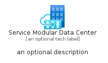
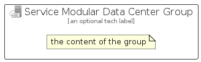

# ServiceModularDataCenter


```text
azure-20/Item/Other/ServiceModularDataCenter
```

```text
include('azure-20/Item/Other/ServiceModularDataCenter')
```


| Illustration | ServiceModularDataCenter | ServiceModularDataCenterCard | ServiceModularDataCenterGroup |
| :---: | :---: | :---: | :---: |
|  |  |  |  |


## Sprites
The item provides the following sriptes:

- `<$ServiceModularDataCenterXs>`
- `<$ServiceModularDataCenterSm>`
- `<$ServiceModularDataCenterMd>`
- `<$ServiceModularDataCenterLg>`


## ServiceModularDataCenter

### Load remotely
```plantuml
@startuml
' configures the library
!global $LIB_BASE_LOCATION="https://raw.githubusercontent.com/tmorin/plantuml-libs/master/distribution"

' loads the library's bootstrap
!include $LIB_BASE_LOCATION/bootstrap.puml

' loads the package bootstrap
include('azure-20/bootstrap')

' loads the Item which embeds the element ServiceModularDataCenter
include('azure-20/Item/Other/ServiceModularDataCenter')

' renders the element
ServiceModularDataCenter('ServiceModularDataCenter', 'Service Modular Data Center', 'an optional tech label', 'an optional description')
@enduml
```

### Load locally
```plantuml
@startuml
' configures the library
!global $INCLUSION_MODE="local"
!global $LIB_BASE_LOCATION="../../.."

' loads the library's bootstrap
!include $LIB_BASE_LOCATION/bootstrap.puml

' loads the package bootstrap
include('azure-20/bootstrap')

' loads the Item which embeds the element ServiceModularDataCenter
include('azure-20/Item/Other/ServiceModularDataCenter')

' renders the element
ServiceModularDataCenter('ServiceModularDataCenter', 'Service Modular Data Center', 'an optional tech label', 'an optional description')
@enduml
```

## ServiceModularDataCenterCard

### Load remotely
```plantuml
@startuml
' configures the library
!global $LIB_BASE_LOCATION="https://raw.githubusercontent.com/tmorin/plantuml-libs/master/distribution"

' loads the library's bootstrap
!include $LIB_BASE_LOCATION/bootstrap.puml

' loads the package bootstrap
include('azure-20/bootstrap')

' loads the Item which embeds the element ServiceModularDataCenterCard
include('azure-20/Item/Other/ServiceModularDataCenter')

' renders the element
ServiceModularDataCenterCard('ServiceModularDataCenterCard', 'Service Modular Data Center Card', 'an optional description')
@enduml
```

### Load locally
```plantuml
@startuml
' configures the library
!global $INCLUSION_MODE="local"
!global $LIB_BASE_LOCATION="../../.."

' loads the library's bootstrap
!include $LIB_BASE_LOCATION/bootstrap.puml

' loads the package bootstrap
include('azure-20/bootstrap')

' loads the Item which embeds the element ServiceModularDataCenterCard
include('azure-20/Item/Other/ServiceModularDataCenter')

' renders the element
ServiceModularDataCenterCard('ServiceModularDataCenterCard', 'Service Modular Data Center Card', 'an optional description')
@enduml
```

## ServiceModularDataCenterGroup

### Load remotely
```plantuml
@startuml
' configures the library
!global $LIB_BASE_LOCATION="https://raw.githubusercontent.com/tmorin/plantuml-libs/master/distribution"

' loads the library's bootstrap
!include $LIB_BASE_LOCATION/bootstrap.puml

' loads the package bootstrap
include('azure-20/bootstrap')

' loads the Item which embeds the element ServiceModularDataCenterGroup
include('azure-20/Item/Other/ServiceModularDataCenter')

' renders the element
ServiceModularDataCenterGroup('ServiceModularDataCenterGroup', 'Service Modular Data Center Group', 'an optional tech label') {
    note as note
        the content of the group
    end note
}
@enduml
```

### Load locally
```plantuml
@startuml
' configures the library
!global $INCLUSION_MODE="local"
!global $LIB_BASE_LOCATION="../../.."

' loads the library's bootstrap
!include $LIB_BASE_LOCATION/bootstrap.puml

' loads the package bootstrap
include('azure-20/bootstrap')

' loads the Item which embeds the element ServiceModularDataCenterGroup
include('azure-20/Item/Other/ServiceModularDataCenter')

' renders the element
ServiceModularDataCenterGroup('ServiceModularDataCenterGroup', 'Service Modular Data Center Group', 'an optional tech label') {
    note as note
        the content of the group
    end note
}
@enduml
```

