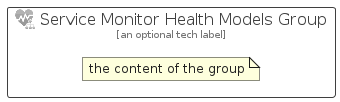

# ServiceMonitorHealthModels


```text
azure-20/Item/Other/ServiceMonitorHealthModels
```

```text
include('azure-20/Item/Other/ServiceMonitorHealthModels')
```


| Illustration | ServiceMonitorHealthModels | ServiceMonitorHealthModelsCard | ServiceMonitorHealthModelsGroup |
| :---: | :---: | :---: | :---: |
|  |  |  |  |


## Sprites
The item provides the following sriptes:

- `<$ServiceMonitorHealthModelsXs>`
- `<$ServiceMonitorHealthModelsSm>`
- `<$ServiceMonitorHealthModelsMd>`
- `<$ServiceMonitorHealthModelsLg>`


## ServiceMonitorHealthModels

### Load remotely
```plantuml
@startuml
' configures the library
!global $LIB_BASE_LOCATION="https://raw.githubusercontent.com/tmorin/plantuml-libs/master/distribution"

' loads the library's bootstrap
!include $LIB_BASE_LOCATION/bootstrap.puml

' loads the package bootstrap
include('azure-20/bootstrap')

' loads the Item which embeds the element ServiceMonitorHealthModels
include('azure-20/Item/Other/ServiceMonitorHealthModels')

' renders the element
ServiceMonitorHealthModels('ServiceMonitorHealthModels', 'Service Monitor Health Models', 'an optional tech label', 'an optional description')
@enduml
```

### Load locally
```plantuml
@startuml
' configures the library
!global $INCLUSION_MODE="local"
!global $LIB_BASE_LOCATION="../../.."

' loads the library's bootstrap
!include $LIB_BASE_LOCATION/bootstrap.puml

' loads the package bootstrap
include('azure-20/bootstrap')

' loads the Item which embeds the element ServiceMonitorHealthModels
include('azure-20/Item/Other/ServiceMonitorHealthModels')

' renders the element
ServiceMonitorHealthModels('ServiceMonitorHealthModels', 'Service Monitor Health Models', 'an optional tech label', 'an optional description')
@enduml
```

## ServiceMonitorHealthModelsCard

### Load remotely
```plantuml
@startuml
' configures the library
!global $LIB_BASE_LOCATION="https://raw.githubusercontent.com/tmorin/plantuml-libs/master/distribution"

' loads the library's bootstrap
!include $LIB_BASE_LOCATION/bootstrap.puml

' loads the package bootstrap
include('azure-20/bootstrap')

' loads the Item which embeds the element ServiceMonitorHealthModelsCard
include('azure-20/Item/Other/ServiceMonitorHealthModels')

' renders the element
ServiceMonitorHealthModelsCard('ServiceMonitorHealthModelsCard', 'Service Monitor Health Models Card', 'an optional description')
@enduml
```

### Load locally
```plantuml
@startuml
' configures the library
!global $INCLUSION_MODE="local"
!global $LIB_BASE_LOCATION="../../.."

' loads the library's bootstrap
!include $LIB_BASE_LOCATION/bootstrap.puml

' loads the package bootstrap
include('azure-20/bootstrap')

' loads the Item which embeds the element ServiceMonitorHealthModelsCard
include('azure-20/Item/Other/ServiceMonitorHealthModels')

' renders the element
ServiceMonitorHealthModelsCard('ServiceMonitorHealthModelsCard', 'Service Monitor Health Models Card', 'an optional description')
@enduml
```

## ServiceMonitorHealthModelsGroup

### Load remotely
```plantuml
@startuml
' configures the library
!global $LIB_BASE_LOCATION="https://raw.githubusercontent.com/tmorin/plantuml-libs/master/distribution"

' loads the library's bootstrap
!include $LIB_BASE_LOCATION/bootstrap.puml

' loads the package bootstrap
include('azure-20/bootstrap')

' loads the Item which embeds the element ServiceMonitorHealthModelsGroup
include('azure-20/Item/Other/ServiceMonitorHealthModels')

' renders the element
ServiceMonitorHealthModelsGroup('ServiceMonitorHealthModelsGroup', 'Service Monitor Health Models Group', 'an optional tech label') {
    note as note
        the content of the group
    end note
}
@enduml
```

### Load locally
```plantuml
@startuml
' configures the library
!global $INCLUSION_MODE="local"
!global $LIB_BASE_LOCATION="../../.."

' loads the library's bootstrap
!include $LIB_BASE_LOCATION/bootstrap.puml

' loads the package bootstrap
include('azure-20/bootstrap')

' loads the Item which embeds the element ServiceMonitorHealthModelsGroup
include('azure-20/Item/Other/ServiceMonitorHealthModels')

' renders the element
ServiceMonitorHealthModelsGroup('ServiceMonitorHealthModelsGroup', 'Service Monitor Health Models Group', 'an optional tech label') {
    note as note
        the content of the group
    end note
}
@enduml
```

