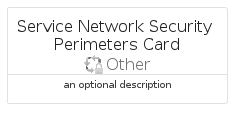
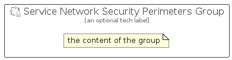

# ServiceNetworkSecurityPerimeters


```text
azure-20/Item/Other/ServiceNetworkSecurityPerimeters
```

```text
include('azure-20/Item/Other/ServiceNetworkSecurityPerimeters')
```


| Illustration | ServiceNetworkSecurityPerimeters | ServiceNetworkSecurityPerimetersCard | ServiceNetworkSecurityPerimetersGroup |
| :---: | :---: | :---: | :---: |
|  |  |  |  |


## Sprites
The item provides the following sriptes:

- `<$ServiceNetworkSecurityPerimetersXs>`
- `<$ServiceNetworkSecurityPerimetersSm>`
- `<$ServiceNetworkSecurityPerimetersMd>`
- `<$ServiceNetworkSecurityPerimetersLg>`


## ServiceNetworkSecurityPerimeters

### Load remotely
```plantuml
@startuml
' configures the library
!global $LIB_BASE_LOCATION="https://raw.githubusercontent.com/tmorin/plantuml-libs/master/distribution"

' loads the library's bootstrap
!include $LIB_BASE_LOCATION/bootstrap.puml

' loads the package bootstrap
include('azure-20/bootstrap')

' loads the Item which embeds the element ServiceNetworkSecurityPerimeters
include('azure-20/Item/Other/ServiceNetworkSecurityPerimeters')

' renders the element
ServiceNetworkSecurityPerimeters('ServiceNetworkSecurityPerimeters', 'Service Network Security Perimeters', 'an optional tech label', 'an optional description')
@enduml
```

### Load locally
```plantuml
@startuml
' configures the library
!global $INCLUSION_MODE="local"
!global $LIB_BASE_LOCATION="../../.."

' loads the library's bootstrap
!include $LIB_BASE_LOCATION/bootstrap.puml

' loads the package bootstrap
include('azure-20/bootstrap')

' loads the Item which embeds the element ServiceNetworkSecurityPerimeters
include('azure-20/Item/Other/ServiceNetworkSecurityPerimeters')

' renders the element
ServiceNetworkSecurityPerimeters('ServiceNetworkSecurityPerimeters', 'Service Network Security Perimeters', 'an optional tech label', 'an optional description')
@enduml
```

## ServiceNetworkSecurityPerimetersCard

### Load remotely
```plantuml
@startuml
' configures the library
!global $LIB_BASE_LOCATION="https://raw.githubusercontent.com/tmorin/plantuml-libs/master/distribution"

' loads the library's bootstrap
!include $LIB_BASE_LOCATION/bootstrap.puml

' loads the package bootstrap
include('azure-20/bootstrap')

' loads the Item which embeds the element ServiceNetworkSecurityPerimetersCard
include('azure-20/Item/Other/ServiceNetworkSecurityPerimeters')

' renders the element
ServiceNetworkSecurityPerimetersCard('ServiceNetworkSecurityPerimetersCard', 'Service Network Security Perimeters Card', 'an optional description')
@enduml
```

### Load locally
```plantuml
@startuml
' configures the library
!global $INCLUSION_MODE="local"
!global $LIB_BASE_LOCATION="../../.."

' loads the library's bootstrap
!include $LIB_BASE_LOCATION/bootstrap.puml

' loads the package bootstrap
include('azure-20/bootstrap')

' loads the Item which embeds the element ServiceNetworkSecurityPerimetersCard
include('azure-20/Item/Other/ServiceNetworkSecurityPerimeters')

' renders the element
ServiceNetworkSecurityPerimetersCard('ServiceNetworkSecurityPerimetersCard', 'Service Network Security Perimeters Card', 'an optional description')
@enduml
```

## ServiceNetworkSecurityPerimetersGroup

### Load remotely
```plantuml
@startuml
' configures the library
!global $LIB_BASE_LOCATION="https://raw.githubusercontent.com/tmorin/plantuml-libs/master/distribution"

' loads the library's bootstrap
!include $LIB_BASE_LOCATION/bootstrap.puml

' loads the package bootstrap
include('azure-20/bootstrap')

' loads the Item which embeds the element ServiceNetworkSecurityPerimetersGroup
include('azure-20/Item/Other/ServiceNetworkSecurityPerimeters')

' renders the element
ServiceNetworkSecurityPerimetersGroup('ServiceNetworkSecurityPerimetersGroup', 'Service Network Security Perimeters Group', 'an optional tech label') {
    note as note
        the content of the group
    end note
}
@enduml
```

### Load locally
```plantuml
@startuml
' configures the library
!global $INCLUSION_MODE="local"
!global $LIB_BASE_LOCATION="../../.."

' loads the library's bootstrap
!include $LIB_BASE_LOCATION/bootstrap.puml

' loads the package bootstrap
include('azure-20/bootstrap')

' loads the Item which embeds the element ServiceNetworkSecurityPerimetersGroup
include('azure-20/Item/Other/ServiceNetworkSecurityPerimeters')

' renders the element
ServiceNetworkSecurityPerimetersGroup('ServiceNetworkSecurityPerimetersGroup', 'Service Network Security Perimeters Group', 'an optional tech label') {
    note as note
        the content of the group
    end note
}
@enduml
```

