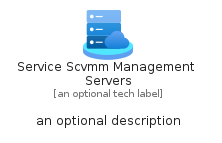
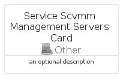
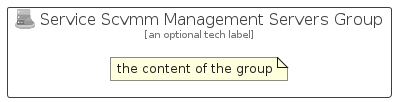

# ServiceScvmmManagementServers


```text
azure-20/Item/Other/ServiceScvmmManagementServers
```

```text
include('azure-20/Item/Other/ServiceScvmmManagementServers')
```


| Illustration | ServiceScvmmManagementServers | ServiceScvmmManagementServersCard | ServiceScvmmManagementServersGroup |
| :---: | :---: | :---: | :---: |
|  |  |  |  |


## Sprites
The item provides the following sriptes:

- `<$ServiceScvmmManagementServersXs>`
- `<$ServiceScvmmManagementServersSm>`
- `<$ServiceScvmmManagementServersMd>`
- `<$ServiceScvmmManagementServersLg>`


## ServiceScvmmManagementServers

### Load remotely
```plantuml
@startuml
' configures the library
!global $LIB_BASE_LOCATION="https://raw.githubusercontent.com/tmorin/plantuml-libs/master/distribution"

' loads the library's bootstrap
!include $LIB_BASE_LOCATION/bootstrap.puml

' loads the package bootstrap
include('azure-20/bootstrap')

' loads the Item which embeds the element ServiceScvmmManagementServers
include('azure-20/Item/Other/ServiceScvmmManagementServers')

' renders the element
ServiceScvmmManagementServers('ServiceScvmmManagementServers', 'Service Scvmm Management Servers', 'an optional tech label', 'an optional description')
@enduml
```

### Load locally
```plantuml
@startuml
' configures the library
!global $INCLUSION_MODE="local"
!global $LIB_BASE_LOCATION="../../.."

' loads the library's bootstrap
!include $LIB_BASE_LOCATION/bootstrap.puml

' loads the package bootstrap
include('azure-20/bootstrap')

' loads the Item which embeds the element ServiceScvmmManagementServers
include('azure-20/Item/Other/ServiceScvmmManagementServers')

' renders the element
ServiceScvmmManagementServers('ServiceScvmmManagementServers', 'Service Scvmm Management Servers', 'an optional tech label', 'an optional description')
@enduml
```

## ServiceScvmmManagementServersCard

### Load remotely
```plantuml
@startuml
' configures the library
!global $LIB_BASE_LOCATION="https://raw.githubusercontent.com/tmorin/plantuml-libs/master/distribution"

' loads the library's bootstrap
!include $LIB_BASE_LOCATION/bootstrap.puml

' loads the package bootstrap
include('azure-20/bootstrap')

' loads the Item which embeds the element ServiceScvmmManagementServersCard
include('azure-20/Item/Other/ServiceScvmmManagementServers')

' renders the element
ServiceScvmmManagementServersCard('ServiceScvmmManagementServersCard', 'Service Scvmm Management Servers Card', 'an optional description')
@enduml
```

### Load locally
```plantuml
@startuml
' configures the library
!global $INCLUSION_MODE="local"
!global $LIB_BASE_LOCATION="../../.."

' loads the library's bootstrap
!include $LIB_BASE_LOCATION/bootstrap.puml

' loads the package bootstrap
include('azure-20/bootstrap')

' loads the Item which embeds the element ServiceScvmmManagementServersCard
include('azure-20/Item/Other/ServiceScvmmManagementServers')

' renders the element
ServiceScvmmManagementServersCard('ServiceScvmmManagementServersCard', 'Service Scvmm Management Servers Card', 'an optional description')
@enduml
```

## ServiceScvmmManagementServersGroup

### Load remotely
```plantuml
@startuml
' configures the library
!global $LIB_BASE_LOCATION="https://raw.githubusercontent.com/tmorin/plantuml-libs/master/distribution"

' loads the library's bootstrap
!include $LIB_BASE_LOCATION/bootstrap.puml

' loads the package bootstrap
include('azure-20/bootstrap')

' loads the Item which embeds the element ServiceScvmmManagementServersGroup
include('azure-20/Item/Other/ServiceScvmmManagementServers')

' renders the element
ServiceScvmmManagementServersGroup('ServiceScvmmManagementServersGroup', 'Service Scvmm Management Servers Group', 'an optional tech label') {
    note as note
        the content of the group
    end note
}
@enduml
```

### Load locally
```plantuml
@startuml
' configures the library
!global $INCLUSION_MODE="local"
!global $LIB_BASE_LOCATION="../../.."

' loads the library's bootstrap
!include $LIB_BASE_LOCATION/bootstrap.puml

' loads the package bootstrap
include('azure-20/bootstrap')

' loads the Item which embeds the element ServiceScvmmManagementServersGroup
include('azure-20/Item/Other/ServiceScvmmManagementServers')

' renders the element
ServiceScvmmManagementServersGroup('ServiceScvmmManagementServersGroup', 'Service Scvmm Management Servers Group', 'an optional tech label') {
    note as note
        the content of the group
    end note
}
@enduml
```

