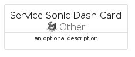
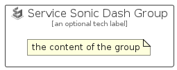

# ServiceSonicDash


```text
azure-20/Item/Other/ServiceSonicDash
```

```text
include('azure-20/Item/Other/ServiceSonicDash')
```


| Illustration | ServiceSonicDash | ServiceSonicDashCard | ServiceSonicDashGroup |
| :---: | :---: | :---: | :---: |
|  |  |  |  |


## Sprites
The item provides the following sriptes:

- `<$ServiceSonicDashXs>`
- `<$ServiceSonicDashSm>`
- `<$ServiceSonicDashMd>`
- `<$ServiceSonicDashLg>`


## ServiceSonicDash

### Load remotely
```plantuml
@startuml
' configures the library
!global $LIB_BASE_LOCATION="https://raw.githubusercontent.com/tmorin/plantuml-libs/master/distribution"

' loads the library's bootstrap
!include $LIB_BASE_LOCATION/bootstrap.puml

' loads the package bootstrap
include('azure-20/bootstrap')

' loads the Item which embeds the element ServiceSonicDash
include('azure-20/Item/Other/ServiceSonicDash')

' renders the element
ServiceSonicDash('ServiceSonicDash', 'Service Sonic Dash', 'an optional tech label', 'an optional description')
@enduml
```

### Load locally
```plantuml
@startuml
' configures the library
!global $INCLUSION_MODE="local"
!global $LIB_BASE_LOCATION="../../.."

' loads the library's bootstrap
!include $LIB_BASE_LOCATION/bootstrap.puml

' loads the package bootstrap
include('azure-20/bootstrap')

' loads the Item which embeds the element ServiceSonicDash
include('azure-20/Item/Other/ServiceSonicDash')

' renders the element
ServiceSonicDash('ServiceSonicDash', 'Service Sonic Dash', 'an optional tech label', 'an optional description')
@enduml
```

## ServiceSonicDashCard

### Load remotely
```plantuml
@startuml
' configures the library
!global $LIB_BASE_LOCATION="https://raw.githubusercontent.com/tmorin/plantuml-libs/master/distribution"

' loads the library's bootstrap
!include $LIB_BASE_LOCATION/bootstrap.puml

' loads the package bootstrap
include('azure-20/bootstrap')

' loads the Item which embeds the element ServiceSonicDashCard
include('azure-20/Item/Other/ServiceSonicDash')

' renders the element
ServiceSonicDashCard('ServiceSonicDashCard', 'Service Sonic Dash Card', 'an optional description')
@enduml
```

### Load locally
```plantuml
@startuml
' configures the library
!global $INCLUSION_MODE="local"
!global $LIB_BASE_LOCATION="../../.."

' loads the library's bootstrap
!include $LIB_BASE_LOCATION/bootstrap.puml

' loads the package bootstrap
include('azure-20/bootstrap')

' loads the Item which embeds the element ServiceSonicDashCard
include('azure-20/Item/Other/ServiceSonicDash')

' renders the element
ServiceSonicDashCard('ServiceSonicDashCard', 'Service Sonic Dash Card', 'an optional description')
@enduml
```

## ServiceSonicDashGroup

### Load remotely
```plantuml
@startuml
' configures the library
!global $LIB_BASE_LOCATION="https://raw.githubusercontent.com/tmorin/plantuml-libs/master/distribution"

' loads the library's bootstrap
!include $LIB_BASE_LOCATION/bootstrap.puml

' loads the package bootstrap
include('azure-20/bootstrap')

' loads the Item which embeds the element ServiceSonicDashGroup
include('azure-20/Item/Other/ServiceSonicDash')

' renders the element
ServiceSonicDashGroup('ServiceSonicDashGroup', 'Service Sonic Dash Group', 'an optional tech label') {
    note as note
        the content of the group
    end note
}
@enduml
```

### Load locally
```plantuml
@startuml
' configures the library
!global $INCLUSION_MODE="local"
!global $LIB_BASE_LOCATION="../../.."

' loads the library's bootstrap
!include $LIB_BASE_LOCATION/bootstrap.puml

' loads the package bootstrap
include('azure-20/bootstrap')

' loads the Item which embeds the element ServiceSonicDashGroup
include('azure-20/Item/Other/ServiceSonicDash')

' renders the element
ServiceSonicDashGroup('ServiceSonicDashGroup', 'Service Sonic Dash Group', 'an optional tech label') {
    note as note
        the content of the group
    end note
}
@enduml
```

