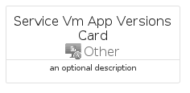
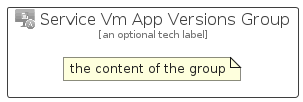

# ServiceVmAppVersions


```text
azure-20/Item/Other/ServiceVmAppVersions
```

```text
include('azure-20/Item/Other/ServiceVmAppVersions')
```


| Illustration | ServiceVmAppVersions | ServiceVmAppVersionsCard | ServiceVmAppVersionsGroup |
| :---: | :---: | :---: | :---: |
|  |  |  |  |


## Sprites
The item provides the following sriptes:

- `<$ServiceVmAppVersionsXs>`
- `<$ServiceVmAppVersionsSm>`
- `<$ServiceVmAppVersionsMd>`
- `<$ServiceVmAppVersionsLg>`


## ServiceVmAppVersions

### Load remotely
```plantuml
@startuml
' configures the library
!global $LIB_BASE_LOCATION="https://raw.githubusercontent.com/tmorin/plantuml-libs/master/distribution"

' loads the library's bootstrap
!include $LIB_BASE_LOCATION/bootstrap.puml

' loads the package bootstrap
include('azure-20/bootstrap')

' loads the Item which embeds the element ServiceVmAppVersions
include('azure-20/Item/Other/ServiceVmAppVersions')

' renders the element
ServiceVmAppVersions('ServiceVmAppVersions', 'Service Vm App Versions', 'an optional tech label', 'an optional description')
@enduml
```

### Load locally
```plantuml
@startuml
' configures the library
!global $INCLUSION_MODE="local"
!global $LIB_BASE_LOCATION="../../.."

' loads the library's bootstrap
!include $LIB_BASE_LOCATION/bootstrap.puml

' loads the package bootstrap
include('azure-20/bootstrap')

' loads the Item which embeds the element ServiceVmAppVersions
include('azure-20/Item/Other/ServiceVmAppVersions')

' renders the element
ServiceVmAppVersions('ServiceVmAppVersions', 'Service Vm App Versions', 'an optional tech label', 'an optional description')
@enduml
```

## ServiceVmAppVersionsCard

### Load remotely
```plantuml
@startuml
' configures the library
!global $LIB_BASE_LOCATION="https://raw.githubusercontent.com/tmorin/plantuml-libs/master/distribution"

' loads the library's bootstrap
!include $LIB_BASE_LOCATION/bootstrap.puml

' loads the package bootstrap
include('azure-20/bootstrap')

' loads the Item which embeds the element ServiceVmAppVersionsCard
include('azure-20/Item/Other/ServiceVmAppVersions')

' renders the element
ServiceVmAppVersionsCard('ServiceVmAppVersionsCard', 'Service Vm App Versions Card', 'an optional description')
@enduml
```

### Load locally
```plantuml
@startuml
' configures the library
!global $INCLUSION_MODE="local"
!global $LIB_BASE_LOCATION="../../.."

' loads the library's bootstrap
!include $LIB_BASE_LOCATION/bootstrap.puml

' loads the package bootstrap
include('azure-20/bootstrap')

' loads the Item which embeds the element ServiceVmAppVersionsCard
include('azure-20/Item/Other/ServiceVmAppVersions')

' renders the element
ServiceVmAppVersionsCard('ServiceVmAppVersionsCard', 'Service Vm App Versions Card', 'an optional description')
@enduml
```

## ServiceVmAppVersionsGroup

### Load remotely
```plantuml
@startuml
' configures the library
!global $LIB_BASE_LOCATION="https://raw.githubusercontent.com/tmorin/plantuml-libs/master/distribution"

' loads the library's bootstrap
!include $LIB_BASE_LOCATION/bootstrap.puml

' loads the package bootstrap
include('azure-20/bootstrap')

' loads the Item which embeds the element ServiceVmAppVersionsGroup
include('azure-20/Item/Other/ServiceVmAppVersions')

' renders the element
ServiceVmAppVersionsGroup('ServiceVmAppVersionsGroup', 'Service Vm App Versions Group', 'an optional tech label') {
    note as note
        the content of the group
    end note
}
@enduml
```

### Load locally
```plantuml
@startuml
' configures the library
!global $INCLUSION_MODE="local"
!global $LIB_BASE_LOCATION="../../.."

' loads the library's bootstrap
!include $LIB_BASE_LOCATION/bootstrap.puml

' loads the package bootstrap
include('azure-20/bootstrap')

' loads the Item which embeds the element ServiceVmAppVersionsGroup
include('azure-20/Item/Other/ServiceVmAppVersions')

' renders the element
ServiceVmAppVersionsGroup('ServiceVmAppVersionsGroup', 'Service Vm App Versions Group', 'an optional tech label') {
    note as note
        the content of the group
    end note
}
@enduml
```

