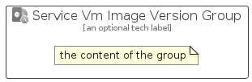

# ServiceVmImageVersion


```text
azure-20/Item/Other/ServiceVmImageVersion
```

```text
include('azure-20/Item/Other/ServiceVmImageVersion')
```


| Illustration | ServiceVmImageVersion | ServiceVmImageVersionCard | ServiceVmImageVersionGroup |
| :---: | :---: | :---: | :---: |
|  |  |  |  |


## Sprites
The item provides the following sriptes:

- `<$ServiceVmImageVersionXs>`
- `<$ServiceVmImageVersionSm>`
- `<$ServiceVmImageVersionMd>`
- `<$ServiceVmImageVersionLg>`


## ServiceVmImageVersion

### Load remotely
```plantuml
@startuml
' configures the library
!global $LIB_BASE_LOCATION="https://raw.githubusercontent.com/tmorin/plantuml-libs/master/distribution"

' loads the library's bootstrap
!include $LIB_BASE_LOCATION/bootstrap.puml

' loads the package bootstrap
include('azure-20/bootstrap')

' loads the Item which embeds the element ServiceVmImageVersion
include('azure-20/Item/Other/ServiceVmImageVersion')

' renders the element
ServiceVmImageVersion('ServiceVmImageVersion', 'Service Vm Image Version', 'an optional tech label', 'an optional description')
@enduml
```

### Load locally
```plantuml
@startuml
' configures the library
!global $INCLUSION_MODE="local"
!global $LIB_BASE_LOCATION="../../.."

' loads the library's bootstrap
!include $LIB_BASE_LOCATION/bootstrap.puml

' loads the package bootstrap
include('azure-20/bootstrap')

' loads the Item which embeds the element ServiceVmImageVersion
include('azure-20/Item/Other/ServiceVmImageVersion')

' renders the element
ServiceVmImageVersion('ServiceVmImageVersion', 'Service Vm Image Version', 'an optional tech label', 'an optional description')
@enduml
```

## ServiceVmImageVersionCard

### Load remotely
```plantuml
@startuml
' configures the library
!global $LIB_BASE_LOCATION="https://raw.githubusercontent.com/tmorin/plantuml-libs/master/distribution"

' loads the library's bootstrap
!include $LIB_BASE_LOCATION/bootstrap.puml

' loads the package bootstrap
include('azure-20/bootstrap')

' loads the Item which embeds the element ServiceVmImageVersionCard
include('azure-20/Item/Other/ServiceVmImageVersion')

' renders the element
ServiceVmImageVersionCard('ServiceVmImageVersionCard', 'Service Vm Image Version Card', 'an optional description')
@enduml
```

### Load locally
```plantuml
@startuml
' configures the library
!global $INCLUSION_MODE="local"
!global $LIB_BASE_LOCATION="../../.."

' loads the library's bootstrap
!include $LIB_BASE_LOCATION/bootstrap.puml

' loads the package bootstrap
include('azure-20/bootstrap')

' loads the Item which embeds the element ServiceVmImageVersionCard
include('azure-20/Item/Other/ServiceVmImageVersion')

' renders the element
ServiceVmImageVersionCard('ServiceVmImageVersionCard', 'Service Vm Image Version Card', 'an optional description')
@enduml
```

## ServiceVmImageVersionGroup

### Load remotely
```plantuml
@startuml
' configures the library
!global $LIB_BASE_LOCATION="https://raw.githubusercontent.com/tmorin/plantuml-libs/master/distribution"

' loads the library's bootstrap
!include $LIB_BASE_LOCATION/bootstrap.puml

' loads the package bootstrap
include('azure-20/bootstrap')

' loads the Item which embeds the element ServiceVmImageVersionGroup
include('azure-20/Item/Other/ServiceVmImageVersion')

' renders the element
ServiceVmImageVersionGroup('ServiceVmImageVersionGroup', 'Service Vm Image Version Group', 'an optional tech label') {
    note as note
        the content of the group
    end note
}
@enduml
```

### Load locally
```plantuml
@startuml
' configures the library
!global $INCLUSION_MODE="local"
!global $LIB_BASE_LOCATION="../../.."

' loads the library's bootstrap
!include $LIB_BASE_LOCATION/bootstrap.puml

' loads the package bootstrap
include('azure-20/bootstrap')

' loads the Item which embeds the element ServiceVmImageVersionGroup
include('azure-20/Item/Other/ServiceVmImageVersion')

' renders the element
ServiceVmImageVersionGroup('ServiceVmImageVersionGroup', 'Service Vm Image Version Group', 'an optional tech label') {
    note as note
        the content of the group
    end note
}
@enduml
```

