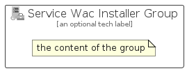

# ServiceWacInstaller


```text
azure-20/Item/Other/ServiceWacInstaller
```

```text
include('azure-20/Item/Other/ServiceWacInstaller')
```


| Illustration | ServiceWacInstaller | ServiceWacInstallerCard | ServiceWacInstallerGroup |
| :---: | :---: | :---: | :---: |
|  |  |  |  |


## Sprites
The item provides the following sriptes:

- `<$ServiceWacInstallerXs>`
- `<$ServiceWacInstallerSm>`
- `<$ServiceWacInstallerMd>`
- `<$ServiceWacInstallerLg>`


## ServiceWacInstaller

### Load remotely
```plantuml
@startuml
' configures the library
!global $LIB_BASE_LOCATION="https://raw.githubusercontent.com/tmorin/plantuml-libs/master/distribution"

' loads the library's bootstrap
!include $LIB_BASE_LOCATION/bootstrap.puml

' loads the package bootstrap
include('azure-20/bootstrap')

' loads the Item which embeds the element ServiceWacInstaller
include('azure-20/Item/Other/ServiceWacInstaller')

' renders the element
ServiceWacInstaller('ServiceWacInstaller', 'Service Wac Installer', 'an optional tech label', 'an optional description')
@enduml
```

### Load locally
```plantuml
@startuml
' configures the library
!global $INCLUSION_MODE="local"
!global $LIB_BASE_LOCATION="../../.."

' loads the library's bootstrap
!include $LIB_BASE_LOCATION/bootstrap.puml

' loads the package bootstrap
include('azure-20/bootstrap')

' loads the Item which embeds the element ServiceWacInstaller
include('azure-20/Item/Other/ServiceWacInstaller')

' renders the element
ServiceWacInstaller('ServiceWacInstaller', 'Service Wac Installer', 'an optional tech label', 'an optional description')
@enduml
```

## ServiceWacInstallerCard

### Load remotely
```plantuml
@startuml
' configures the library
!global $LIB_BASE_LOCATION="https://raw.githubusercontent.com/tmorin/plantuml-libs/master/distribution"

' loads the library's bootstrap
!include $LIB_BASE_LOCATION/bootstrap.puml

' loads the package bootstrap
include('azure-20/bootstrap')

' loads the Item which embeds the element ServiceWacInstallerCard
include('azure-20/Item/Other/ServiceWacInstaller')

' renders the element
ServiceWacInstallerCard('ServiceWacInstallerCard', 'Service Wac Installer Card', 'an optional description')
@enduml
```

### Load locally
```plantuml
@startuml
' configures the library
!global $INCLUSION_MODE="local"
!global $LIB_BASE_LOCATION="../../.."

' loads the library's bootstrap
!include $LIB_BASE_LOCATION/bootstrap.puml

' loads the package bootstrap
include('azure-20/bootstrap')

' loads the Item which embeds the element ServiceWacInstallerCard
include('azure-20/Item/Other/ServiceWacInstaller')

' renders the element
ServiceWacInstallerCard('ServiceWacInstallerCard', 'Service Wac Installer Card', 'an optional description')
@enduml
```

## ServiceWacInstallerGroup

### Load remotely
```plantuml
@startuml
' configures the library
!global $LIB_BASE_LOCATION="https://raw.githubusercontent.com/tmorin/plantuml-libs/master/distribution"

' loads the library's bootstrap
!include $LIB_BASE_LOCATION/bootstrap.puml

' loads the package bootstrap
include('azure-20/bootstrap')

' loads the Item which embeds the element ServiceWacInstallerGroup
include('azure-20/Item/Other/ServiceWacInstaller')

' renders the element
ServiceWacInstallerGroup('ServiceWacInstallerGroup', 'Service Wac Installer Group', 'an optional tech label') {
    note as note
        the content of the group
    end note
}
@enduml
```

### Load locally
```plantuml
@startuml
' configures the library
!global $INCLUSION_MODE="local"
!global $LIB_BASE_LOCATION="../../.."

' loads the library's bootstrap
!include $LIB_BASE_LOCATION/bootstrap.puml

' loads the package bootstrap
include('azure-20/bootstrap')

' loads the Item which embeds the element ServiceWacInstallerGroup
include('azure-20/Item/Other/ServiceWacInstaller')

' renders the element
ServiceWacInstallerGroup('ServiceWacInstallerGroup', 'Service Wac Installer Group', 'an optional tech label') {
    note as note
        the content of the group
    end note
}
@enduml
```

