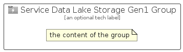

# ServiceDataLakeStorageGen1


```text
azure-20/Item/Storage/ServiceDataLakeStorageGen1
```

```text
include('azure-20/Item/Storage/ServiceDataLakeStorageGen1')
```


| Illustration | ServiceDataLakeStorageGen1 | ServiceDataLakeStorageGen1Card | ServiceDataLakeStorageGen1Group |
| :---: | :---: | :---: | :---: |
|  |  |  |  |


## Sprites
The item provides the following sriptes:

- `<$ServiceDataLakeStorageGen1Xs>`
- `<$ServiceDataLakeStorageGen1Sm>`
- `<$ServiceDataLakeStorageGen1Md>`
- `<$ServiceDataLakeStorageGen1Lg>`


## ServiceDataLakeStorageGen1

### Load remotely
```plantuml
@startuml
' configures the library
!global $LIB_BASE_LOCATION="https://raw.githubusercontent.com/tmorin/plantuml-libs/master/distribution"

' loads the library's bootstrap
!include $LIB_BASE_LOCATION/bootstrap.puml

' loads the package bootstrap
include('azure-20/bootstrap')

' loads the Item which embeds the element ServiceDataLakeStorageGen1
include('azure-20/Item/Storage/ServiceDataLakeStorageGen1')

' renders the element
ServiceDataLakeStorageGen1('ServiceDataLakeStorageGen1', 'Service Data Lake Storage Gen1', 'an optional tech label', 'an optional description')
@enduml
```

### Load locally
```plantuml
@startuml
' configures the library
!global $INCLUSION_MODE="local"
!global $LIB_BASE_LOCATION="../../.."

' loads the library's bootstrap
!include $LIB_BASE_LOCATION/bootstrap.puml

' loads the package bootstrap
include('azure-20/bootstrap')

' loads the Item which embeds the element ServiceDataLakeStorageGen1
include('azure-20/Item/Storage/ServiceDataLakeStorageGen1')

' renders the element
ServiceDataLakeStorageGen1('ServiceDataLakeStorageGen1', 'Service Data Lake Storage Gen1', 'an optional tech label', 'an optional description')
@enduml
```

## ServiceDataLakeStorageGen1Card

### Load remotely
```plantuml
@startuml
' configures the library
!global $LIB_BASE_LOCATION="https://raw.githubusercontent.com/tmorin/plantuml-libs/master/distribution"

' loads the library's bootstrap
!include $LIB_BASE_LOCATION/bootstrap.puml

' loads the package bootstrap
include('azure-20/bootstrap')

' loads the Item which embeds the element ServiceDataLakeStorageGen1Card
include('azure-20/Item/Storage/ServiceDataLakeStorageGen1')

' renders the element
ServiceDataLakeStorageGen1Card('ServiceDataLakeStorageGen1Card', 'Service Data Lake Storage Gen1 Card', 'an optional description')
@enduml
```

### Load locally
```plantuml
@startuml
' configures the library
!global $INCLUSION_MODE="local"
!global $LIB_BASE_LOCATION="../../.."

' loads the library's bootstrap
!include $LIB_BASE_LOCATION/bootstrap.puml

' loads the package bootstrap
include('azure-20/bootstrap')

' loads the Item which embeds the element ServiceDataLakeStorageGen1Card
include('azure-20/Item/Storage/ServiceDataLakeStorageGen1')

' renders the element
ServiceDataLakeStorageGen1Card('ServiceDataLakeStorageGen1Card', 'Service Data Lake Storage Gen1 Card', 'an optional description')
@enduml
```

## ServiceDataLakeStorageGen1Group

### Load remotely
```plantuml
@startuml
' configures the library
!global $LIB_BASE_LOCATION="https://raw.githubusercontent.com/tmorin/plantuml-libs/master/distribution"

' loads the library's bootstrap
!include $LIB_BASE_LOCATION/bootstrap.puml

' loads the package bootstrap
include('azure-20/bootstrap')

' loads the Item which embeds the element ServiceDataLakeStorageGen1Group
include('azure-20/Item/Storage/ServiceDataLakeStorageGen1')

' renders the element
ServiceDataLakeStorageGen1Group('ServiceDataLakeStorageGen1Group', 'Service Data Lake Storage Gen1 Group', 'an optional tech label') {
    note as note
        the content of the group
    end note
}
@enduml
```

### Load locally
```plantuml
@startuml
' configures the library
!global $INCLUSION_MODE="local"
!global $LIB_BASE_LOCATION="../../.."

' loads the library's bootstrap
!include $LIB_BASE_LOCATION/bootstrap.puml

' loads the package bootstrap
include('azure-20/bootstrap')

' loads the Item which embeds the element ServiceDataLakeStorageGen1Group
include('azure-20/Item/Storage/ServiceDataLakeStorageGen1')

' renders the element
ServiceDataLakeStorageGen1Group('ServiceDataLakeStorageGen1Group', 'Service Data Lake Storage Gen1 Group', 'an optional tech label') {
    note as note
        the content of the group
    end note
}
@enduml
```

