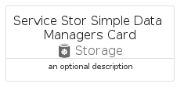
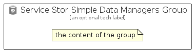

# ServiceStorSimpleDataManagers


```text
azure-20/Item/Storage/ServiceStorSimpleDataManagers
```

```text
include('azure-20/Item/Storage/ServiceStorSimpleDataManagers')
```


| Illustration | ServiceStorSimpleDataManagers | ServiceStorSimpleDataManagersCard | ServiceStorSimpleDataManagersGroup |
| :---: | :---: | :---: | :---: |
|  |  |  |  |


## Sprites
The item provides the following sriptes:

- `<$ServiceStorSimpleDataManagersXs>`
- `<$ServiceStorSimpleDataManagersSm>`
- `<$ServiceStorSimpleDataManagersMd>`
- `<$ServiceStorSimpleDataManagersLg>`


## ServiceStorSimpleDataManagers

### Load remotely
```plantuml
@startuml
' configures the library
!global $LIB_BASE_LOCATION="https://raw.githubusercontent.com/tmorin/plantuml-libs/master/distribution"

' loads the library's bootstrap
!include $LIB_BASE_LOCATION/bootstrap.puml

' loads the package bootstrap
include('azure-20/bootstrap')

' loads the Item which embeds the element ServiceStorSimpleDataManagers
include('azure-20/Item/Storage/ServiceStorSimpleDataManagers')

' renders the element
ServiceStorSimpleDataManagers('ServiceStorSimpleDataManagers', 'Service Stor Simple Data Managers', 'an optional tech label', 'an optional description')
@enduml
```

### Load locally
```plantuml
@startuml
' configures the library
!global $INCLUSION_MODE="local"
!global $LIB_BASE_LOCATION="../../.."

' loads the library's bootstrap
!include $LIB_BASE_LOCATION/bootstrap.puml

' loads the package bootstrap
include('azure-20/bootstrap')

' loads the Item which embeds the element ServiceStorSimpleDataManagers
include('azure-20/Item/Storage/ServiceStorSimpleDataManagers')

' renders the element
ServiceStorSimpleDataManagers('ServiceStorSimpleDataManagers', 'Service Stor Simple Data Managers', 'an optional tech label', 'an optional description')
@enduml
```

## ServiceStorSimpleDataManagersCard

### Load remotely
```plantuml
@startuml
' configures the library
!global $LIB_BASE_LOCATION="https://raw.githubusercontent.com/tmorin/plantuml-libs/master/distribution"

' loads the library's bootstrap
!include $LIB_BASE_LOCATION/bootstrap.puml

' loads the package bootstrap
include('azure-20/bootstrap')

' loads the Item which embeds the element ServiceStorSimpleDataManagersCard
include('azure-20/Item/Storage/ServiceStorSimpleDataManagers')

' renders the element
ServiceStorSimpleDataManagersCard('ServiceStorSimpleDataManagersCard', 'Service Stor Simple Data Managers Card', 'an optional description')
@enduml
```

### Load locally
```plantuml
@startuml
' configures the library
!global $INCLUSION_MODE="local"
!global $LIB_BASE_LOCATION="../../.."

' loads the library's bootstrap
!include $LIB_BASE_LOCATION/bootstrap.puml

' loads the package bootstrap
include('azure-20/bootstrap')

' loads the Item which embeds the element ServiceStorSimpleDataManagersCard
include('azure-20/Item/Storage/ServiceStorSimpleDataManagers')

' renders the element
ServiceStorSimpleDataManagersCard('ServiceStorSimpleDataManagersCard', 'Service Stor Simple Data Managers Card', 'an optional description')
@enduml
```

## ServiceStorSimpleDataManagersGroup

### Load remotely
```plantuml
@startuml
' configures the library
!global $LIB_BASE_LOCATION="https://raw.githubusercontent.com/tmorin/plantuml-libs/master/distribution"

' loads the library's bootstrap
!include $LIB_BASE_LOCATION/bootstrap.puml

' loads the package bootstrap
include('azure-20/bootstrap')

' loads the Item which embeds the element ServiceStorSimpleDataManagersGroup
include('azure-20/Item/Storage/ServiceStorSimpleDataManagers')

' renders the element
ServiceStorSimpleDataManagersGroup('ServiceStorSimpleDataManagersGroup', 'Service Stor Simple Data Managers Group', 'an optional tech label') {
    note as note
        the content of the group
    end note
}
@enduml
```

### Load locally
```plantuml
@startuml
' configures the library
!global $INCLUSION_MODE="local"
!global $LIB_BASE_LOCATION="../../.."

' loads the library's bootstrap
!include $LIB_BASE_LOCATION/bootstrap.puml

' loads the package bootstrap
include('azure-20/bootstrap')

' loads the Item which embeds the element ServiceStorSimpleDataManagersGroup
include('azure-20/Item/Storage/ServiceStorSimpleDataManagers')

' renders the element
ServiceStorSimpleDataManagersGroup('ServiceStorSimpleDataManagersGroup', 'Service Stor Simple Data Managers Group', 'an optional tech label') {
    note as note
        the content of the group
    end note
}
@enduml
```

