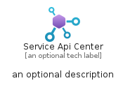

# ServiceApiCenter


```text
azure-20/Item/Web/ServiceApiCenter
```

```text
include('azure-20/Item/Web/ServiceApiCenter')
```


| Illustration | ServiceApiCenter | ServiceApiCenterCard | ServiceApiCenterGroup |
| :---: | :---: | :---: | :---: |
|  |  |  |  |


## Sprites
The item provides the following sriptes:

- `<$ServiceApiCenterXs>`
- `<$ServiceApiCenterSm>`
- `<$ServiceApiCenterMd>`
- `<$ServiceApiCenterLg>`


## ServiceApiCenter

### Load remotely
```plantuml
@startuml
' configures the library
!global $LIB_BASE_LOCATION="https://raw.githubusercontent.com/tmorin/plantuml-libs/master/distribution"

' loads the library's bootstrap
!include $LIB_BASE_LOCATION/bootstrap.puml

' loads the package bootstrap
include('azure-20/bootstrap')

' loads the Item which embeds the element ServiceApiCenter
include('azure-20/Item/Web/ServiceApiCenter')

' renders the element
ServiceApiCenter('ServiceApiCenter', 'Service Api Center', 'an optional tech label', 'an optional description')
@enduml
```

### Load locally
```plantuml
@startuml
' configures the library
!global $INCLUSION_MODE="local"
!global $LIB_BASE_LOCATION="../../.."

' loads the library's bootstrap
!include $LIB_BASE_LOCATION/bootstrap.puml

' loads the package bootstrap
include('azure-20/bootstrap')

' loads the Item which embeds the element ServiceApiCenter
include('azure-20/Item/Web/ServiceApiCenter')

' renders the element
ServiceApiCenter('ServiceApiCenter', 'Service Api Center', 'an optional tech label', 'an optional description')
@enduml
```

## ServiceApiCenterCard

### Load remotely
```plantuml
@startuml
' configures the library
!global $LIB_BASE_LOCATION="https://raw.githubusercontent.com/tmorin/plantuml-libs/master/distribution"

' loads the library's bootstrap
!include $LIB_BASE_LOCATION/bootstrap.puml

' loads the package bootstrap
include('azure-20/bootstrap')

' loads the Item which embeds the element ServiceApiCenterCard
include('azure-20/Item/Web/ServiceApiCenter')

' renders the element
ServiceApiCenterCard('ServiceApiCenterCard', 'Service Api Center Card', 'an optional description')
@enduml
```

### Load locally
```plantuml
@startuml
' configures the library
!global $INCLUSION_MODE="local"
!global $LIB_BASE_LOCATION="../../.."

' loads the library's bootstrap
!include $LIB_BASE_LOCATION/bootstrap.puml

' loads the package bootstrap
include('azure-20/bootstrap')

' loads the Item which embeds the element ServiceApiCenterCard
include('azure-20/Item/Web/ServiceApiCenter')

' renders the element
ServiceApiCenterCard('ServiceApiCenterCard', 'Service Api Center Card', 'an optional description')
@enduml
```

## ServiceApiCenterGroup

### Load remotely
```plantuml
@startuml
' configures the library
!global $LIB_BASE_LOCATION="https://raw.githubusercontent.com/tmorin/plantuml-libs/master/distribution"

' loads the library's bootstrap
!include $LIB_BASE_LOCATION/bootstrap.puml

' loads the package bootstrap
include('azure-20/bootstrap')

' loads the Item which embeds the element ServiceApiCenterGroup
include('azure-20/Item/Web/ServiceApiCenter')

' renders the element
ServiceApiCenterGroup('ServiceApiCenterGroup', 'Service Api Center Group', 'an optional tech label') {
    note as note
        the content of the group
    end note
}
@enduml
```

### Load locally
```plantuml
@startuml
' configures the library
!global $INCLUSION_MODE="local"
!global $LIB_BASE_LOCATION="../../.."

' loads the library's bootstrap
!include $LIB_BASE_LOCATION/bootstrap.puml

' loads the package bootstrap
include('azure-20/bootstrap')

' loads the Item which embeds the element ServiceApiCenterGroup
include('azure-20/Item/Web/ServiceApiCenter')

' renders the element
ServiceApiCenterGroup('ServiceApiCenterGroup', 'Service Api Center Group', 'an optional tech label') {
    note as note
        the content of the group
    end note
}
@enduml
```

