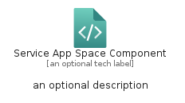
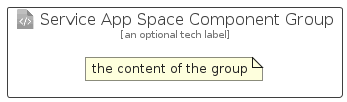

# ServiceAppSpaceComponent


```text
azure-20/Item/Web/ServiceAppSpaceComponent
```

```text
include('azure-20/Item/Web/ServiceAppSpaceComponent')
```


| Illustration | ServiceAppSpaceComponent | ServiceAppSpaceComponentCard | ServiceAppSpaceComponentGroup |
| :---: | :---: | :---: | :---: |
|  |  |  |  |


## Sprites
The item provides the following sriptes:

- `<$ServiceAppSpaceComponentXs>`
- `<$ServiceAppSpaceComponentSm>`
- `<$ServiceAppSpaceComponentMd>`
- `<$ServiceAppSpaceComponentLg>`


## ServiceAppSpaceComponent

### Load remotely
```plantuml
@startuml
' configures the library
!global $LIB_BASE_LOCATION="https://raw.githubusercontent.com/tmorin/plantuml-libs/master/distribution"

' loads the library's bootstrap
!include $LIB_BASE_LOCATION/bootstrap.puml

' loads the package bootstrap
include('azure-20/bootstrap')

' loads the Item which embeds the element ServiceAppSpaceComponent
include('azure-20/Item/Web/ServiceAppSpaceComponent')

' renders the element
ServiceAppSpaceComponent('ServiceAppSpaceComponent', 'Service App Space Component', 'an optional tech label', 'an optional description')
@enduml
```

### Load locally
```plantuml
@startuml
' configures the library
!global $INCLUSION_MODE="local"
!global $LIB_BASE_LOCATION="../../.."

' loads the library's bootstrap
!include $LIB_BASE_LOCATION/bootstrap.puml

' loads the package bootstrap
include('azure-20/bootstrap')

' loads the Item which embeds the element ServiceAppSpaceComponent
include('azure-20/Item/Web/ServiceAppSpaceComponent')

' renders the element
ServiceAppSpaceComponent('ServiceAppSpaceComponent', 'Service App Space Component', 'an optional tech label', 'an optional description')
@enduml
```

## ServiceAppSpaceComponentCard

### Load remotely
```plantuml
@startuml
' configures the library
!global $LIB_BASE_LOCATION="https://raw.githubusercontent.com/tmorin/plantuml-libs/master/distribution"

' loads the library's bootstrap
!include $LIB_BASE_LOCATION/bootstrap.puml

' loads the package bootstrap
include('azure-20/bootstrap')

' loads the Item which embeds the element ServiceAppSpaceComponentCard
include('azure-20/Item/Web/ServiceAppSpaceComponent')

' renders the element
ServiceAppSpaceComponentCard('ServiceAppSpaceComponentCard', 'Service App Space Component Card', 'an optional description')
@enduml
```

### Load locally
```plantuml
@startuml
' configures the library
!global $INCLUSION_MODE="local"
!global $LIB_BASE_LOCATION="../../.."

' loads the library's bootstrap
!include $LIB_BASE_LOCATION/bootstrap.puml

' loads the package bootstrap
include('azure-20/bootstrap')

' loads the Item which embeds the element ServiceAppSpaceComponentCard
include('azure-20/Item/Web/ServiceAppSpaceComponent')

' renders the element
ServiceAppSpaceComponentCard('ServiceAppSpaceComponentCard', 'Service App Space Component Card', 'an optional description')
@enduml
```

## ServiceAppSpaceComponentGroup

### Load remotely
```plantuml
@startuml
' configures the library
!global $LIB_BASE_LOCATION="https://raw.githubusercontent.com/tmorin/plantuml-libs/master/distribution"

' loads the library's bootstrap
!include $LIB_BASE_LOCATION/bootstrap.puml

' loads the package bootstrap
include('azure-20/bootstrap')

' loads the Item which embeds the element ServiceAppSpaceComponentGroup
include('azure-20/Item/Web/ServiceAppSpaceComponent')

' renders the element
ServiceAppSpaceComponentGroup('ServiceAppSpaceComponentGroup', 'Service App Space Component Group', 'an optional tech label') {
    note as note
        the content of the group
    end note
}
@enduml
```

### Load locally
```plantuml
@startuml
' configures the library
!global $INCLUSION_MODE="local"
!global $LIB_BASE_LOCATION="../../.."

' loads the library's bootstrap
!include $LIB_BASE_LOCATION/bootstrap.puml

' loads the package bootstrap
include('azure-20/bootstrap')

' loads the Item which embeds the element ServiceAppSpaceComponentGroup
include('azure-20/Item/Web/ServiceAppSpaceComponent')

' renders the element
ServiceAppSpaceComponentGroup('ServiceAppSpaceComponentGroup', 'Service App Space Component Group', 'an optional tech label') {
    note as note
        the content of the group
    end note
}
@enduml
```

