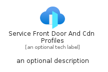
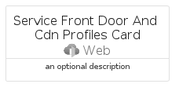

# ServiceFrontDoorAndCdnProfiles


```text
azure-20/Item/Web/ServiceFrontDoorAndCdnProfiles
```

```text
include('azure-20/Item/Web/ServiceFrontDoorAndCdnProfiles')
```


| Illustration | ServiceFrontDoorAndCdnProfiles | ServiceFrontDoorAndCdnProfilesCard | ServiceFrontDoorAndCdnProfilesGroup |
| :---: | :---: | :---: | :---: |
|  |  |  |  |


## Sprites
The item provides the following sriptes:

- `<$ServiceFrontDoorAndCdnProfilesXs>`
- `<$ServiceFrontDoorAndCdnProfilesSm>`
- `<$ServiceFrontDoorAndCdnProfilesMd>`
- `<$ServiceFrontDoorAndCdnProfilesLg>`


## ServiceFrontDoorAndCdnProfiles

### Load remotely
```plantuml
@startuml
' configures the library
!global $LIB_BASE_LOCATION="https://raw.githubusercontent.com/tmorin/plantuml-libs/master/distribution"

' loads the library's bootstrap
!include $LIB_BASE_LOCATION/bootstrap.puml

' loads the package bootstrap
include('azure-20/bootstrap')

' loads the Item which embeds the element ServiceFrontDoorAndCdnProfiles
include('azure-20/Item/Web/ServiceFrontDoorAndCdnProfiles')

' renders the element
ServiceFrontDoorAndCdnProfiles('ServiceFrontDoorAndCdnProfiles', 'Service Front Door And Cdn Profiles', 'an optional tech label', 'an optional description')
@enduml
```

### Load locally
```plantuml
@startuml
' configures the library
!global $INCLUSION_MODE="local"
!global $LIB_BASE_LOCATION="../../.."

' loads the library's bootstrap
!include $LIB_BASE_LOCATION/bootstrap.puml

' loads the package bootstrap
include('azure-20/bootstrap')

' loads the Item which embeds the element ServiceFrontDoorAndCdnProfiles
include('azure-20/Item/Web/ServiceFrontDoorAndCdnProfiles')

' renders the element
ServiceFrontDoorAndCdnProfiles('ServiceFrontDoorAndCdnProfiles', 'Service Front Door And Cdn Profiles', 'an optional tech label', 'an optional description')
@enduml
```

## ServiceFrontDoorAndCdnProfilesCard

### Load remotely
```plantuml
@startuml
' configures the library
!global $LIB_BASE_LOCATION="https://raw.githubusercontent.com/tmorin/plantuml-libs/master/distribution"

' loads the library's bootstrap
!include $LIB_BASE_LOCATION/bootstrap.puml

' loads the package bootstrap
include('azure-20/bootstrap')

' loads the Item which embeds the element ServiceFrontDoorAndCdnProfilesCard
include('azure-20/Item/Web/ServiceFrontDoorAndCdnProfiles')

' renders the element
ServiceFrontDoorAndCdnProfilesCard('ServiceFrontDoorAndCdnProfilesCard', 'Service Front Door And Cdn Profiles Card', 'an optional description')
@enduml
```

### Load locally
```plantuml
@startuml
' configures the library
!global $INCLUSION_MODE="local"
!global $LIB_BASE_LOCATION="../../.."

' loads the library's bootstrap
!include $LIB_BASE_LOCATION/bootstrap.puml

' loads the package bootstrap
include('azure-20/bootstrap')

' loads the Item which embeds the element ServiceFrontDoorAndCdnProfilesCard
include('azure-20/Item/Web/ServiceFrontDoorAndCdnProfiles')

' renders the element
ServiceFrontDoorAndCdnProfilesCard('ServiceFrontDoorAndCdnProfilesCard', 'Service Front Door And Cdn Profiles Card', 'an optional description')
@enduml
```

## ServiceFrontDoorAndCdnProfilesGroup

### Load remotely
```plantuml
@startuml
' configures the library
!global $LIB_BASE_LOCATION="https://raw.githubusercontent.com/tmorin/plantuml-libs/master/distribution"

' loads the library's bootstrap
!include $LIB_BASE_LOCATION/bootstrap.puml

' loads the package bootstrap
include('azure-20/bootstrap')

' loads the Item which embeds the element ServiceFrontDoorAndCdnProfilesGroup
include('azure-20/Item/Web/ServiceFrontDoorAndCdnProfiles')

' renders the element
ServiceFrontDoorAndCdnProfilesGroup('ServiceFrontDoorAndCdnProfilesGroup', 'Service Front Door And Cdn Profiles Group', 'an optional tech label') {
    note as note
        the content of the group
    end note
}
@enduml
```

### Load locally
```plantuml
@startuml
' configures the library
!global $INCLUSION_MODE="local"
!global $LIB_BASE_LOCATION="../../.."

' loads the library's bootstrap
!include $LIB_BASE_LOCATION/bootstrap.puml

' loads the package bootstrap
include('azure-20/bootstrap')

' loads the Item which embeds the element ServiceFrontDoorAndCdnProfilesGroup
include('azure-20/Item/Web/ServiceFrontDoorAndCdnProfiles')

' renders the element
ServiceFrontDoorAndCdnProfilesGroup('ServiceFrontDoorAndCdnProfilesGroup', 'Service Front Door And Cdn Profiles Group', 'an optional tech label') {
    note as note
        the content of the group
    end note
}
@enduml
```

