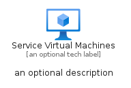
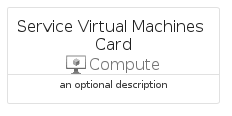
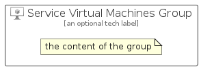

# ServiceVirtualMachines


```text
azure-23/Item/Compute/ServiceVirtualMachines
```

```text
include('azure-23/Item/Compute/ServiceVirtualMachines')
```


| Illustration | ServiceVirtualMachines | ServiceVirtualMachinesCard | ServiceVirtualMachinesGroup |
| :---: | :---: | :---: | :---: |
|  |  |  |  |


## Sprites
The item provides the following sriptes:

- `<$ServiceVirtualMachinesXs>`
- `<$ServiceVirtualMachinesSm>`
- `<$ServiceVirtualMachinesMd>`
- `<$ServiceVirtualMachinesLg>`


## ServiceVirtualMachines

### Load remotely
```plantuml
@startuml
' configures the library
!global $LIB_BASE_LOCATION="https://raw.githubusercontent.com/tmorin/plantuml-libs/master/distribution"

' loads the library's bootstrap
!include $LIB_BASE_LOCATION/bootstrap.puml

' loads the package bootstrap
include('azure-23/bootstrap')

' loads the Item which embeds the element ServiceVirtualMachines
include('azure-23/Item/Compute/ServiceVirtualMachines')

' renders the element
ServiceVirtualMachines('ServiceVirtualMachines', 'Service Virtual Machines', 'an optional tech label', 'an optional description')
@enduml
```

### Load locally
```plantuml
@startuml
' configures the library
!global $INCLUSION_MODE="local"
!global $LIB_BASE_LOCATION="../../.."

' loads the library's bootstrap
!include $LIB_BASE_LOCATION/bootstrap.puml

' loads the package bootstrap
include('azure-23/bootstrap')

' loads the Item which embeds the element ServiceVirtualMachines
include('azure-23/Item/Compute/ServiceVirtualMachines')

' renders the element
ServiceVirtualMachines('ServiceVirtualMachines', 'Service Virtual Machines', 'an optional tech label', 'an optional description')
@enduml
```

## ServiceVirtualMachinesCard

### Load remotely
```plantuml
@startuml
' configures the library
!global $LIB_BASE_LOCATION="https://raw.githubusercontent.com/tmorin/plantuml-libs/master/distribution"

' loads the library's bootstrap
!include $LIB_BASE_LOCATION/bootstrap.puml

' loads the package bootstrap
include('azure-23/bootstrap')

' loads the Item which embeds the element ServiceVirtualMachinesCard
include('azure-23/Item/Compute/ServiceVirtualMachines')

' renders the element
ServiceVirtualMachinesCard('ServiceVirtualMachinesCard', 'Service Virtual Machines Card', 'an optional description')
@enduml
```

### Load locally
```plantuml
@startuml
' configures the library
!global $INCLUSION_MODE="local"
!global $LIB_BASE_LOCATION="../../.."

' loads the library's bootstrap
!include $LIB_BASE_LOCATION/bootstrap.puml

' loads the package bootstrap
include('azure-23/bootstrap')

' loads the Item which embeds the element ServiceVirtualMachinesCard
include('azure-23/Item/Compute/ServiceVirtualMachines')

' renders the element
ServiceVirtualMachinesCard('ServiceVirtualMachinesCard', 'Service Virtual Machines Card', 'an optional description')
@enduml
```

## ServiceVirtualMachinesGroup

### Load remotely
```plantuml
@startuml
' configures the library
!global $LIB_BASE_LOCATION="https://raw.githubusercontent.com/tmorin/plantuml-libs/master/distribution"

' loads the library's bootstrap
!include $LIB_BASE_LOCATION/bootstrap.puml

' loads the package bootstrap
include('azure-23/bootstrap')

' loads the Item which embeds the element ServiceVirtualMachinesGroup
include('azure-23/Item/Compute/ServiceVirtualMachines')

' renders the element
ServiceVirtualMachinesGroup('ServiceVirtualMachinesGroup', 'Service Virtual Machines Group', 'an optional tech label') {
    note as note
        the content of the group
    end note
}
@enduml
```

### Load locally
```plantuml
@startuml
' configures the library
!global $INCLUSION_MODE="local"
!global $LIB_BASE_LOCATION="../../.."

' loads the library's bootstrap
!include $LIB_BASE_LOCATION/bootstrap.puml

' loads the package bootstrap
include('azure-23/bootstrap')

' loads the Item which embeds the element ServiceVirtualMachinesGroup
include('azure-23/Item/Compute/ServiceVirtualMachines')

' renders the element
ServiceVirtualMachinesGroup('ServiceVirtualMachinesGroup', 'Service Virtual Machines Group', 'an optional tech label') {
    note as note
        the content of the group
    end note
}
@enduml
```

