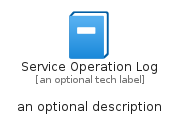
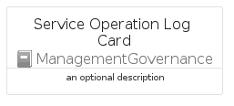
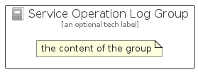

# ServiceOperationLog


```text
azure-23/Item/ManagementGovernance/ServiceOperationLog
```

```text
include('azure-23/Item/ManagementGovernance/ServiceOperationLog')
```


| Illustration | ServiceOperationLog | ServiceOperationLogCard | ServiceOperationLogGroup |
| :---: | :---: | :---: | :---: |
|  |  |  |  |


## Sprites
The item provides the following sriptes:

- `<$ServiceOperationLogXs>`
- `<$ServiceOperationLogSm>`
- `<$ServiceOperationLogMd>`
- `<$ServiceOperationLogLg>`


## ServiceOperationLog

### Load remotely
```plantuml
@startuml
' configures the library
!global $LIB_BASE_LOCATION="https://raw.githubusercontent.com/tmorin/plantuml-libs/master/distribution"

' loads the library's bootstrap
!include $LIB_BASE_LOCATION/bootstrap.puml

' loads the package bootstrap
include('azure-23/bootstrap')

' loads the Item which embeds the element ServiceOperationLog
include('azure-23/Item/ManagementGovernance/ServiceOperationLog')

' renders the element
ServiceOperationLog('ServiceOperationLog', 'Service Operation Log', 'an optional tech label', 'an optional description')
@enduml
```

### Load locally
```plantuml
@startuml
' configures the library
!global $INCLUSION_MODE="local"
!global $LIB_BASE_LOCATION="../../.."

' loads the library's bootstrap
!include $LIB_BASE_LOCATION/bootstrap.puml

' loads the package bootstrap
include('azure-23/bootstrap')

' loads the Item which embeds the element ServiceOperationLog
include('azure-23/Item/ManagementGovernance/ServiceOperationLog')

' renders the element
ServiceOperationLog('ServiceOperationLog', 'Service Operation Log', 'an optional tech label', 'an optional description')
@enduml
```

## ServiceOperationLogCard

### Load remotely
```plantuml
@startuml
' configures the library
!global $LIB_BASE_LOCATION="https://raw.githubusercontent.com/tmorin/plantuml-libs/master/distribution"

' loads the library's bootstrap
!include $LIB_BASE_LOCATION/bootstrap.puml

' loads the package bootstrap
include('azure-23/bootstrap')

' loads the Item which embeds the element ServiceOperationLogCard
include('azure-23/Item/ManagementGovernance/ServiceOperationLog')

' renders the element
ServiceOperationLogCard('ServiceOperationLogCard', 'Service Operation Log Card', 'an optional description')
@enduml
```

### Load locally
```plantuml
@startuml
' configures the library
!global $INCLUSION_MODE="local"
!global $LIB_BASE_LOCATION="../../.."

' loads the library's bootstrap
!include $LIB_BASE_LOCATION/bootstrap.puml

' loads the package bootstrap
include('azure-23/bootstrap')

' loads the Item which embeds the element ServiceOperationLogCard
include('azure-23/Item/ManagementGovernance/ServiceOperationLog')

' renders the element
ServiceOperationLogCard('ServiceOperationLogCard', 'Service Operation Log Card', 'an optional description')
@enduml
```

## ServiceOperationLogGroup

### Load remotely
```plantuml
@startuml
' configures the library
!global $LIB_BASE_LOCATION="https://raw.githubusercontent.com/tmorin/plantuml-libs/master/distribution"

' loads the library's bootstrap
!include $LIB_BASE_LOCATION/bootstrap.puml

' loads the package bootstrap
include('azure-23/bootstrap')

' loads the Item which embeds the element ServiceOperationLogGroup
include('azure-23/Item/ManagementGovernance/ServiceOperationLog')

' renders the element
ServiceOperationLogGroup('ServiceOperationLogGroup', 'Service Operation Log Group', 'an optional tech label') {
    note as note
        the content of the group
    end note
}
@enduml
```

### Load locally
```plantuml
@startuml
' configures the library
!global $INCLUSION_MODE="local"
!global $LIB_BASE_LOCATION="../../.."

' loads the library's bootstrap
!include $LIB_BASE_LOCATION/bootstrap.puml

' loads the package bootstrap
include('azure-23/bootstrap')

' loads the Item which embeds the element ServiceOperationLogGroup
include('azure-23/Item/ManagementGovernance/ServiceOperationLog')

' renders the element
ServiceOperationLogGroup('ServiceOperationLogGroup', 'Service Operation Log Group', 'an optional tech label') {
    note as note
        the content of the group
    end note
}
@enduml
```

