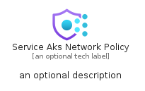
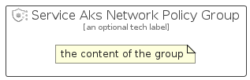

# ServiceAksNetworkPolicy


```text
azure-23/Item/NewIcons/ServiceAksNetworkPolicy
```

```text
include('azure-23/Item/NewIcons/ServiceAksNetworkPolicy')
```


| Illustration | ServiceAksNetworkPolicy | ServiceAksNetworkPolicyCard | ServiceAksNetworkPolicyGroup |
| :---: | :---: | :---: | :---: |
|  |  |  |  |


## Sprites
The item provides the following sriptes:

- `<$ServiceAksNetworkPolicyXs>`
- `<$ServiceAksNetworkPolicySm>`
- `<$ServiceAksNetworkPolicyMd>`
- `<$ServiceAksNetworkPolicyLg>`


## ServiceAksNetworkPolicy

### Load remotely
```plantuml
@startuml
' configures the library
!global $LIB_BASE_LOCATION="https://raw.githubusercontent.com/tmorin/plantuml-libs/master/distribution"

' loads the library's bootstrap
!include $LIB_BASE_LOCATION/bootstrap.puml

' loads the package bootstrap
include('azure-23/bootstrap')

' loads the Item which embeds the element ServiceAksNetworkPolicy
include('azure-23/Item/NewIcons/ServiceAksNetworkPolicy')

' renders the element
ServiceAksNetworkPolicy('ServiceAksNetworkPolicy', 'Service Aks Network Policy', 'an optional tech label', 'an optional description')
@enduml
```

### Load locally
```plantuml
@startuml
' configures the library
!global $INCLUSION_MODE="local"
!global $LIB_BASE_LOCATION="../../.."

' loads the library's bootstrap
!include $LIB_BASE_LOCATION/bootstrap.puml

' loads the package bootstrap
include('azure-23/bootstrap')

' loads the Item which embeds the element ServiceAksNetworkPolicy
include('azure-23/Item/NewIcons/ServiceAksNetworkPolicy')

' renders the element
ServiceAksNetworkPolicy('ServiceAksNetworkPolicy', 'Service Aks Network Policy', 'an optional tech label', 'an optional description')
@enduml
```

## ServiceAksNetworkPolicyCard

### Load remotely
```plantuml
@startuml
' configures the library
!global $LIB_BASE_LOCATION="https://raw.githubusercontent.com/tmorin/plantuml-libs/master/distribution"

' loads the library's bootstrap
!include $LIB_BASE_LOCATION/bootstrap.puml

' loads the package bootstrap
include('azure-23/bootstrap')

' loads the Item which embeds the element ServiceAksNetworkPolicyCard
include('azure-23/Item/NewIcons/ServiceAksNetworkPolicy')

' renders the element
ServiceAksNetworkPolicyCard('ServiceAksNetworkPolicyCard', 'Service Aks Network Policy Card', 'an optional description')
@enduml
```

### Load locally
```plantuml
@startuml
' configures the library
!global $INCLUSION_MODE="local"
!global $LIB_BASE_LOCATION="../../.."

' loads the library's bootstrap
!include $LIB_BASE_LOCATION/bootstrap.puml

' loads the package bootstrap
include('azure-23/bootstrap')

' loads the Item which embeds the element ServiceAksNetworkPolicyCard
include('azure-23/Item/NewIcons/ServiceAksNetworkPolicy')

' renders the element
ServiceAksNetworkPolicyCard('ServiceAksNetworkPolicyCard', 'Service Aks Network Policy Card', 'an optional description')
@enduml
```

## ServiceAksNetworkPolicyGroup

### Load remotely
```plantuml
@startuml
' configures the library
!global $LIB_BASE_LOCATION="https://raw.githubusercontent.com/tmorin/plantuml-libs/master/distribution"

' loads the library's bootstrap
!include $LIB_BASE_LOCATION/bootstrap.puml

' loads the package bootstrap
include('azure-23/bootstrap')

' loads the Item which embeds the element ServiceAksNetworkPolicyGroup
include('azure-23/Item/NewIcons/ServiceAksNetworkPolicy')

' renders the element
ServiceAksNetworkPolicyGroup('ServiceAksNetworkPolicyGroup', 'Service Aks Network Policy Group', 'an optional tech label') {
    note as note
        the content of the group
    end note
}
@enduml
```

### Load locally
```plantuml
@startuml
' configures the library
!global $INCLUSION_MODE="local"
!global $LIB_BASE_LOCATION="../../.."

' loads the library's bootstrap
!include $LIB_BASE_LOCATION/bootstrap.puml

' loads the package bootstrap
include('azure-23/bootstrap')

' loads the Item which embeds the element ServiceAksNetworkPolicyGroup
include('azure-23/Item/NewIcons/ServiceAksNetworkPolicy')

' renders the element
ServiceAksNetworkPolicyGroup('ServiceAksNetworkPolicyGroup', 'Service Aks Network Policy Group', 'an optional tech label') {
    note as note
        the content of the group
    end note
}
@enduml
```

