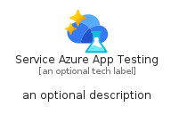
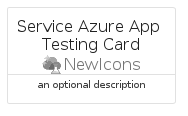
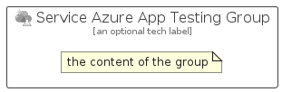

# ServiceAzureAppTesting


```text
azure-23/Item/NewIcons/ServiceAzureAppTesting
```

```text
include('azure-23/Item/NewIcons/ServiceAzureAppTesting')
```


| Illustration | ServiceAzureAppTesting | ServiceAzureAppTestingCard | ServiceAzureAppTestingGroup |
| :---: | :---: | :---: | :---: |
|  |  |  |  |


## Sprites
The item provides the following sriptes:

- `<$ServiceAzureAppTestingXs>`
- `<$ServiceAzureAppTestingSm>`
- `<$ServiceAzureAppTestingMd>`
- `<$ServiceAzureAppTestingLg>`


## ServiceAzureAppTesting

### Load remotely
```plantuml
@startuml
' configures the library
!global $LIB_BASE_LOCATION="https://raw.githubusercontent.com/tmorin/plantuml-libs/master/distribution"

' loads the library's bootstrap
!include $LIB_BASE_LOCATION/bootstrap.puml

' loads the package bootstrap
include('azure-23/bootstrap')

' loads the Item which embeds the element ServiceAzureAppTesting
include('azure-23/Item/NewIcons/ServiceAzureAppTesting')

' renders the element
ServiceAzureAppTesting('ServiceAzureAppTesting', 'Service Azure App Testing', 'an optional tech label', 'an optional description')
@enduml
```

### Load locally
```plantuml
@startuml
' configures the library
!global $INCLUSION_MODE="local"
!global $LIB_BASE_LOCATION="../../.."

' loads the library's bootstrap
!include $LIB_BASE_LOCATION/bootstrap.puml

' loads the package bootstrap
include('azure-23/bootstrap')

' loads the Item which embeds the element ServiceAzureAppTesting
include('azure-23/Item/NewIcons/ServiceAzureAppTesting')

' renders the element
ServiceAzureAppTesting('ServiceAzureAppTesting', 'Service Azure App Testing', 'an optional tech label', 'an optional description')
@enduml
```

## ServiceAzureAppTestingCard

### Load remotely
```plantuml
@startuml
' configures the library
!global $LIB_BASE_LOCATION="https://raw.githubusercontent.com/tmorin/plantuml-libs/master/distribution"

' loads the library's bootstrap
!include $LIB_BASE_LOCATION/bootstrap.puml

' loads the package bootstrap
include('azure-23/bootstrap')

' loads the Item which embeds the element ServiceAzureAppTestingCard
include('azure-23/Item/NewIcons/ServiceAzureAppTesting')

' renders the element
ServiceAzureAppTestingCard('ServiceAzureAppTestingCard', 'Service Azure App Testing Card', 'an optional description')
@enduml
```

### Load locally
```plantuml
@startuml
' configures the library
!global $INCLUSION_MODE="local"
!global $LIB_BASE_LOCATION="../../.."

' loads the library's bootstrap
!include $LIB_BASE_LOCATION/bootstrap.puml

' loads the package bootstrap
include('azure-23/bootstrap')

' loads the Item which embeds the element ServiceAzureAppTestingCard
include('azure-23/Item/NewIcons/ServiceAzureAppTesting')

' renders the element
ServiceAzureAppTestingCard('ServiceAzureAppTestingCard', 'Service Azure App Testing Card', 'an optional description')
@enduml
```

## ServiceAzureAppTestingGroup

### Load remotely
```plantuml
@startuml
' configures the library
!global $LIB_BASE_LOCATION="https://raw.githubusercontent.com/tmorin/plantuml-libs/master/distribution"

' loads the library's bootstrap
!include $LIB_BASE_LOCATION/bootstrap.puml

' loads the package bootstrap
include('azure-23/bootstrap')

' loads the Item which embeds the element ServiceAzureAppTestingGroup
include('azure-23/Item/NewIcons/ServiceAzureAppTesting')

' renders the element
ServiceAzureAppTestingGroup('ServiceAzureAppTestingGroup', 'Service Azure App Testing Group', 'an optional tech label') {
    note as note
        the content of the group
    end note
}
@enduml
```

### Load locally
```plantuml
@startuml
' configures the library
!global $INCLUSION_MODE="local"
!global $LIB_BASE_LOCATION="../../.."

' loads the library's bootstrap
!include $LIB_BASE_LOCATION/bootstrap.puml

' loads the package bootstrap
include('azure-23/bootstrap')

' loads the Item which embeds the element ServiceAzureAppTestingGroup
include('azure-23/Item/NewIcons/ServiceAzureAppTesting')

' renders the element
ServiceAzureAppTestingGroup('ServiceAzureAppTestingGroup', 'Service Azure App Testing Group', 'an optional tech label') {
    note as note
        the content of the group
    end note
}
@enduml
```

