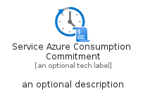
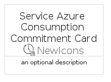
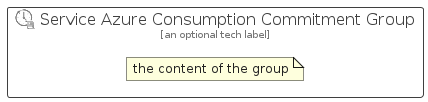

# ServiceAzureConsumptionCommitment


```text
azure-23/Item/NewIcons/ServiceAzureConsumptionCommitment
```

```text
include('azure-23/Item/NewIcons/ServiceAzureConsumptionCommitment')
```


| Illustration | ServiceAzureConsumptionCommitment | ServiceAzureConsumptionCommitmentCard | ServiceAzureConsumptionCommitmentGroup |
| :---: | :---: | :---: | :---: |
|  |  |  |  |


## Sprites
The item provides the following sriptes:

- `<$ServiceAzureConsumptionCommitmentXs>`
- `<$ServiceAzureConsumptionCommitmentSm>`
- `<$ServiceAzureConsumptionCommitmentMd>`
- `<$ServiceAzureConsumptionCommitmentLg>`


## ServiceAzureConsumptionCommitment

### Load remotely
```plantuml
@startuml
' configures the library
!global $LIB_BASE_LOCATION="https://raw.githubusercontent.com/tmorin/plantuml-libs/master/distribution"

' loads the library's bootstrap
!include $LIB_BASE_LOCATION/bootstrap.puml

' loads the package bootstrap
include('azure-23/bootstrap')

' loads the Item which embeds the element ServiceAzureConsumptionCommitment
include('azure-23/Item/NewIcons/ServiceAzureConsumptionCommitment')

' renders the element
ServiceAzureConsumptionCommitment('ServiceAzureConsumptionCommitment', 'Service Azure Consumption Commitment', 'an optional tech label', 'an optional description')
@enduml
```

### Load locally
```plantuml
@startuml
' configures the library
!global $INCLUSION_MODE="local"
!global $LIB_BASE_LOCATION="../../.."

' loads the library's bootstrap
!include $LIB_BASE_LOCATION/bootstrap.puml

' loads the package bootstrap
include('azure-23/bootstrap')

' loads the Item which embeds the element ServiceAzureConsumptionCommitment
include('azure-23/Item/NewIcons/ServiceAzureConsumptionCommitment')

' renders the element
ServiceAzureConsumptionCommitment('ServiceAzureConsumptionCommitment', 'Service Azure Consumption Commitment', 'an optional tech label', 'an optional description')
@enduml
```

## ServiceAzureConsumptionCommitmentCard

### Load remotely
```plantuml
@startuml
' configures the library
!global $LIB_BASE_LOCATION="https://raw.githubusercontent.com/tmorin/plantuml-libs/master/distribution"

' loads the library's bootstrap
!include $LIB_BASE_LOCATION/bootstrap.puml

' loads the package bootstrap
include('azure-23/bootstrap')

' loads the Item which embeds the element ServiceAzureConsumptionCommitmentCard
include('azure-23/Item/NewIcons/ServiceAzureConsumptionCommitment')

' renders the element
ServiceAzureConsumptionCommitmentCard('ServiceAzureConsumptionCommitmentCard', 'Service Azure Consumption Commitment Card', 'an optional description')
@enduml
```

### Load locally
```plantuml
@startuml
' configures the library
!global $INCLUSION_MODE="local"
!global $LIB_BASE_LOCATION="../../.."

' loads the library's bootstrap
!include $LIB_BASE_LOCATION/bootstrap.puml

' loads the package bootstrap
include('azure-23/bootstrap')

' loads the Item which embeds the element ServiceAzureConsumptionCommitmentCard
include('azure-23/Item/NewIcons/ServiceAzureConsumptionCommitment')

' renders the element
ServiceAzureConsumptionCommitmentCard('ServiceAzureConsumptionCommitmentCard', 'Service Azure Consumption Commitment Card', 'an optional description')
@enduml
```

## ServiceAzureConsumptionCommitmentGroup

### Load remotely
```plantuml
@startuml
' configures the library
!global $LIB_BASE_LOCATION="https://raw.githubusercontent.com/tmorin/plantuml-libs/master/distribution"

' loads the library's bootstrap
!include $LIB_BASE_LOCATION/bootstrap.puml

' loads the package bootstrap
include('azure-23/bootstrap')

' loads the Item which embeds the element ServiceAzureConsumptionCommitmentGroup
include('azure-23/Item/NewIcons/ServiceAzureConsumptionCommitment')

' renders the element
ServiceAzureConsumptionCommitmentGroup('ServiceAzureConsumptionCommitmentGroup', 'Service Azure Consumption Commitment Group', 'an optional tech label') {
    note as note
        the content of the group
    end note
}
@enduml
```

### Load locally
```plantuml
@startuml
' configures the library
!global $INCLUSION_MODE="local"
!global $LIB_BASE_LOCATION="../../.."

' loads the library's bootstrap
!include $LIB_BASE_LOCATION/bootstrap.puml

' loads the package bootstrap
include('azure-23/bootstrap')

' loads the Item which embeds the element ServiceAzureConsumptionCommitmentGroup
include('azure-23/Item/NewIcons/ServiceAzureConsumptionCommitment')

' renders the element
ServiceAzureConsumptionCommitmentGroup('ServiceAzureConsumptionCommitmentGroup', 'Service Azure Consumption Commitment Group', 'an optional tech label') {
    note as note
        the content of the group
    end note
}
@enduml
```

