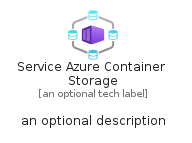
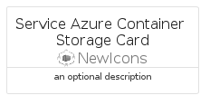
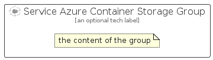

# ServiceAzureContainerStorage


```text
azure-23/Item/NewIcons/ServiceAzureContainerStorage
```

```text
include('azure-23/Item/NewIcons/ServiceAzureContainerStorage')
```


| Illustration | ServiceAzureContainerStorage | ServiceAzureContainerStorageCard | ServiceAzureContainerStorageGroup |
| :---: | :---: | :---: | :---: |
|  |  |  |  |


## Sprites
The item provides the following sriptes:

- `<$ServiceAzureContainerStorageXs>`
- `<$ServiceAzureContainerStorageSm>`
- `<$ServiceAzureContainerStorageMd>`
- `<$ServiceAzureContainerStorageLg>`


## ServiceAzureContainerStorage

### Load remotely
```plantuml
@startuml
' configures the library
!global $LIB_BASE_LOCATION="https://raw.githubusercontent.com/tmorin/plantuml-libs/master/distribution"

' loads the library's bootstrap
!include $LIB_BASE_LOCATION/bootstrap.puml

' loads the package bootstrap
include('azure-23/bootstrap')

' loads the Item which embeds the element ServiceAzureContainerStorage
include('azure-23/Item/NewIcons/ServiceAzureContainerStorage')

' renders the element
ServiceAzureContainerStorage('ServiceAzureContainerStorage', 'Service Azure Container Storage', 'an optional tech label', 'an optional description')
@enduml
```

### Load locally
```plantuml
@startuml
' configures the library
!global $INCLUSION_MODE="local"
!global $LIB_BASE_LOCATION="../../.."

' loads the library's bootstrap
!include $LIB_BASE_LOCATION/bootstrap.puml

' loads the package bootstrap
include('azure-23/bootstrap')

' loads the Item which embeds the element ServiceAzureContainerStorage
include('azure-23/Item/NewIcons/ServiceAzureContainerStorage')

' renders the element
ServiceAzureContainerStorage('ServiceAzureContainerStorage', 'Service Azure Container Storage', 'an optional tech label', 'an optional description')
@enduml
```

## ServiceAzureContainerStorageCard

### Load remotely
```plantuml
@startuml
' configures the library
!global $LIB_BASE_LOCATION="https://raw.githubusercontent.com/tmorin/plantuml-libs/master/distribution"

' loads the library's bootstrap
!include $LIB_BASE_LOCATION/bootstrap.puml

' loads the package bootstrap
include('azure-23/bootstrap')

' loads the Item which embeds the element ServiceAzureContainerStorageCard
include('azure-23/Item/NewIcons/ServiceAzureContainerStorage')

' renders the element
ServiceAzureContainerStorageCard('ServiceAzureContainerStorageCard', 'Service Azure Container Storage Card', 'an optional description')
@enduml
```

### Load locally
```plantuml
@startuml
' configures the library
!global $INCLUSION_MODE="local"
!global $LIB_BASE_LOCATION="../../.."

' loads the library's bootstrap
!include $LIB_BASE_LOCATION/bootstrap.puml

' loads the package bootstrap
include('azure-23/bootstrap')

' loads the Item which embeds the element ServiceAzureContainerStorageCard
include('azure-23/Item/NewIcons/ServiceAzureContainerStorage')

' renders the element
ServiceAzureContainerStorageCard('ServiceAzureContainerStorageCard', 'Service Azure Container Storage Card', 'an optional description')
@enduml
```

## ServiceAzureContainerStorageGroup

### Load remotely
```plantuml
@startuml
' configures the library
!global $LIB_BASE_LOCATION="https://raw.githubusercontent.com/tmorin/plantuml-libs/master/distribution"

' loads the library's bootstrap
!include $LIB_BASE_LOCATION/bootstrap.puml

' loads the package bootstrap
include('azure-23/bootstrap')

' loads the Item which embeds the element ServiceAzureContainerStorageGroup
include('azure-23/Item/NewIcons/ServiceAzureContainerStorage')

' renders the element
ServiceAzureContainerStorageGroup('ServiceAzureContainerStorageGroup', 'Service Azure Container Storage Group', 'an optional tech label') {
    note as note
        the content of the group
    end note
}
@enduml
```

### Load locally
```plantuml
@startuml
' configures the library
!global $INCLUSION_MODE="local"
!global $LIB_BASE_LOCATION="../../.."

' loads the library's bootstrap
!include $LIB_BASE_LOCATION/bootstrap.puml

' loads the package bootstrap
include('azure-23/bootstrap')

' loads the Item which embeds the element ServiceAzureContainerStorageGroup
include('azure-23/Item/NewIcons/ServiceAzureContainerStorage')

' renders the element
ServiceAzureContainerStorageGroup('ServiceAzureContainerStorageGroup', 'Service Azure Container Storage Group', 'an optional tech label') {
    note as note
        the content of the group
    end note
}
@enduml
```

