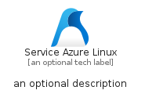
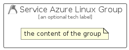

# ServiceAzureLinux


```text
azure-23/Item/NewIcons/ServiceAzureLinux
```

```text
include('azure-23/Item/NewIcons/ServiceAzureLinux')
```


| Illustration | ServiceAzureLinux | ServiceAzureLinuxCard | ServiceAzureLinuxGroup |
| :---: | :---: | :---: | :---: |
|  |  |  |  |


## Sprites
The item provides the following sriptes:

- `<$ServiceAzureLinuxXs>`
- `<$ServiceAzureLinuxSm>`
- `<$ServiceAzureLinuxMd>`
- `<$ServiceAzureLinuxLg>`


## ServiceAzureLinux

### Load remotely
```plantuml
@startuml
' configures the library
!global $LIB_BASE_LOCATION="https://raw.githubusercontent.com/tmorin/plantuml-libs/master/distribution"

' loads the library's bootstrap
!include $LIB_BASE_LOCATION/bootstrap.puml

' loads the package bootstrap
include('azure-23/bootstrap')

' loads the Item which embeds the element ServiceAzureLinux
include('azure-23/Item/NewIcons/ServiceAzureLinux')

' renders the element
ServiceAzureLinux('ServiceAzureLinux', 'Service Azure Linux', 'an optional tech label', 'an optional description')
@enduml
```

### Load locally
```plantuml
@startuml
' configures the library
!global $INCLUSION_MODE="local"
!global $LIB_BASE_LOCATION="../../.."

' loads the library's bootstrap
!include $LIB_BASE_LOCATION/bootstrap.puml

' loads the package bootstrap
include('azure-23/bootstrap')

' loads the Item which embeds the element ServiceAzureLinux
include('azure-23/Item/NewIcons/ServiceAzureLinux')

' renders the element
ServiceAzureLinux('ServiceAzureLinux', 'Service Azure Linux', 'an optional tech label', 'an optional description')
@enduml
```

## ServiceAzureLinuxCard

### Load remotely
```plantuml
@startuml
' configures the library
!global $LIB_BASE_LOCATION="https://raw.githubusercontent.com/tmorin/plantuml-libs/master/distribution"

' loads the library's bootstrap
!include $LIB_BASE_LOCATION/bootstrap.puml

' loads the package bootstrap
include('azure-23/bootstrap')

' loads the Item which embeds the element ServiceAzureLinuxCard
include('azure-23/Item/NewIcons/ServiceAzureLinux')

' renders the element
ServiceAzureLinuxCard('ServiceAzureLinuxCard', 'Service Azure Linux Card', 'an optional description')
@enduml
```

### Load locally
```plantuml
@startuml
' configures the library
!global $INCLUSION_MODE="local"
!global $LIB_BASE_LOCATION="../../.."

' loads the library's bootstrap
!include $LIB_BASE_LOCATION/bootstrap.puml

' loads the package bootstrap
include('azure-23/bootstrap')

' loads the Item which embeds the element ServiceAzureLinuxCard
include('azure-23/Item/NewIcons/ServiceAzureLinux')

' renders the element
ServiceAzureLinuxCard('ServiceAzureLinuxCard', 'Service Azure Linux Card', 'an optional description')
@enduml
```

## ServiceAzureLinuxGroup

### Load remotely
```plantuml
@startuml
' configures the library
!global $LIB_BASE_LOCATION="https://raw.githubusercontent.com/tmorin/plantuml-libs/master/distribution"

' loads the library's bootstrap
!include $LIB_BASE_LOCATION/bootstrap.puml

' loads the package bootstrap
include('azure-23/bootstrap')

' loads the Item which embeds the element ServiceAzureLinuxGroup
include('azure-23/Item/NewIcons/ServiceAzureLinux')

' renders the element
ServiceAzureLinuxGroup('ServiceAzureLinuxGroup', 'Service Azure Linux Group', 'an optional tech label') {
    note as note
        the content of the group
    end note
}
@enduml
```

### Load locally
```plantuml
@startuml
' configures the library
!global $INCLUSION_MODE="local"
!global $LIB_BASE_LOCATION="../../.."

' loads the library's bootstrap
!include $LIB_BASE_LOCATION/bootstrap.puml

' loads the package bootstrap
include('azure-23/bootstrap')

' loads the Item which embeds the element ServiceAzureLinuxGroup
include('azure-23/Item/NewIcons/ServiceAzureLinux')

' renders the element
ServiceAzureLinuxGroup('ServiceAzureLinuxGroup', 'Service Azure Linux Group', 'an optional tech label') {
    note as note
        the content of the group
    end note
}
@enduml
```

