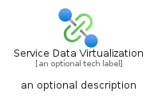
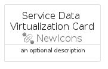
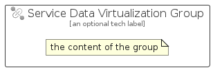

# ServiceDataVirtualization


```text
azure-23/Item/NewIcons/ServiceDataVirtualization
```

```text
include('azure-23/Item/NewIcons/ServiceDataVirtualization')
```


| Illustration | ServiceDataVirtualization | ServiceDataVirtualizationCard | ServiceDataVirtualizationGroup |
| :---: | :---: | :---: | :---: |
|  |  |  |  |


## Sprites
The item provides the following sriptes:

- `<$ServiceDataVirtualizationXs>`
- `<$ServiceDataVirtualizationSm>`
- `<$ServiceDataVirtualizationMd>`
- `<$ServiceDataVirtualizationLg>`


## ServiceDataVirtualization

### Load remotely
```plantuml
@startuml
' configures the library
!global $LIB_BASE_LOCATION="https://raw.githubusercontent.com/tmorin/plantuml-libs/master/distribution"

' loads the library's bootstrap
!include $LIB_BASE_LOCATION/bootstrap.puml

' loads the package bootstrap
include('azure-23/bootstrap')

' loads the Item which embeds the element ServiceDataVirtualization
include('azure-23/Item/NewIcons/ServiceDataVirtualization')

' renders the element
ServiceDataVirtualization('ServiceDataVirtualization', 'Service Data Virtualization', 'an optional tech label', 'an optional description')
@enduml
```

### Load locally
```plantuml
@startuml
' configures the library
!global $INCLUSION_MODE="local"
!global $LIB_BASE_LOCATION="../../.."

' loads the library's bootstrap
!include $LIB_BASE_LOCATION/bootstrap.puml

' loads the package bootstrap
include('azure-23/bootstrap')

' loads the Item which embeds the element ServiceDataVirtualization
include('azure-23/Item/NewIcons/ServiceDataVirtualization')

' renders the element
ServiceDataVirtualization('ServiceDataVirtualization', 'Service Data Virtualization', 'an optional tech label', 'an optional description')
@enduml
```

## ServiceDataVirtualizationCard

### Load remotely
```plantuml
@startuml
' configures the library
!global $LIB_BASE_LOCATION="https://raw.githubusercontent.com/tmorin/plantuml-libs/master/distribution"

' loads the library's bootstrap
!include $LIB_BASE_LOCATION/bootstrap.puml

' loads the package bootstrap
include('azure-23/bootstrap')

' loads the Item which embeds the element ServiceDataVirtualizationCard
include('azure-23/Item/NewIcons/ServiceDataVirtualization')

' renders the element
ServiceDataVirtualizationCard('ServiceDataVirtualizationCard', 'Service Data Virtualization Card', 'an optional description')
@enduml
```

### Load locally
```plantuml
@startuml
' configures the library
!global $INCLUSION_MODE="local"
!global $LIB_BASE_LOCATION="../../.."

' loads the library's bootstrap
!include $LIB_BASE_LOCATION/bootstrap.puml

' loads the package bootstrap
include('azure-23/bootstrap')

' loads the Item which embeds the element ServiceDataVirtualizationCard
include('azure-23/Item/NewIcons/ServiceDataVirtualization')

' renders the element
ServiceDataVirtualizationCard('ServiceDataVirtualizationCard', 'Service Data Virtualization Card', 'an optional description')
@enduml
```

## ServiceDataVirtualizationGroup

### Load remotely
```plantuml
@startuml
' configures the library
!global $LIB_BASE_LOCATION="https://raw.githubusercontent.com/tmorin/plantuml-libs/master/distribution"

' loads the library's bootstrap
!include $LIB_BASE_LOCATION/bootstrap.puml

' loads the package bootstrap
include('azure-23/bootstrap')

' loads the Item which embeds the element ServiceDataVirtualizationGroup
include('azure-23/Item/NewIcons/ServiceDataVirtualization')

' renders the element
ServiceDataVirtualizationGroup('ServiceDataVirtualizationGroup', 'Service Data Virtualization Group', 'an optional tech label') {
    note as note
        the content of the group
    end note
}
@enduml
```

### Load locally
```plantuml
@startuml
' configures the library
!global $INCLUSION_MODE="local"
!global $LIB_BASE_LOCATION="../../.."

' loads the library's bootstrap
!include $LIB_BASE_LOCATION/bootstrap.puml

' loads the package bootstrap
include('azure-23/bootstrap')

' loads the Item which embeds the element ServiceDataVirtualizationGroup
include('azure-23/Item/NewIcons/ServiceDataVirtualization')

' renders the element
ServiceDataVirtualizationGroup('ServiceDataVirtualizationGroup', 'Service Data Virtualization Group', 'an optional tech label') {
    note as note
        the content of the group
    end note
}
@enduml
```

