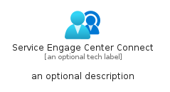
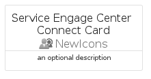
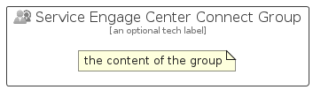

# ServiceEngageCenterConnect


```text
azure-23/Item/NewIcons/ServiceEngageCenterConnect
```

```text
include('azure-23/Item/NewIcons/ServiceEngageCenterConnect')
```


| Illustration | ServiceEngageCenterConnect | ServiceEngageCenterConnectCard | ServiceEngageCenterConnectGroup |
| :---: | :---: | :---: | :---: |
|  |  |  |  |


## Sprites
The item provides the following sriptes:

- `<$ServiceEngageCenterConnectXs>`
- `<$ServiceEngageCenterConnectSm>`
- `<$ServiceEngageCenterConnectMd>`
- `<$ServiceEngageCenterConnectLg>`


## ServiceEngageCenterConnect

### Load remotely
```plantuml
@startuml
' configures the library
!global $LIB_BASE_LOCATION="https://raw.githubusercontent.com/tmorin/plantuml-libs/master/distribution"

' loads the library's bootstrap
!include $LIB_BASE_LOCATION/bootstrap.puml

' loads the package bootstrap
include('azure-23/bootstrap')

' loads the Item which embeds the element ServiceEngageCenterConnect
include('azure-23/Item/NewIcons/ServiceEngageCenterConnect')

' renders the element
ServiceEngageCenterConnect('ServiceEngageCenterConnect', 'Service Engage Center Connect', 'an optional tech label', 'an optional description')
@enduml
```

### Load locally
```plantuml
@startuml
' configures the library
!global $INCLUSION_MODE="local"
!global $LIB_BASE_LOCATION="../../.."

' loads the library's bootstrap
!include $LIB_BASE_LOCATION/bootstrap.puml

' loads the package bootstrap
include('azure-23/bootstrap')

' loads the Item which embeds the element ServiceEngageCenterConnect
include('azure-23/Item/NewIcons/ServiceEngageCenterConnect')

' renders the element
ServiceEngageCenterConnect('ServiceEngageCenterConnect', 'Service Engage Center Connect', 'an optional tech label', 'an optional description')
@enduml
```

## ServiceEngageCenterConnectCard

### Load remotely
```plantuml
@startuml
' configures the library
!global $LIB_BASE_LOCATION="https://raw.githubusercontent.com/tmorin/plantuml-libs/master/distribution"

' loads the library's bootstrap
!include $LIB_BASE_LOCATION/bootstrap.puml

' loads the package bootstrap
include('azure-23/bootstrap')

' loads the Item which embeds the element ServiceEngageCenterConnectCard
include('azure-23/Item/NewIcons/ServiceEngageCenterConnect')

' renders the element
ServiceEngageCenterConnectCard('ServiceEngageCenterConnectCard', 'Service Engage Center Connect Card', 'an optional description')
@enduml
```

### Load locally
```plantuml
@startuml
' configures the library
!global $INCLUSION_MODE="local"
!global $LIB_BASE_LOCATION="../../.."

' loads the library's bootstrap
!include $LIB_BASE_LOCATION/bootstrap.puml

' loads the package bootstrap
include('azure-23/bootstrap')

' loads the Item which embeds the element ServiceEngageCenterConnectCard
include('azure-23/Item/NewIcons/ServiceEngageCenterConnect')

' renders the element
ServiceEngageCenterConnectCard('ServiceEngageCenterConnectCard', 'Service Engage Center Connect Card', 'an optional description')
@enduml
```

## ServiceEngageCenterConnectGroup

### Load remotely
```plantuml
@startuml
' configures the library
!global $LIB_BASE_LOCATION="https://raw.githubusercontent.com/tmorin/plantuml-libs/master/distribution"

' loads the library's bootstrap
!include $LIB_BASE_LOCATION/bootstrap.puml

' loads the package bootstrap
include('azure-23/bootstrap')

' loads the Item which embeds the element ServiceEngageCenterConnectGroup
include('azure-23/Item/NewIcons/ServiceEngageCenterConnect')

' renders the element
ServiceEngageCenterConnectGroup('ServiceEngageCenterConnectGroup', 'Service Engage Center Connect Group', 'an optional tech label') {
    note as note
        the content of the group
    end note
}
@enduml
```

### Load locally
```plantuml
@startuml
' configures the library
!global $INCLUSION_MODE="local"
!global $LIB_BASE_LOCATION="../../.."

' loads the library's bootstrap
!include $LIB_BASE_LOCATION/bootstrap.puml

' loads the package bootstrap
include('azure-23/bootstrap')

' loads the Item which embeds the element ServiceEngageCenterConnectGroup
include('azure-23/Item/NewIcons/ServiceEngageCenterConnect')

' renders the element
ServiceEngageCenterConnectGroup('ServiceEngageCenterConnectGroup', 'Service Engage Center Connect Group', 'an optional tech label') {
    note as note
        the content of the group
    end note
}
@enduml
```

